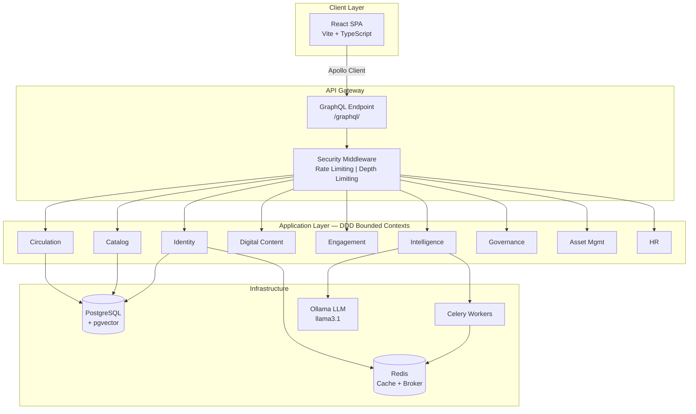

# Nova Smart Library Management Ecosystem — Documentation

> **Comprehensive Technical Documentation & Architectural Reference**
>
> Version: 1.0 | Last Updated: July 2025

---

## Table of Contents

| # | Document | Description |
|---|---------|-------------|
| 1 | [Architecture Overview](01-architecture-overview.md) | System architecture, technology stack, DDD bounded contexts, deployment topology, design principles |
| 2 | [ER Diagrams](02-er-diagrams.md) | Complete Entity-Relationship diagrams for all 38 models across 10 bounded contexts |
| 3 | [Use Case Diagrams](03-use-case-diagrams.md) | Actor-based use case diagrams for Members, Librarians, Administrators, and System |
| 4 | [Class / UML Diagrams](04-class-diagrams.md) | UML class diagrams per bounded context with all attributes, methods, and relationships |
| 5 | [Sequence Diagrams](05-sequence-diagrams.md) | Interaction sequence diagrams for all key workflows (auth, borrow, search, AI, etc.) |
| 6 | [Component Diagrams](06-component-diagrams.md) | Backend and frontend component architecture diagrams |
| 7 | [Data Flow Diagrams](07-data-flow-diagrams.md) | System-wide data flow, event bus, and integration patterns |
| 8 | [API Reference](08-api-reference.md) | Complete GraphQL API — 85+ queries, 81+ mutations, all types |
| 9 | [Security Architecture](09-security-architecture.md) | Authentication, authorization, RBAC, middleware, security headers, rate limiting |
| 10 | [AI/ML Architecture](10-ai-ml-architecture.md) | AI/ML pipeline, search engine, recommendation engine, predictive analytics, LLM integration |
| 11 | [Frontend Architecture](11-frontend-architecture.md) | React app structure, routing, state management, Apollo Client, components |
| 12 | [Deployment & Configuration](12-deployment-configuration.md) | Infrastructure, settings, Celery, Redis, PostgreSQL, environment configuration |

---

## Project Overview

**Nova Smart Library Management Ecosystem** is a full-stack, AI-powered library management platform built with Domain-Driven Design (DDD) principles. It manages the complete lifecycle of physical and digital library resources, including:

- **Catalog Management** — Books, authors, categories, physical copies, reviews
- **Circulation** — Borrowing, reservations, returns, fines, overdue management
- **Digital Content** — E-books, audiobooks, reading sessions, bookmarks, highlights
- **Identity & Access** — User registration (with NIC/OCR verification), JWT authentication, RBAC
- **Engagement & Gamification** — Knowledge Points, achievements, leaderboards, daily streaks
- **AI-Powered Intelligence** — Hybrid search, personalized recommendations, predictive analytics, LLM-powered insights
- **Governance** — Audit logging, security event tracking, KP ledger
- **Asset Management** — Physical library assets, maintenance, disposal tracking
- **HR Management** — Departments, employees, job vacancies, applications
- **System Administration** — Settings, SMTP, role configuration, analytics dashboards

---

## Technology Stack

| Layer | Technology | Version |
|-------|-----------|---------|
| **Backend Framework** | Django | 6.0.2 |
| **API** | Graphene-Django (GraphQL) | 3.x |
| **Authentication** | django-graphql-jwt (JWT) | HS256 |
| **Database** | PostgreSQL + pgvector | 15+ |
| **Cache / Broker** | Redis | 5.x |
| **Task Queue** | Celery | 5.3+ |
| **Frontend Framework** | React | 18.3 |
| **State Management** | Zustand + Apollo Client | 5.0 / 3.11 |
| **Build Tool** | Vite | 6.0 |
| **Language** | TypeScript | 5.7 |
| **CSS Framework** | Tailwind CSS | 3.4 |
| **ML/AI** | scikit-learn, sentence-transformers, Ollama | — |
| **OCR** | pytesseract + Pillow | — |
| **Face Recognition** | face-recognition + OpenCV | — |

---

## Architecture at a Glance

---

## Quick Links

- **Backend codebase**: `backend/`
- **Frontend codebase**: `frontend/`
- **GraphQL endpoint**: `http://localhost:8000/graphql/`
- **Frontend dev server**: `http://localhost:3000`
- **PostgreSQL**: port `5433`
- **Redis**: port `6379`
- **Ollama LLM**: `http://localhost:11434`
