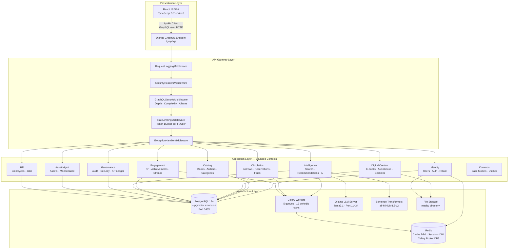
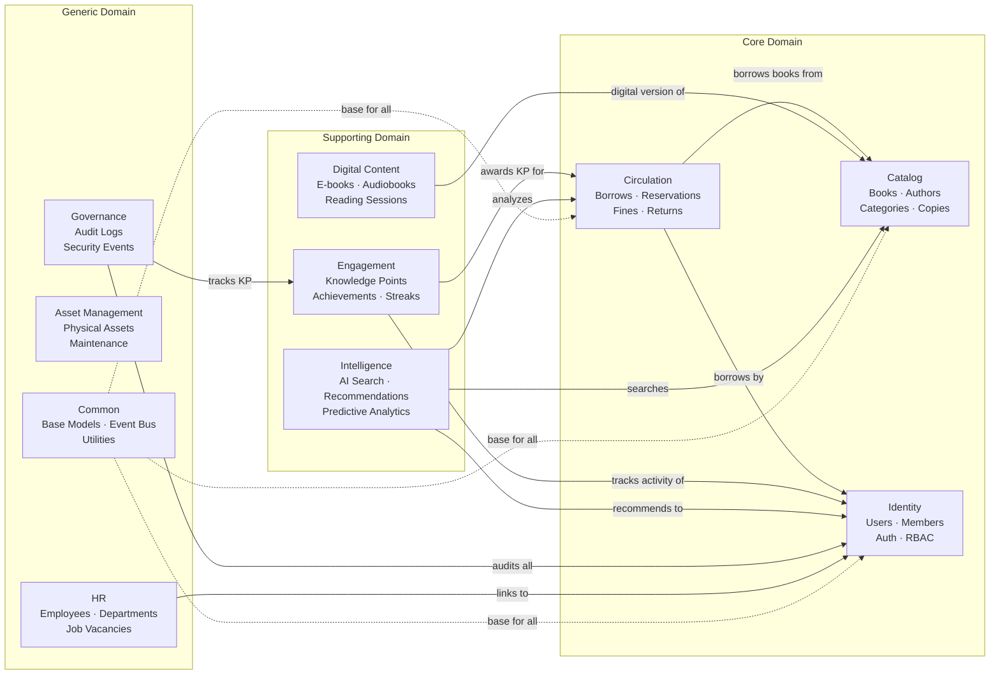
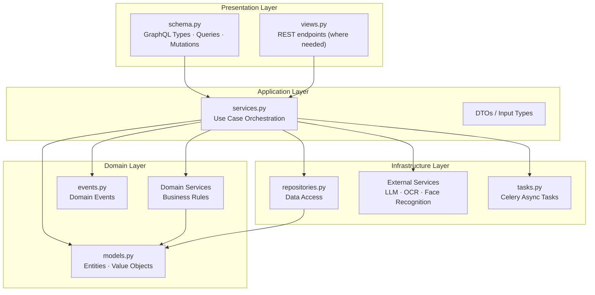
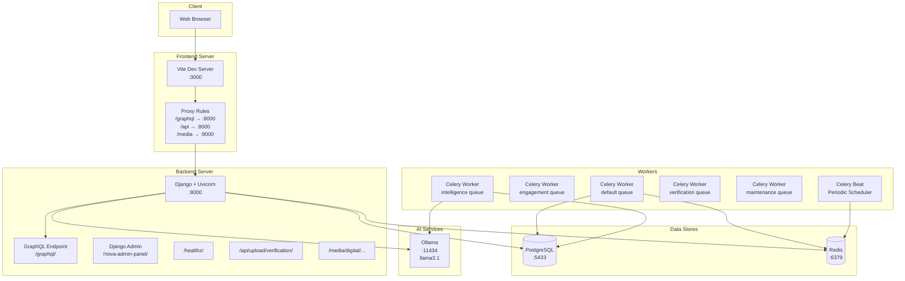

# 01 — Architecture Overview

> System Architecture, Design Principles, Technology Stack, and Deployment Topology

---

## 1. Design Philosophy

Nova Smart Library Management Ecosystem follows **Domain-Driven Design (DDD)** principles with clean architecture patterns:

| Principle | Implementation |
|-----------|---------------|
| **Bounded Contexts** | 10 independent domain modules with clear boundaries |
| **Layered Architecture** | Each context has `domain/`, `application/`, `infrastructure/`, `presentation/` layers |
| **CQRS-like Separation** | Queries and mutations separated at the GraphQL schema level |
| **Event-Driven** | Central event bus for cross-context communication |
| **Soft Deletes** | `SoftDeletableModel` with `is_deleted` flag and custom manager |
| **Optimistic Concurrency** | `VersionedModel` with auto-incrementing `version` field |
| **Repository Pattern** | Domain services encapsulate data access logic |
| **Single Responsibility** | Each module owns its models, services, and API surface |

---

## 2. System Architecture Diagram

---

## 3. Bounded Context Map

The system is organized into 10 bounded contexts, each responsible for a specific business domain:

---

## 4. DDD Layer Architecture (per Bounded Context)

Each bounded context follows a 4-layer architecture:

---

## 5. Technology Stack Detail

### 5.1 Backend Stack

| Component | Technology | Purpose |
|-----------|-----------|---------|
| Web Framework | Django 6.0.2 | HTTP handling, ORM, admin |
| API Layer | Graphene-Django 3.x | GraphQL schema and resolvers |
| Authentication | django-graphql-jwt | JWT-based auth (HS256) |
| Password Hashing | Argon2 (primary) + PBKDF2 | Secure password storage |
| Database | PostgreSQL 15+ | Relational data storage |
| Vector Store | pgvector | Book embedding storage and similarity search |
| Cache | Redis (django-redis) | Query caching, session storage |
| Task Queue | Celery 5.3+ (Redis broker) | Async background tasks |
| Embedding Model | sentence-transformers (all-MiniLM-L6-v2) | 384-dim book embeddings |
| ML Framework | scikit-learn | Recommendation, prediction models |
| LLM | Ollama (llama3.1) | Conversational AI, analytics |
| OCR | pytesseract + Pillow | ID document text extraction |
| Face Recognition | face-recognition + OpenCV | Identity verification |
| NLP | NLTK | Text processing, tokenization |
| ASGI Server | Uvicorn | Production async server |

### 5.2 Frontend Stack

| Component | Technology | Purpose |
|-----------|-----------|---------|
| UI Framework | React 18.3 | Component-based UI |
| Language | TypeScript 5.7 | Type-safe JavaScript |
| Build Tool | Vite 6.0 | HMR dev server and bundler |
| GraphQL Client | Apollo Client 3.11 | Query, mutation, cache management |
| State Management | Zustand 5.0 | Lightweight client state |
| CSS Framework | Tailwind CSS 3.4 | Utility-first styling |
| Form Management | react-hook-form 7.54 + Zod | Form validation |
| Animations | Framer Motion 11.15 | UI animations |
| Charts | Chart.js 4.4 + react-chartjs-2 | Data visualization |
| UI Components | Headless UI 2.2 + Heroicons 2.2 | Accessible primitives |
| Routing | React Router DOM 6.28 | Client-side routing |
| Notifications | react-hot-toast 2.4 | Toast messages |
| Security | DOMPurify 3.3 | XSS prevention |
| Testing | Vitest + Testing Library | Unit and component tests |

### 5.3 Infrastructure

| Component | Technology | Purpose |
|-----------|-----------|---------|
| Database | PostgreSQL on port 5433 | Primary data store |
| Cache | Redis on port 6379 (DB 0, 1, 3) | Caching, sessions, Celery broker |
| LLM Server | Ollama on port 11434 | Local AI model hosting |
| Dev Server | Vite on port 3000 | Frontend dev with HMR |
| Backend Server | Django on port 8000 | API serving |
| File Storage | Local `media/` directory | Uploads, covers, digital assets |

---

## 6. Deployment Topology

---

## 7. Module Dependency Matrix

| Module | Depends On | Depended By |
|--------|-----------|-------------|
| **Common** | — | All modules |
| **Identity** | Common | Circulation, Engagement, Intelligence, Governance, HR |
| **Catalog** | Common | Circulation, Digital Content, Intelligence |
| **Circulation** | Common, Identity, Catalog | Engagement, Intelligence, Governance |
| **Digital Content** | Common, Identity, Catalog | Engagement, Intelligence |
| **Engagement** | Common, Identity | Governance |
| **Intelligence** | Common, Identity, Catalog, Circulation, Digital Content | — |
| **Governance** | Common, Identity, Engagement | — |
| **Asset Management** | Common | — |
| **HR** | Common, Identity | — |

---

## 8. Key Design Patterns

| Pattern | Where Used | Purpose |
|---------|-----------|---------|
| **Repository** | Domain services in each context | Data access abstraction |
| **Factory** | AI Provider Factory | Dynamic provider selection |
| **Strategy** | Recommendation Engine | Collaborative / Content-based / Hybrid |
| **Observer / Event Bus** | `common/event_bus.py` | Cross-context event propagation |
| **Decorator** | `common/decorators.py` | Auth, caching, rate limiting |
| **Template Method** | Abstract base models | Common lifecycle behavior |
| **Middleware Chain** | Django middleware stack | Request/response processing |
| **CQRS** | GraphQL Query vs. Mutation | Read/write separation |
| **Optimistic Locking** | `VersionedModel` | Concurrent update safety |
| **Soft Delete** | `SoftDeletableModel` | Non-destructive data removal |
