# 02 — Entity-Relationship Diagrams

> Complete ER diagrams for all 38 concrete models + 4 abstract base models across 10 bounded contexts

---

## 1. Complete System ER Overview

This high-level diagram shows all entities and their cross-context relationships:

```mermaid
erDiagram
    User ||--o{ BorrowRecord : "borrows"
    User ||--o{ Reservation : "reserves"
    User ||--o{ Fine : "owes"
    User ||--o{ BookReview : "writes"
    User ||--o{ ReadingSession : "reads"
    User ||--o{ UserLibrary : "has library"
    User ||--o{ UserEngagement : "has engagement"
    User ||--o{ UserAchievement : "earns"
    User ||--o{ DailyActivity : "logs activity"
    User ||--o{ Recommendation : "receives"
    User ||--o{ UserPreference : "configures"
    User ||--o{ SearchLog : "searches"
    User ||--o{ BookView : "views"
    User ||--o{ AuditLog : "triggers"
    User ||--o{ SecurityEvent : "causes"
    User ||--o{ KPLedger : "earns KP"
    User ||--o{ VerificationRequest : "requests"
    User ||--o{ Member : "has membership"
    User ||--o{ Employee : "is employee"
    User ||--o{ ReservationBan : "may be banned"

    Book ||--o{ BookCopy : "has copies"
    Book ||--o{ BookReview : "has reviews"
    Book ||--o{ BorrowRecord : "is borrowed"
    Book ||--o{ Reservation : "is reserved"
    Book ||--o{ DigitalAsset : "has digital"
    Book ||--o{ Recommendation : "is recommended"
    Book ||--o{ TrendingBook : "trends"
    Book ||--o{ BookView : "is viewed"
    Book }o--o{ Author : "written by"
    Book }o--o{ Category : "categorized in"

    BookCopy ||--o{ BorrowRecord : "copy lent"

    DigitalAsset ||--o{ ReadingSession : "has sessions"
    DigitalAsset ||--o{ Bookmark : "has bookmarks"
    DigitalAsset ||--o{ Highlight : "has highlights"
    DigitalAsset ||--o{ UserLibrary : "in library"

    Category ||--o{ Category : "has children"

    Achievement ||--o{ UserAchievement : "awarded as"

    Department ||--o{ Employee : "employs"
    Department ||--o{ JobVacancy : "posts"
    JobVacancy ||--o{ JobApplication : "receives"

    AssetCategory ||--o{ Asset : "categorizes"
    Asset ||--o{ MaintenanceLog : "maintained"
    Asset ||--o{ AssetDisposal : "disposed"
```

---

## 2. Common Module — Abstract Base Models

These abstract models are inherited across all bounded contexts:

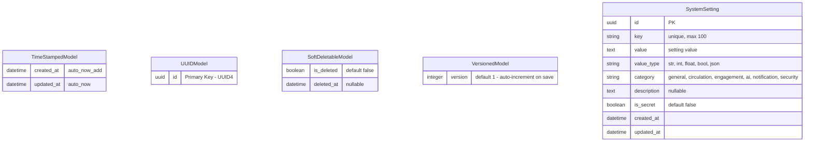

---

## 3. Identity Context

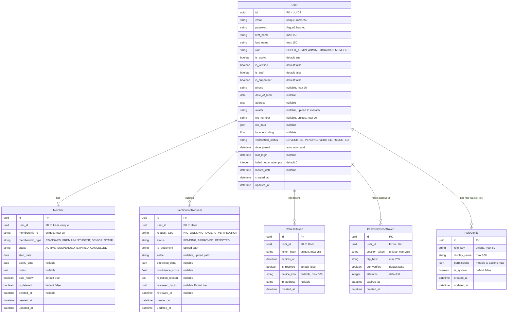

---

## 4. Catalog Context

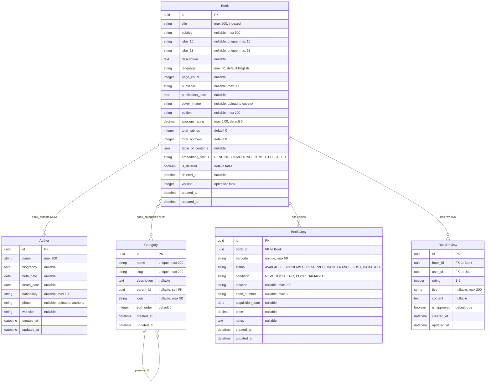

---

## 5. Circulation Context

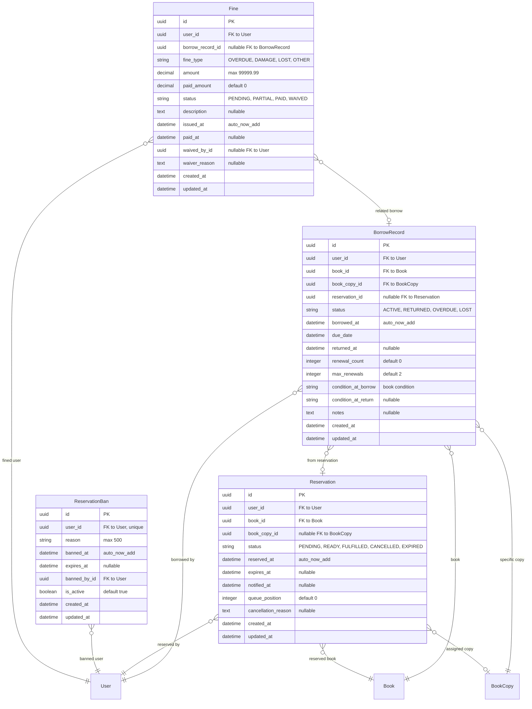

---

## 6. Digital Content Context

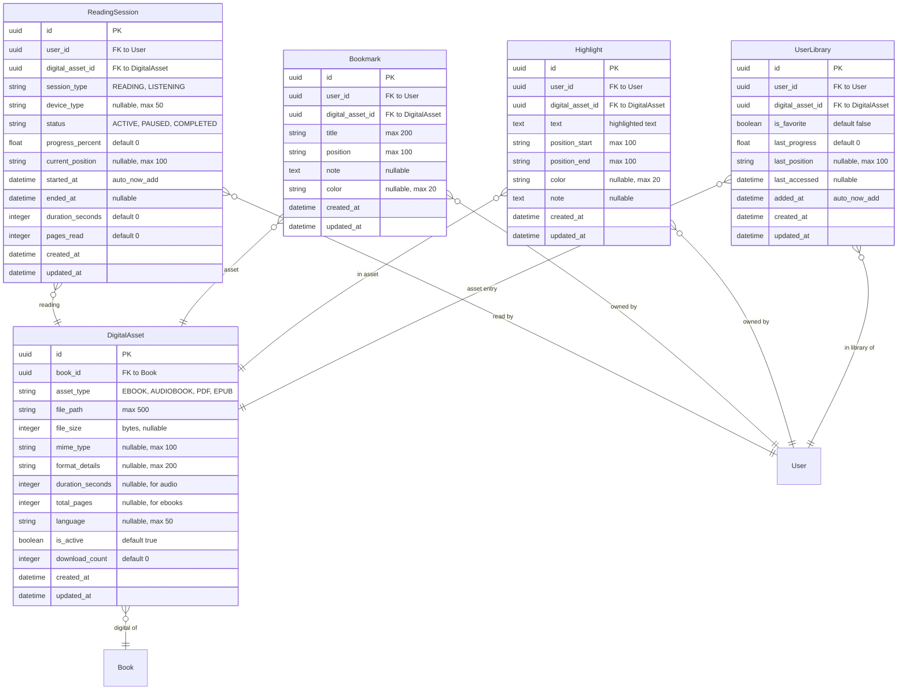

---

## 7. Engagement Context

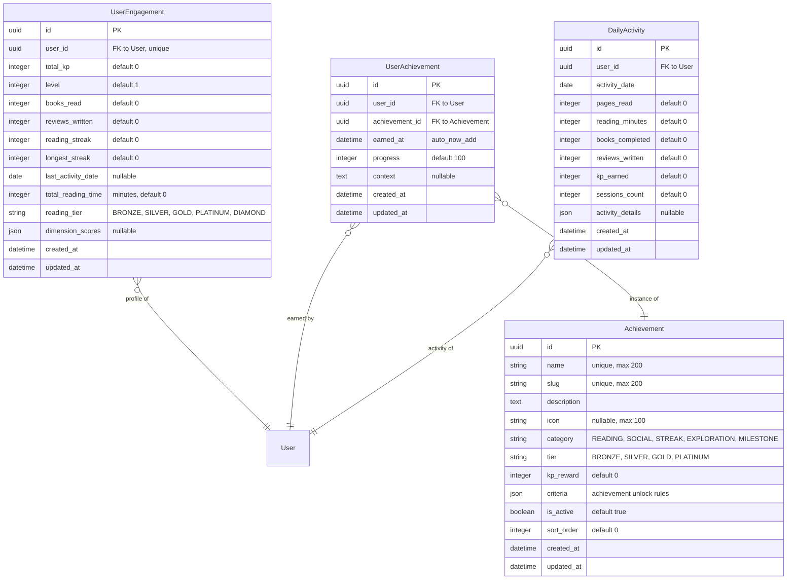

---

## 8. Intelligence Context

```mermaid
erDiagram
    Recommendation {
        uuid id "PK"
        uuid user_id "FK to User"
        uuid book_id "FK to Book"
        float score "0.0-1.0"
        string strategy "COLLABORATIVE, CONTENT_BASED, HYBRID, TRENDING, POPULAR"
        string reason "max 500, nullable"
        boolean is_clicked "default false"
        boolean is_dismissed "default false"
        datetime generated_at "auto_now_add"
        datetime expires_at "nullable"
        datetime created_at
        datetime updated_at
    }

    UserPreference {
        uuid id "PK"
        uuid user_id "FK to User, unique"
        json preferred_categories "nullable"
        json preferred_authors "nullable"
        json preferred_languages "nullable"
        string reading_pace "SLOW, MODERATE, FAST"
        string content_length_pref "SHORT, MEDIUM, LONG, ANY"
        json topic_interests "nullable"
        boolean notify_new_releases "default true"
        boolean notify_recommendations "default true"
        json preference_vector "nullable - embedding"
        datetime created_at
        datetime updated_at
    }

    SearchLog {
        uuid id "PK"
        uuid user_id "nullable FK to User"
        string query "max 500"
        integer results_count "default 0"
        float search_time_ms "nullable"
        string search_type "FULLTEXT, SEMANTIC, HYBRID, FUZZY"
        json filters_used "nullable"
        uuid clicked_book_id "nullable FK to Book"
        datetime created_at
    }

    AIModelVersion {
        uuid id "PK"
        string model_type "RECOMMENDATION, EMBEDDING, PREDICTION, NLP"
        string version_tag "max 100"
        string model_path "nullable, max 500"
        json metrics "nullable - evaluation scores"
        json parameters "nullable - hyperparameters"
        boolean is_active "default false"
        datetime trained_at "nullable"
        integer training_duration "seconds, nullable"
        integer training_samples "nullable"
        datetime created_at
        datetime updated_at
    }

    AIProviderConfig {
        uuid id "PK"
        string provider "OLLAMA, OPENAI, GEMINI, LOCAL_TRANSFORMERS"
        string capability "TEXT_GENERATION, EMBEDDING, CLASSIFICATION"
        string model_name "max 200"
        string api_endpoint "nullable, max 500"
        string api_key "nullable, encrypted, max 500"
        json extra_config "nullable"
        boolean is_active "default false"
        integer priority "default 0"
        integer max_tokens "default 2048"
        float temperature "default 0.7"
        datetime last_health_check "nullable"
        boolean is_healthy "default true"
        datetime created_at
        datetime updated_at
    }

    TrendingBook {
        uuid id "PK"
        uuid book_id "FK to Book, unique-per-period"
        string period "DAILY, WEEKLY, MONTHLY"
        float trend_score "default 0"
        integer view_count "default 0"
        integer borrow_count "default 0"
        integer search_count "default 0"
        integer review_count "default 0"
        datetime computed_at "auto_now"
        datetime created_at
        datetime updated_at
    }

    BookView {
        uuid id "PK"
        uuid user_id "nullable FK to User"
        uuid book_id "FK to Book"
        string source "CATALOG, SEARCH, RECOMMENDATION, TRENDING, DIRECT"
        integer duration_seconds "nullable"
        datetime viewed_at "auto_now_add"
        datetime created_at
    }

    Recommendation }o--|| User : "for user"
    Recommendation }o--|| Book : "recommends book"
    UserPreference }o--|| User : "preferences of"
    SearchLog }o--o| User : "searched by"
    TrendingBook }o--|| Book : "trending book"
    BookView }o--o| User : "viewed by"
    BookView }o--|| Book : "book viewed"
```

---

## 9. Governance Context

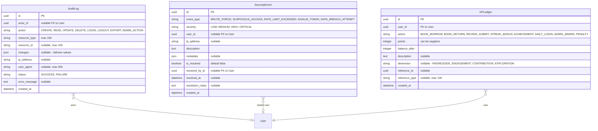

---

## 10. Asset Management Context

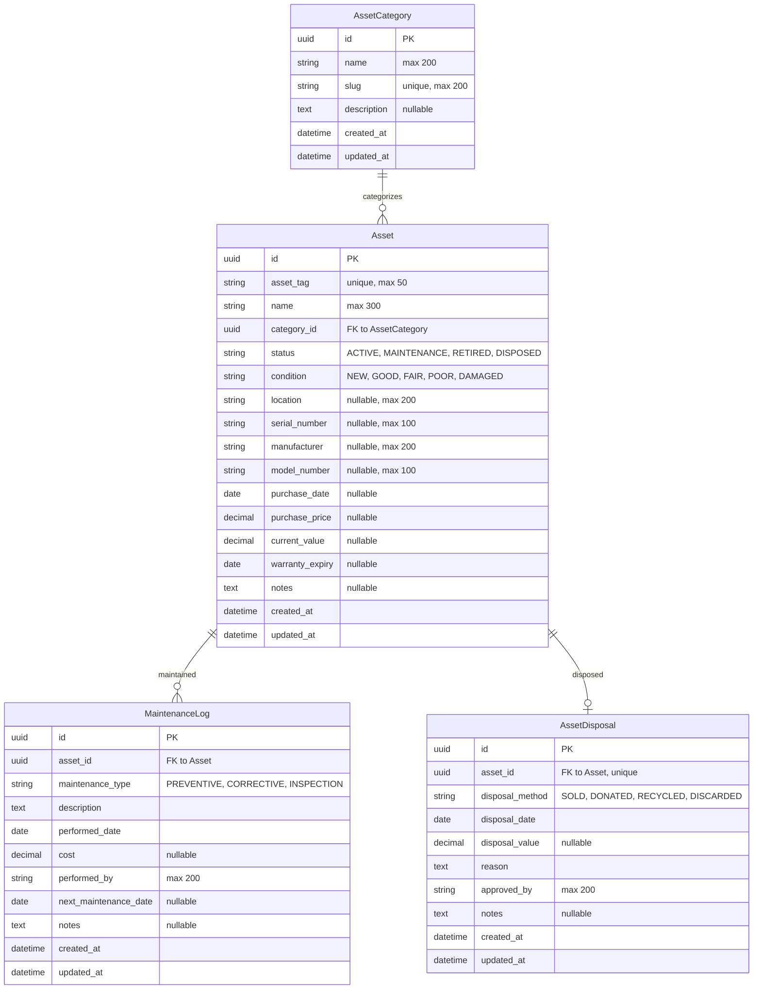

---

## 11. HR Context

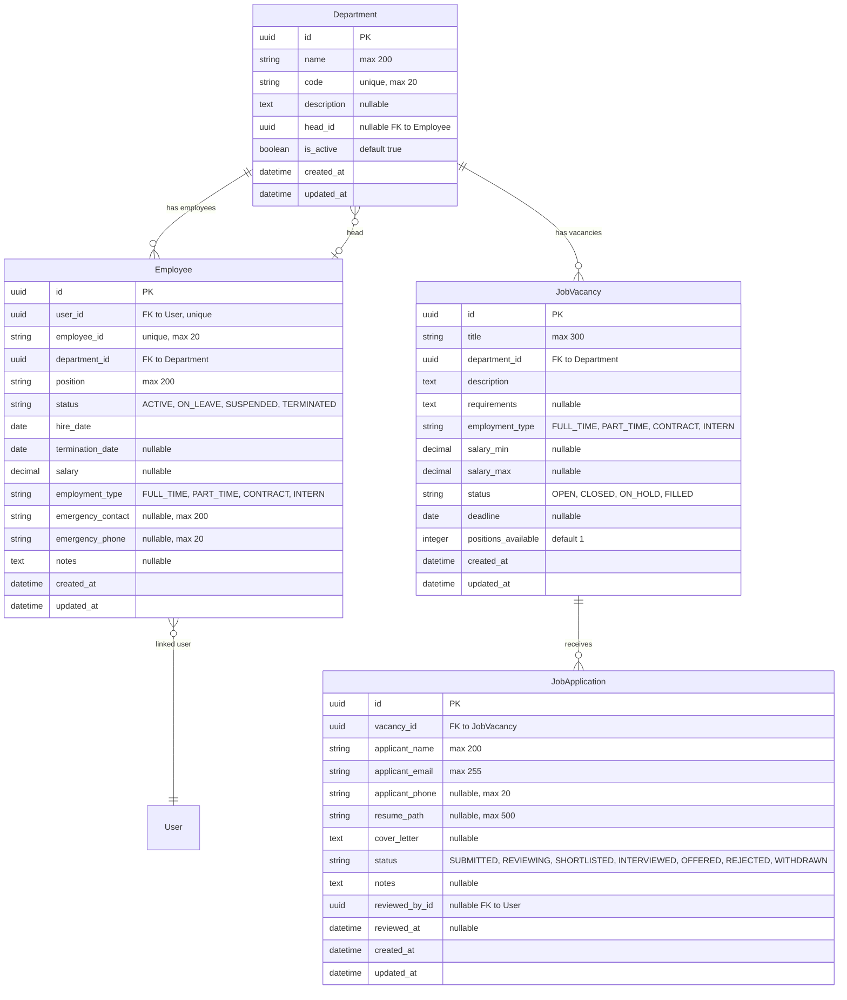

---

## 12. Cross-Context Relationship Summary

| Relationship | From Context | To Context | Cardinality | Description |
|-------------|-------------|------------|-------------|-------------|
| User → BorrowRecord | Identity | Circulation | 1:N | User borrows books |
| User → Reservation | Identity | Circulation | 1:N | User reserves books |
| User → Fine | Identity | Circulation | 1:N | User owes fines |
| User → BookReview | Identity | Catalog | 1:N | User writes reviews |
| User → ReadingSession | Identity | Digital Content | 1:N | User reads digitally |
| User → UserEngagement | Identity | Engagement | 1:1 | User engagement profile |
| User → Recommendation | Identity | Intelligence | 1:N | User gets recommendations |
| User → AuditLog | Identity | Governance | 1:N | User actions audited |
| User → Employee | Identity | HR | 1:1 | User is an employee |
| User → Member | Identity | Identity | 1:1 | User has membership |
| Book → BookCopy | Catalog | Catalog | 1:N | Book has physical copies |
| Book → DigitalAsset | Catalog | Digital Content | 1:N | Book has digital versions |
| Book → BorrowRecord | Catalog | Circulation | 1:N | Book is borrowed |
| Book → Reservation | Catalog | Circulation | 1:N | Book is reserved |
| Book → Recommendation | Catalog | Intelligence | 1:N | Book is recommended |
| Book → TrendingBook | Catalog | Intelligence | 1:N | Book trends |
| BookCopy → BorrowRecord | Catalog | Circulation | 1:N | Copy is lent |
| DigitalAsset → ReadingSession | Digital Content | Digital Content | 1:N | Asset has sessions |
| Achievement → UserAchievement | Engagement | Engagement | 1:N | Achievement instances |
| Department → Employee | HR | HR | 1:N | Department has employees |
| AssetCategory → Asset | Asset Mgmt | Asset Mgmt | 1:N | Category has assets |
