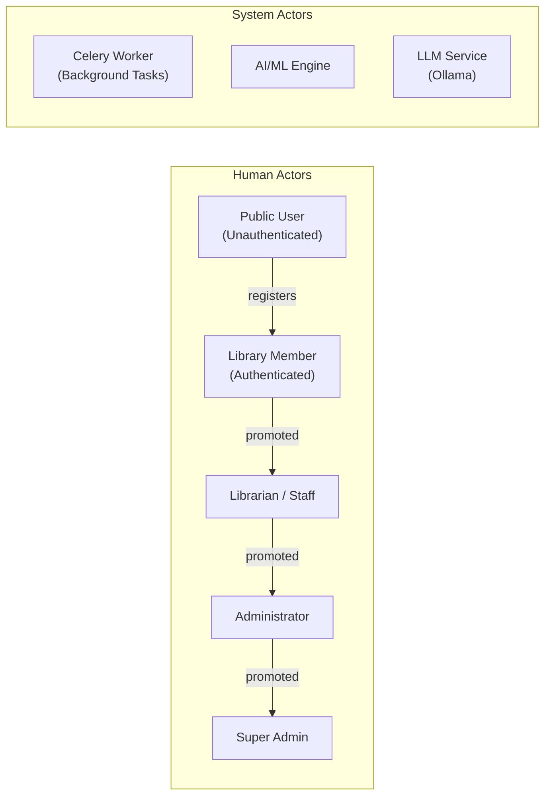
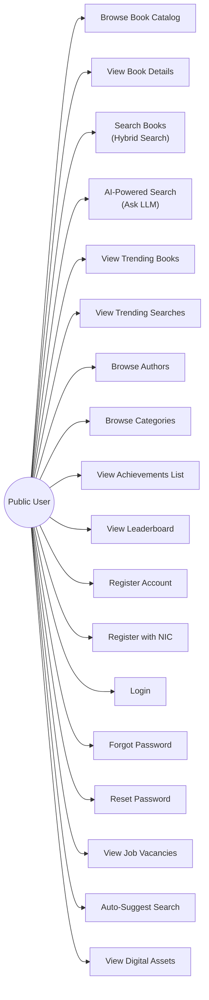
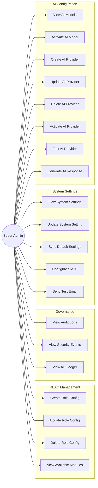
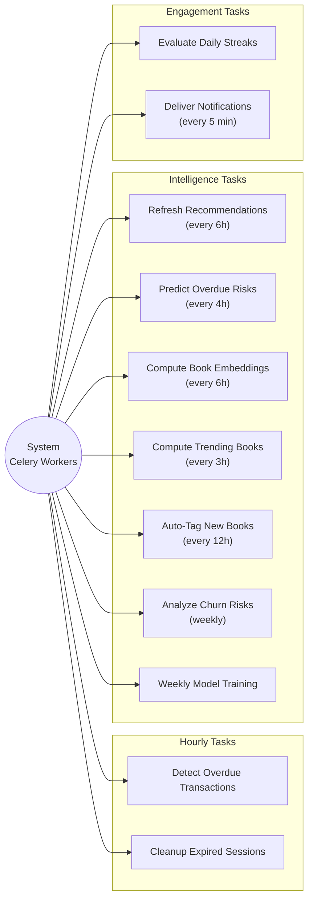

# 03 — Use Case Diagrams

> Actor-based use case diagrams for all system actors: Public User, Library Member, Librarian/Staff, Administrator, Super Admin, and System

---

## 1. System Actors Overview

---

## 2. Public User Use Cases

---

## 3. Library Member Use Cases

```mermaid
graph LR
    M(("Library Member"))

    subgraph "Catalog & Search"
        UC1["Browse Catalog"]
        UC2["View Book Details"]
        UC3["Hybrid Search"]
        UC4["AI Search Assistant"]
        UC5["Submit Book Review"]
        UC6["View Browse History"]
    end

    subgraph "Circulation"
        UC7["Reserve Book"]
        UC8["Cancel Reservation"]
        UC9["View My Borrows"]
        UC10["View My Reservations"]
        UC11["Renew Borrow"]
        UC12["View My Fines"]
        UC13["Pay Fine"]
        UC14["Check Reservation Ban"]
    end

    subgraph "Digital Content"
        UC15["Access Digital Library"]
        UC16["Read E-book"]
        UC17["Listen to Audiobook"]
        UC18["Add Bookmark"]
        UC19["Add Highlight"]
        UC20["Toggle Favorite"]
        UC21["Track Reading Progress"]
    end

    subgraph "Engagement"
        UC22["View Knowledge Points"]
        UC23["View Achievements"]
        UC24["View Daily Activity"]
        UC25["View Leaderboard Rank"]
    end

    subgraph "Intelligence"
        UC26["View Recommendations"]
        UC27["Click Recommendation"]
        UC28["Dismiss Recommendation"]
        UC29["Update Preferences"]
        UC30["View Reading Insights"]
        UC31["View Reading Speed"]
        UC32["View Session Patterns"]
        UC33["View Completion Predictions"]
    end

    subgraph "Profile & Identity"
        UC34["Update Profile"]
        UC35["Change Password"]
        UC36["Submit Verification"]
        UC37["View Notifications"]
        UC38["Apply for Job"]
    end

    M --> UC1
    M --> UC2
    M --> UC3
    M --> UC4
    M --> UC5
    M --> UC6
    M --> UC7
    M --> UC8
    M --> UC9
    M --> UC10
    M --> UC11
    M --> UC12
    M --> UC13
    M --> UC14
    M --> UC15
    M --> UC16
    M --> UC17
    M --> UC18
    M --> UC19
    M --> UC20
    M --> UC21
    M --> UC22
    M --> UC23
    M --> UC24
    M --> UC25
    M --> UC26
    M --> UC27
    M --> UC28
    M --> UC29
    M --> UC30
    M --> UC31
    M --> UC32
    M --> UC33
    M --> UC34
    M --> UC35
    M --> UC36
    M --> UC37
    M --> UC38
```

---

## 4. Librarian / Staff Use Cases

```mermaid
graph LR
    L(("Librarian / Staff"))

    subgraph "Circulation Management"
        UC1["Confirm Book Pickup"]
        UC2["Process Book Return"]
        UC3["View All Borrows"]
        UC4["View Overdue Borrows"]
        UC5["View Pending Pickups"]
        UC6["Waive Fine"]
        UC7["Lift Reservation Ban"]
        UC8["View User Borrows"]
        UC9["View User Fines"]
        UC10["View User Reservations"]
        UC11["View All Fines"]
    end

    subgraph "Catalog Management"
        UC12["Create Book"]
        UC13["Update Book"]
        UC14["Delete Book"]
        UC15["Add Book Copy"]
        UC16["Create Author"]
        UC17["Update Author"]
        UC18["Delete Author"]
        UC19["Create Category"]
    end

    subgraph "User Management"
        UC20["View User List"]
        UC21["View User Details"]
        UC22["Manage Members"]
        UC23["Review Verifications"]
    end

    subgraph "Digital Content Admin"
        UC24["Upload Digital Asset"]
        UC25["Update Digital Asset"]
        UC26["Delete Digital Asset"]
    end

    subgraph "Analytics"
        UC27["View Search Analytics"]
        UC28["View Overdue Predictions"]
        UC29["View Demand Forecasts"]
        UC30["View Churn Predictions"]
        UC31["View Collection Gaps"]
        UC32["View LLM Analytics"]
        UC33["View KP Ledger"]
    end

    subgraph "Asset Management"
        UC34["View Assets"]
        UC35["Create Asset"]
        UC36["Log Maintenance"]
        UC37["View Maintenance History"]
    end

    L --> UC1
    L --> UC2
    L --> UC3
    L --> UC4
    L --> UC5
    L --> UC6
    L --> UC7
    L --> UC8
    L --> UC9
    L --> UC10
    L --> UC11
    L --> UC12
    L --> UC13
    L --> UC14
    L --> UC15
    L --> UC16
    L --> UC17
    L --> UC18
    L --> UC19
    L --> UC20
    L --> UC21
    L --> UC22
    L --> UC23
    L --> UC24
    L --> UC25
    L --> UC26
    L --> UC27
    L --> UC28
    L --> UC29
    L --> UC30
    L --> UC31
    L --> UC32
    L --> UC33
    L --> UC34
    L --> UC35
    L --> UC36
    L --> UC37
```

---

## 5. Administrator Use Cases

```mermaid
graph LR
    A(("Administrator"))

    subgraph "User Administration"
        UC1["Activate User"]
        UC2["Deactivate User"]
        UC3["Change User Role"]
        UC4["Admin Update User"]
        UC5["Admin Create User"]
        UC6["Create Member"]
        UC7["Update Member"]
        UC8["Delete Member"]
    end

    subgraph "HR Management"
        UC9["Manage Departments"]
        UC10["Manage Employees"]
        UC11["Create Job Vacancy"]
        UC12["Update Job Vacancy"]
        UC13["Review Job Applications"]
        UC14["View HR Statistics"]
    end

    subgraph "Asset Management"
        UC15["Create Asset Category"]
        UC16["Manage Assets"]
        UC17["Update Asset"]
        UC18["Delete Asset"]
        UC19["Dispose Asset"]
        UC20["View Asset Statistics"]
    end

    subgraph "Intelligence Management"
        UC21["Generate Recommendations"]
        UC22["Trigger Model Training"]
        UC23["Trigger Embedding Computation"]
        UC24["View Recommendation Metrics"]
        UC25["Manage AI Providers"]
    end

    subgraph "Engagement Admin"
        UC26["Award Knowledge Points"]
        UC27["View User Engagement"]
        UC28["View User Achievements"]
    end

    A --> UC1
    A --> UC2
    A --> UC3
    A --> UC4
    A --> UC5
    A --> UC6
    A --> UC7
    A --> UC8
    A --> UC9
    A --> UC10
    A --> UC11
    A --> UC12
    A --> UC13
    A --> UC14
    A --> UC15
    A --> UC16
    A --> UC17
    A --> UC18
    A --> UC19
    A --> UC20
    A --> UC21
    A --> UC22
    A --> UC23
    A --> UC24
    A --> UC25
    A --> UC26
    A --> UC27
    A --> UC28
```

---

## 6. Super Admin Use Cases

---

## 7. System / Automated Use Cases

---

## 8. Use Case Summary Matrix

| Use Case Category | Public | Member | Librarian | Admin | Super Admin | System |
|------------------|--------|--------|-----------|-------|-------------|--------|
| **Catalog Browsing** | 8 | 6 | 8 | — | — | 1 |
| **Circulation** | — | 8 | 11 | — | — | 1 |
| **Digital Content** | 1 | 7 | 3 | — | — | 1 |
| **Engagement** | 2 | 4 | 1 | 3 | — | 2 |
| **Intelligence/AI** | 3 | 8 | 6 | 5 | 8 | 7 |
| **Identity/Auth** | 6 | 4 | 3 | 8 | 4 | — |
| **Governance** | — | — | 1 | — | 3 | — |
| **Asset Management** | — | — | 4 | 6 | — | — |
| **HR** | 1 | 1 | — | 6 | — | — |
| **Settings** | — | — | — | — | 5 | — |
| **Total** | **21** | **38** | **37** | **28** | **20** | **12** |
