# 04 — Class / UML Diagrams

> UML class diagrams per bounded context showing all attributes, methods, relationships, and inheritance

---

## 1. Abstract Base Classes (Common Module)

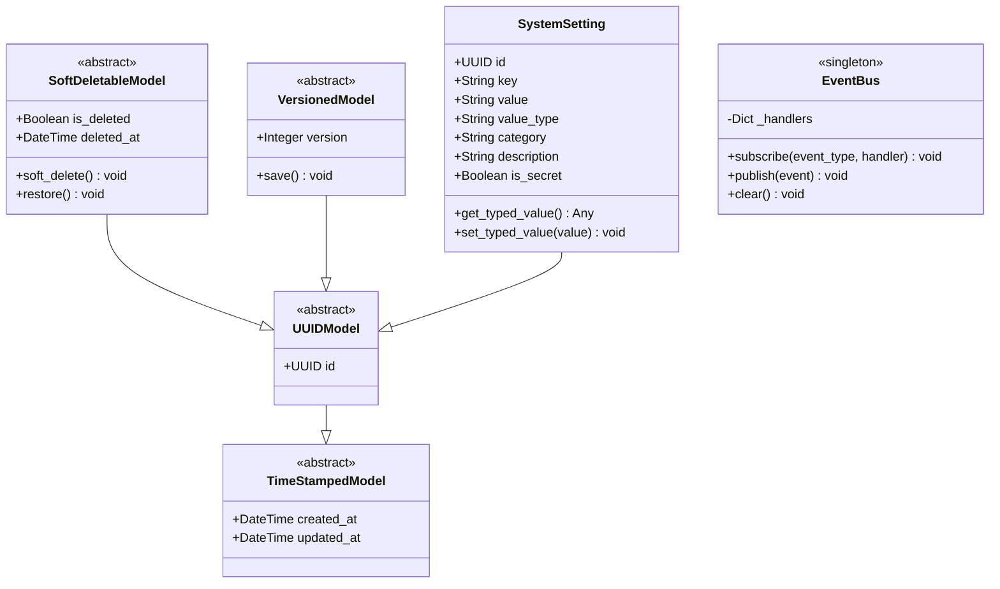

---

## 2. Identity Context

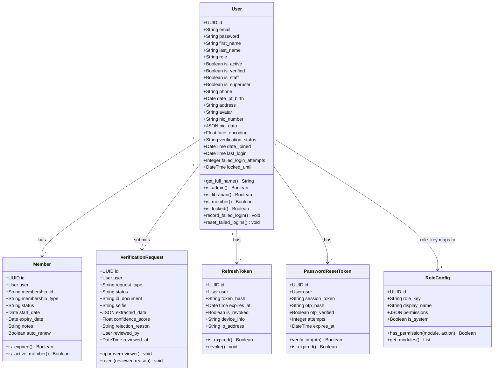

---

## 3. Catalog Context

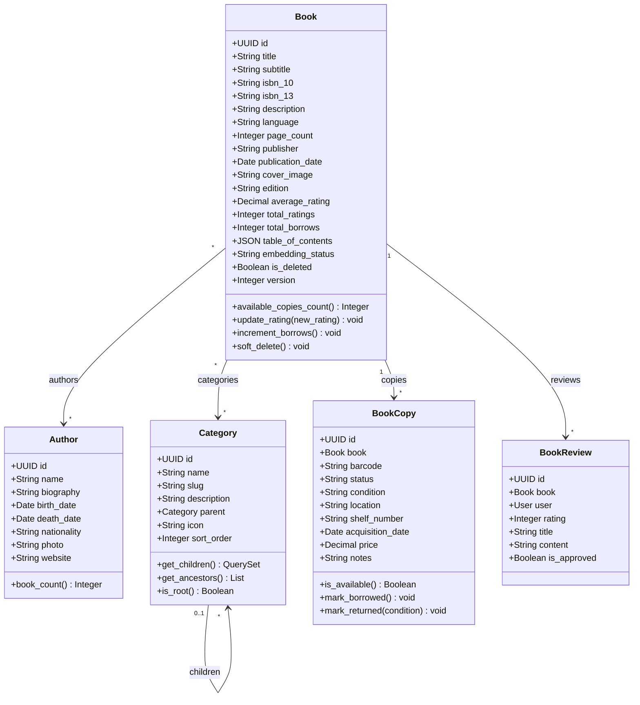

---

## 4. Circulation Context

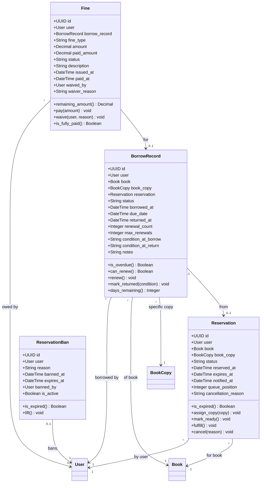

---

## 5. Digital Content Context

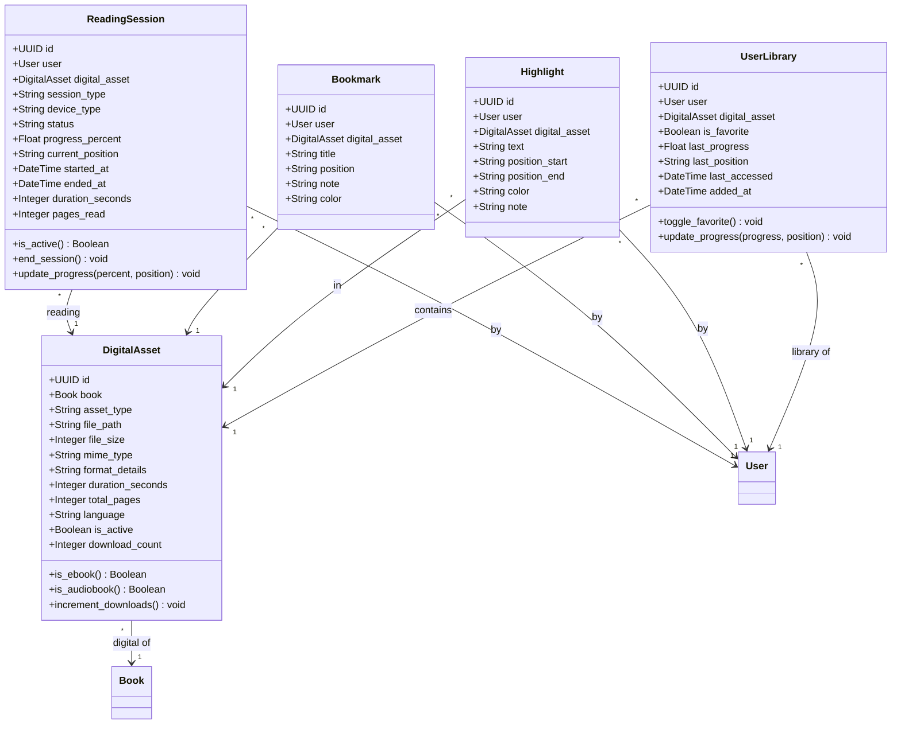

---

## 6. Engagement Context

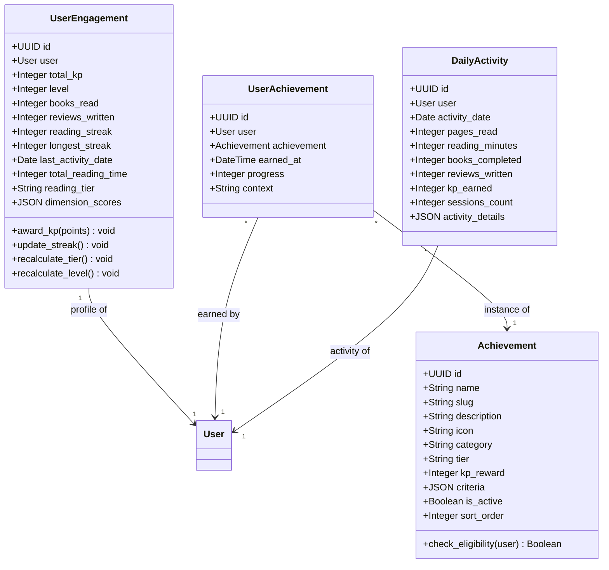

---

## 7. Intelligence Context

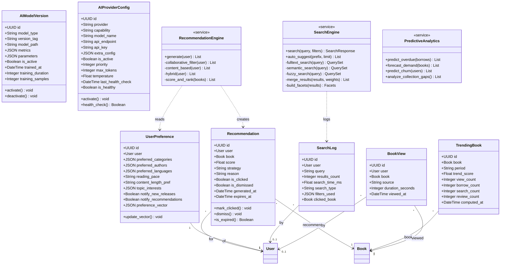

---

## 8. Governance Context

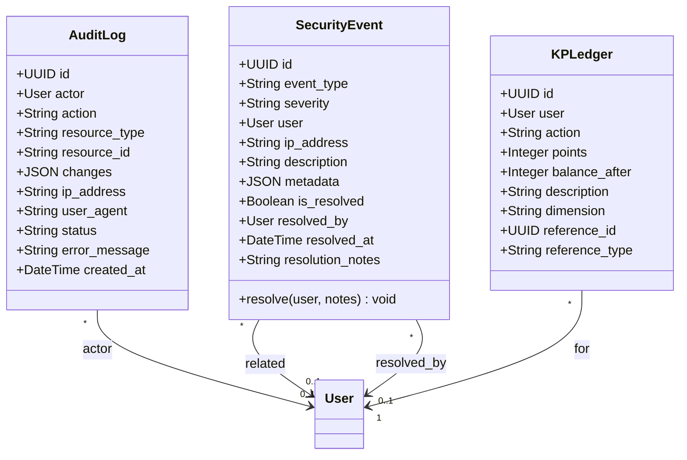

---

## 9. Asset Management Context

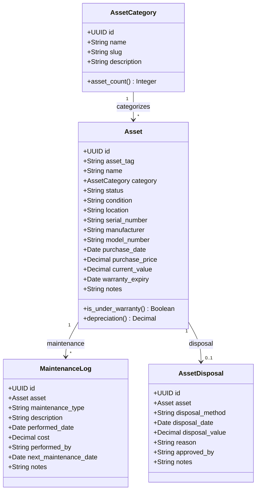

---

## 10. HR Context

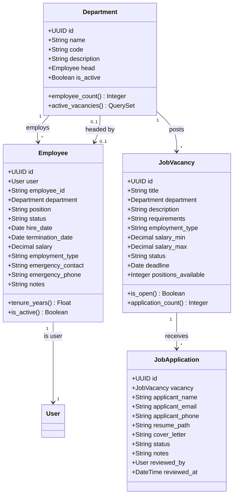

---

## 11. Inheritance Hierarchy

```mermaid
classDiagram
    class Model {
        <<Django>>
    }

    class AbstractBaseUser {
        <<Django>>
    }

    class TimeStampedModel {
        <<abstract>>
    }

    class UUIDModel {
        <<abstract>>
    }

    class SoftDeletableModel {
        <<abstract>>
    }

    class VersionedModel {
        <<abstract>>
    }

    Model <|-- TimeStampedModel
    TimeStampedModel <|-- UUIDModel
    UUIDModel <|-- SoftDeletableModel
    UUIDModel <|-- VersionedModel
    AbstractBaseUser <|-- User

    SoftDeletableModel <|-- Book
    SoftDeletableModel <|-- Member

    VersionedModel <|-- BookReview

    UUIDModel <|-- Author
    UUIDModel <|-- Category
    UUIDModel <|-- BookCopy
    UUIDModel <|-- BorrowRecord
    UUIDModel <|-- Reservation
    UUIDModel <|-- Fine
    UUIDModel <|-- DigitalAsset
    UUIDModel <|-- ReadingSession
    UUIDModel <|-- Bookmark
    UUIDModel <|-- Highlight
    UUIDModel <|-- UserLibrary
    UUIDModel <|-- UserEngagement
    UUIDModel <|-- Achievement
    UUIDModel <|-- UserAchievement
    UUIDModel <|-- DailyActivity
    UUIDModel <|-- Recommendation
    UUIDModel <|-- UserPreference
    UUIDModel <|-- AIModelVersion
    UUIDModel <|-- AIProviderConfig
    UUIDModel <|-- TrendingBook
    UUIDModel <|-- Asset
    UUIDModel <|-- AssetCategory
    UUIDModel <|-- MaintenanceLog
    UUIDModel <|-- AssetDisposal
    UUIDModel <|-- Department
    UUIDModel <|-- Employee
    UUIDModel <|-- JobVacancy
    UUIDModel <|-- JobApplication
```
