# 05 — Sequence Diagrams

> Interaction sequence diagrams for all key system workflows

---

## 1. User Registration Flow

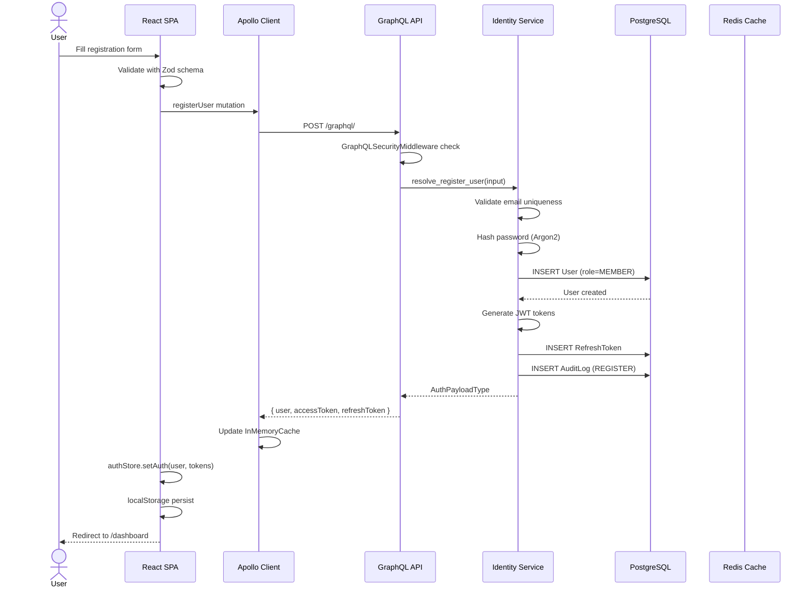
```mermaid
sequenceDiagram
    actor User
    participant SPA as React SPA
    participant Apollo as Apollo Client
    participant GQL as GraphQL API
    participant Auth as Identity Service
    participant DB as PostgreSQL
    participant Redis as Redis Cache

    User->>SPA: Fill registration form
    SPA->>SPA: Validate with Zod schema
    SPA->>Apollo: registerUser mutation
    Apollo->>GQL: POST /graphql/
    GQL->>GQL: GraphQLSecurityMiddleware check
    GQL->>Auth: resolve_register_user(input)
    Auth->>Auth: Validate email uniqueness
    Auth->>Auth: Hash password (Argon2)
    Auth->>DB: INSERT User (role=MEMBER)
    DB-->>Auth: User created
    Auth->>Auth: Generate JWT tokens
    Auth->>DB: INSERT RefreshToken
    Auth->>DB: INSERT AuditLog (REGISTER)
    Auth-->>GQL: AuthPayloadType
    GQL-->>Apollo: { user, accessToken, refreshToken }
    Apollo->>Apollo: Update InMemoryCache
    SPA->>SPA: authStore.setAuth(user, tokens)
    SPA->>SPA: localStorage persist
    SPA-->>User: Redirect to /dashboard
```

---

## 2. User Login Flow

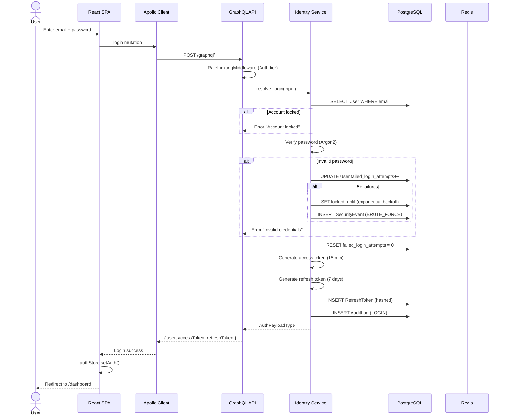
```mermaid
sequenceDiagram
    actor User
    participant SPA as React SPA
    participant Apollo as Apollo Client
    participant GQL as GraphQL API
    participant Auth as Identity Service
    participant DB as PostgreSQL
    participant Redis as Redis

    User->>SPA: Enter email + password
    SPA->>Apollo: login mutation
    Apollo->>GQL: POST /graphql/
    GQL->>GQL: RateLimitingMiddleware (Auth tier)
    GQL->>Auth: resolve_login(input)
    Auth->>DB: SELECT User WHERE email
    alt Account locked
        Auth-->>GQL: Error "Account locked"
    end
    Auth->>Auth: Verify password (Argon2)
    alt Invalid password
        Auth->>DB: UPDATE User failed_login_attempts++
        alt 5+ failures
            Auth->>DB: SET locked_until (exponential backoff)
            Auth->>DB: INSERT SecurityEvent (BRUTE_FORCE)
        end
        Auth-->>GQL: Error "Invalid credentials"
    end
    Auth->>DB: RESET failed_login_attempts = 0
    Auth->>Auth: Generate access token (15 min)
    Auth->>Auth: Generate refresh token (7 days)
    Auth->>DB: INSERT RefreshToken (hashed)
    Auth->>DB: INSERT AuditLog (LOGIN)
    Auth-->>GQL: AuthPayloadType
    GQL-->>Apollo: { user, accessToken, refreshToken }
    Apollo-->>SPA: Login success
    SPA->>SPA: authStore.setAuth()
    SPA-->>User: Redirect to /dashboard
```

---

## 3. JWT Token Refresh Flow

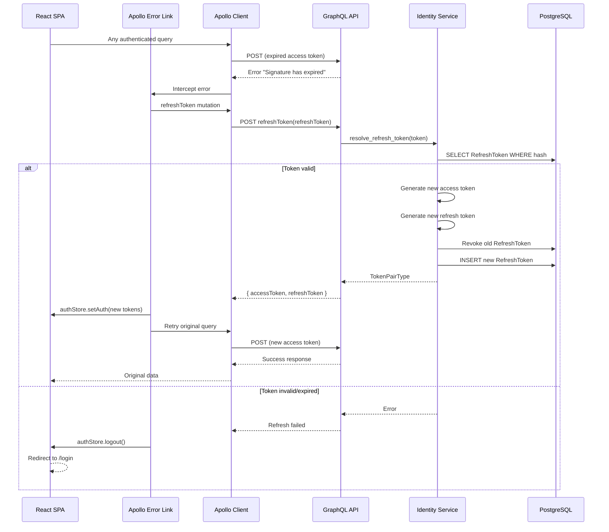
```mermaid
sequenceDiagram
    participant SPA as React SPA
    participant ErrorLink as Apollo Error Link
    participant Apollo as Apollo Client
    participant GQL as GraphQL API
    participant Auth as Identity Service
    participant DB as PostgreSQL

    SPA->>Apollo: Any authenticated query
    Apollo->>GQL: POST (expired access token)
    GQL-->>Apollo: Error "Signature has expired"
    Apollo->>ErrorLink: Intercept error
    ErrorLink->>Apollo: refreshToken mutation
    Apollo->>GQL: POST refreshToken(refreshToken)
    GQL->>Auth: resolve_refresh_token(token)
    Auth->>DB: SELECT RefreshToken WHERE hash
    alt Token valid
        Auth->>Auth: Generate new access token
        Auth->>Auth: Generate new refresh token
        Auth->>DB: Revoke old RefreshToken
        Auth->>DB: INSERT new RefreshToken
        Auth-->>GQL: TokenPairType
        GQL-->>Apollo: { accessToken, refreshToken }
        ErrorLink->>SPA: authStore.setAuth(new tokens)
        ErrorLink->>Apollo: Retry original query
        Apollo->>GQL: POST (new access token)
        GQL-->>Apollo: Success response
        Apollo-->>SPA: Original data
    else Token invalid/expired
        Auth-->>GQL: Error
        GQL-->>Apollo: Refresh failed
        ErrorLink->>SPA: authStore.logout()
        SPA-->>SPA: Redirect to /login
    end
```

---

## 4. Password Reset Flow (3-Step OTP)

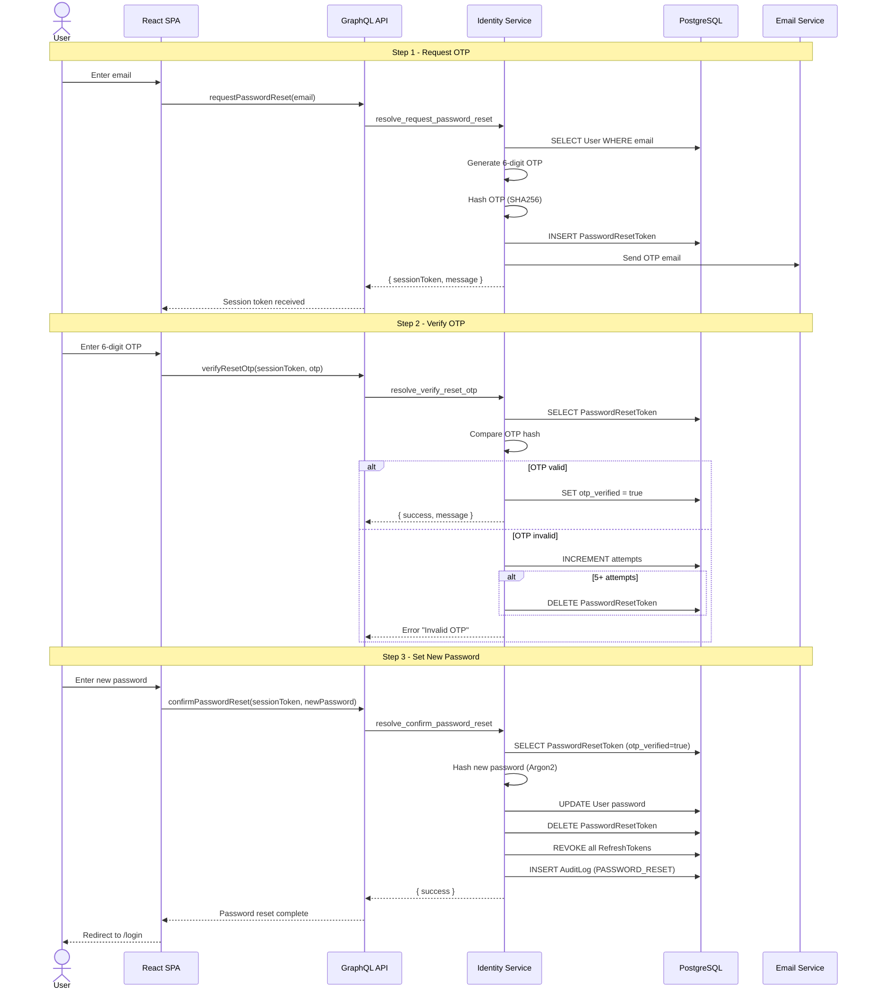
```mermaid
sequenceDiagram
    actor User
    participant SPA as React SPA
    participant GQL as GraphQL API
    participant Auth as Identity Service
    participant DB as PostgreSQL
    participant Email as Email Service

    Note over User,Email: Step 1 - Request OTP
    User->>SPA: Enter email
    SPA->>GQL: requestPasswordReset(email)
    GQL->>Auth: resolve_request_password_reset
    Auth->>DB: SELECT User WHERE email
    Auth->>Auth: Generate 6-digit OTP
    Auth->>Auth: Hash OTP (SHA256)
    Auth->>DB: INSERT PasswordResetToken
    Auth->>Email: Send OTP email
    Auth-->>GQL: { sessionToken, message }
    GQL-->>SPA: Session token received

    Note over User,Email: Step 2 - Verify OTP
    User->>SPA: Enter 6-digit OTP
    SPA->>GQL: verifyResetOtp(sessionToken, otp)
    GQL->>Auth: resolve_verify_reset_otp
    Auth->>DB: SELECT PasswordResetToken
    Auth->>Auth: Compare OTP hash
    alt OTP valid
        Auth->>DB: SET otp_verified = true
        Auth-->>GQL: { success, message }
    else OTP invalid
        Auth->>DB: INCREMENT attempts
        alt 5+ attempts
            Auth->>DB: DELETE PasswordResetToken
        end
        Auth-->>GQL: Error "Invalid OTP"
    end

    Note over User,Email: Step 3 - Set New Password
    User->>SPA: Enter new password
    SPA->>GQL: confirmPasswordReset(sessionToken, newPassword)
    GQL->>Auth: resolve_confirm_password_reset
    Auth->>DB: SELECT PasswordResetToken (otp_verified=true)
    Auth->>Auth: Hash new password (Argon2)
    Auth->>DB: UPDATE User password
    Auth->>DB: DELETE PasswordResetToken
    Auth->>DB: REVOKE all RefreshTokens
    Auth->>DB: INSERT AuditLog (PASSWORD_RESET)
    Auth-->>GQL: { success }
    GQL-->>SPA: Password reset complete
    SPA-->>User: Redirect to /login
```

---

## 5. Book Reservation and Borrow Flow

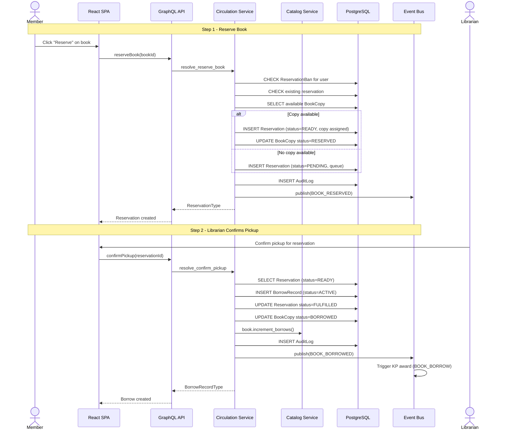
```mermaid
sequenceDiagram
    actor Member
    participant SPA as React SPA
    participant GQL as GraphQL API
    participant Circ as Circulation Service
    participant Cat as Catalog Service
    participant DB as PostgreSQL
    participant Events as Event Bus

    Note over Member,Events: Step 1 - Reserve Book
    Member->>SPA: Click "Reserve" on book
    SPA->>GQL: reserveBook(bookId)
    GQL->>Circ: resolve_reserve_book
    Circ->>DB: CHECK ReservationBan for user
    Circ->>DB: CHECK existing reservation
    Circ->>DB: SELECT available BookCopy
    alt Copy available
        Circ->>DB: INSERT Reservation (status=READY, copy assigned)
        Circ->>DB: UPDATE BookCopy status=RESERVED
    else No copy available
        Circ->>DB: INSERT Reservation (status=PENDING, queue)
    end
    Circ->>DB: INSERT AuditLog
    Circ->>Events: publish(BOOK_RESERVED)
    Circ-->>GQL: ReservationType
    GQL-->>SPA: Reservation created

    Note over Member,Events: Step 2 - Librarian Confirms Pickup
    actor Librarian
    Librarian->>SPA: Confirm pickup for reservation
    SPA->>GQL: confirmPickup(reservationId)
    GQL->>Circ: resolve_confirm_pickup
    Circ->>DB: SELECT Reservation (status=READY)
    Circ->>DB: INSERT BorrowRecord (status=ACTIVE)
    Circ->>DB: UPDATE Reservation status=FULFILLED
    Circ->>DB: UPDATE BookCopy status=BORROWED
    Circ->>Cat: book.increment_borrows()
    Circ->>DB: INSERT AuditLog
    Circ->>Events: publish(BOOK_BORROWED)
    Events->>Events: Trigger KP award (BOOK_BORROW)
    Circ-->>GQL: BorrowRecordType
    GQL-->>SPA: Borrow created
```

---

## 6. Book Return Flow

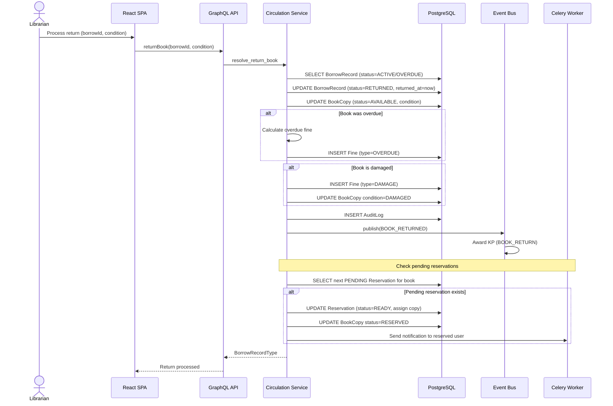
```mermaid
sequenceDiagram
    actor Librarian
    participant SPA as React SPA
    participant GQL as GraphQL API
    participant Circ as Circulation Service
    participant DB as PostgreSQL
    participant Events as Event Bus
    participant Celery as Celery Worker

    Librarian->>SPA: Process return (borrowId, condition)
    SPA->>GQL: returnBook(borrowId, condition)
    GQL->>Circ: resolve_return_book
    Circ->>DB: SELECT BorrowRecord (status=ACTIVE/OVERDUE)
    Circ->>DB: UPDATE BorrowRecord (status=RETURNED, returned_at=now)
    Circ->>DB: UPDATE BookCopy (status=AVAILABLE, condition)
    alt Book was overdue
        Circ->>Circ: Calculate overdue fine
        Circ->>DB: INSERT Fine (type=OVERDUE)
    end
    alt Book is damaged
        Circ->>DB: INSERT Fine (type=DAMAGE)
        Circ->>DB: UPDATE BookCopy condition=DAMAGED
    end
    Circ->>DB: INSERT AuditLog
    Circ->>Events: publish(BOOK_RETURNED)
    Events->>Events: Award KP (BOOK_RETURN)

    Note over Circ,Celery: Check pending reservations
    Circ->>DB: SELECT next PENDING Reservation for book
    alt Pending reservation exists
        Circ->>DB: UPDATE Reservation (status=READY, assign copy)
        Circ->>DB: UPDATE BookCopy status=RESERVED
        Circ->>Celery: Send notification to reserved user
    end

    Circ-->>GQL: BorrowRecordType
    GQL-->>SPA: Return processed
```

---

## 7. Hybrid Search Flow

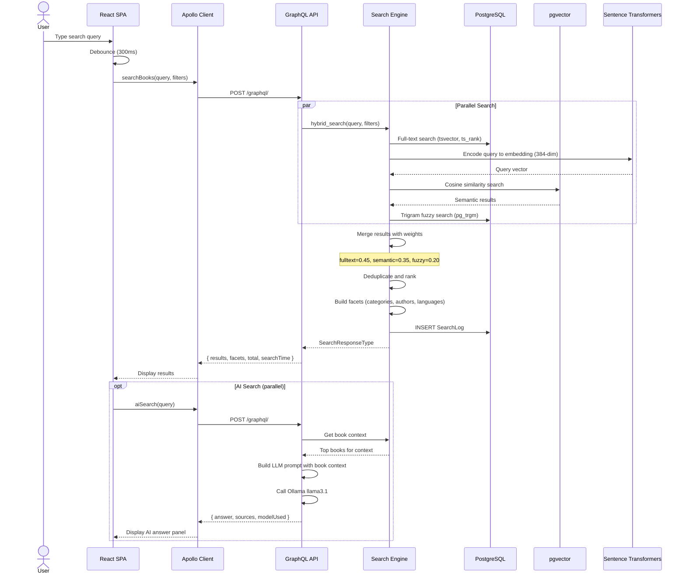
```mermaid
sequenceDiagram
    actor User
    participant SPA as React SPA
    participant Apollo as Apollo Client
    participant GQL as GraphQL API
    participant Search as Search Engine
    participant DB as PostgreSQL
    participant PGVector as pgvector
    participant ST as Sentence Transformers

    User->>SPA: Type search query
    SPA->>SPA: Debounce (300ms)
    SPA->>Apollo: searchBooks(query, filters)
    Apollo->>GQL: POST /graphql/

    par Parallel Search
        GQL->>Search: hybrid_search(query, filters)
        Search->>DB: Full-text search (tsvector, ts_rank)
        Search->>ST: Encode query to embedding (384-dim)
        ST-->>Search: Query vector
        Search->>PGVector: Cosine similarity search
        PGVector-->>Search: Semantic results
        Search->>DB: Trigram fuzzy search (pg_trgm)
    end

    Search->>Search: Merge results with weights
    Note over Search: fulltext=0.45, semantic=0.35, fuzzy=0.20
    Search->>Search: Deduplicate and rank
    Search->>Search: Build facets (categories, authors, languages)
    Search->>DB: INSERT SearchLog
    Search-->>GQL: SearchResponseType

    GQL-->>Apollo: { results, facets, total, searchTime }
    Apollo-->>SPA: Display results

    opt AI Search (parallel)
        SPA->>Apollo: aiSearch(query)
        Apollo->>GQL: POST /graphql/
        GQL->>Search: Get book context
        Search-->>GQL: Top books for context
        GQL->>GQL: Build LLM prompt with book context
        GQL->>GQL: Call Ollama llama3.1
        GQL-->>Apollo: { answer, sources, modelUsed }
        Apollo-->>SPA: Display AI answer panel
    end
```

---

## 8. AI-Powered Search (LLM) Flow

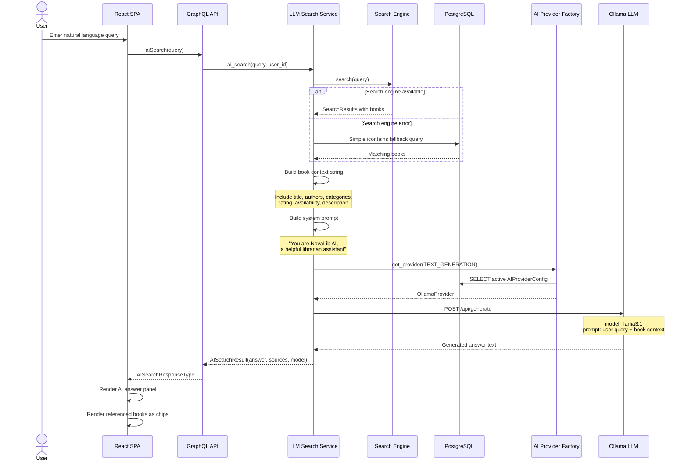
```mermaid
sequenceDiagram
    actor User
    participant SPA as React SPA
    participant GQL as GraphQL API
    participant LLMSearch as LLM Search Service
    participant Search as Search Engine
    participant DB as PostgreSQL
    participant Factory as AI Provider Factory
    participant Ollama as Ollama LLM

    User->>SPA: Enter natural language query
    SPA->>GQL: aiSearch(query)
    GQL->>LLMSearch: ai_search(query, user_id)

    LLMSearch->>Search: search(query)
    alt Search engine available
        Search-->>LLMSearch: SearchResults with books
    else Search engine error
        LLMSearch->>DB: Simple icontains fallback query
        DB-->>LLMSearch: Matching books
    end

    LLMSearch->>LLMSearch: Build book context string
    Note over LLMSearch: Include title, authors, categories,<br/>rating, availability, description

    LLMSearch->>LLMSearch: Build system prompt
    Note over LLMSearch: "You are NovaLib AI,<br/>a helpful librarian assistant"

    LLMSearch->>Factory: get_provider(TEXT_GENERATION)
    Factory->>DB: SELECT active AIProviderConfig
    Factory-->>LLMSearch: OllamaProvider

    LLMSearch->>Ollama: POST /api/generate
    Note over Ollama: model: llama3.1<br/>prompt: user query + book context
    Ollama-->>LLMSearch: Generated answer text

    LLMSearch-->>GQL: AISearchResult(answer, sources, model)
    GQL-->>SPA: AISearchResponseType
    SPA->>SPA: Render AI answer panel
    SPA->>SPA: Render referenced books as chips
```

---

## 9. Recommendation Generation Flow

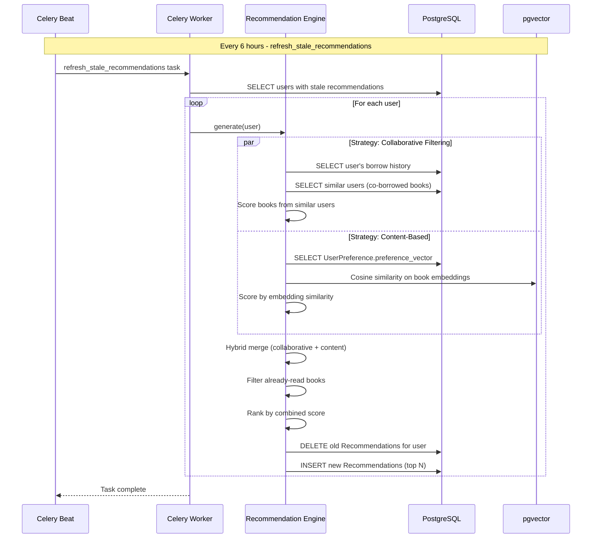
```mermaid
sequenceDiagram
    participant Beat as Celery Beat
    participant Worker as Celery Worker
    participant RecEngine as Recommendation Engine
    participant DB as PostgreSQL
    participant PGVector as pgvector

    Note over Beat,PGVector: Every 6 hours - refresh_stale_recommendations

    Beat->>Worker: refresh_stale_recommendations task
    Worker->>DB: SELECT users with stale recommendations
    loop For each user
        Worker->>RecEngine: generate(user)

        par Strategy: Collaborative Filtering
            RecEngine->>DB: SELECT user's borrow history
            RecEngine->>DB: SELECT similar users (co-borrowed books)
            RecEngine->>RecEngine: Score books from similar users
        and Strategy: Content-Based
            RecEngine->>DB: SELECT UserPreference.preference_vector
            RecEngine->>PGVector: Cosine similarity on book embeddings
            RecEngine->>RecEngine: Score by embedding similarity
        end

        RecEngine->>RecEngine: Hybrid merge (collaborative + content)
        RecEngine->>RecEngine: Filter already-read books
        RecEngine->>RecEngine: Rank by combined score
        RecEngine->>DB: DELETE old Recommendations for user
        RecEngine->>DB: INSERT new Recommendations (top N)
    end

    Worker-->>Beat: Task complete
```

---

## 10. Overdue Detection Flow

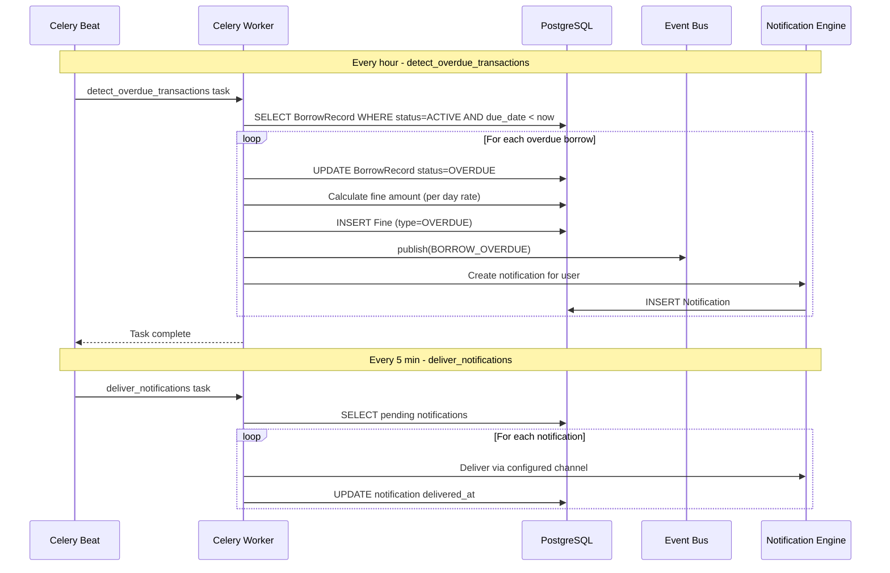
```mermaid
sequenceDiagram
    participant Beat as Celery Beat
    participant Worker as Celery Worker
    participant DB as PostgreSQL
    participant Events as Event Bus
    participant Notify as Notification Engine

    Note over Beat,Notify: Every hour - detect_overdue_transactions

    Beat->>Worker: detect_overdue_transactions task
    Worker->>DB: SELECT BorrowRecord WHERE status=ACTIVE AND due_date < now
    loop For each overdue borrow
        Worker->>DB: UPDATE BorrowRecord status=OVERDUE
        Worker->>DB: Calculate fine amount (per day rate)
        Worker->>DB: INSERT Fine (type=OVERDUE)
        Worker->>Events: publish(BORROW_OVERDUE)
        Worker->>Notify: Create notification for user
        Notify->>DB: INSERT Notification
    end
    Worker-->>Beat: Task complete

    Note over Beat,Notify: Every 5 min - deliver_notifications
    Beat->>Worker: deliver_notifications task
    Worker->>DB: SELECT pending notifications
    loop For each notification
        Worker->>Notify: Deliver via configured channel
        Worker->>DB: UPDATE notification delivered_at
    end
```

---

## 11. NIC Verification Flow

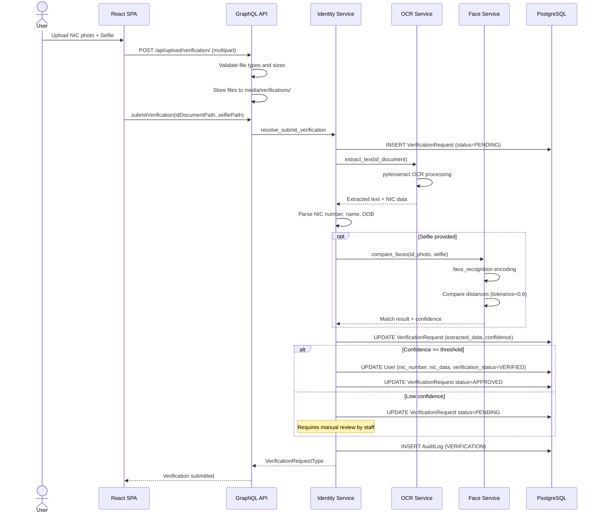
```mermaid
sequenceDiagram
    actor User
    participant SPA as React SPA
    participant GQL as GraphQL API
    participant Auth as Identity Service
    participant OCR as OCR Service
    participant Face as Face Service
    participant DB as PostgreSQL

    User->>SPA: Upload NIC photo + Selfie
    SPA->>GQL: POST /api/upload/verification/ (multipart)
    GQL->>GQL: Validate file types and sizes
    GQL->>GQL: Store files to media/verifications/

    SPA->>GQL: submitVerification(idDocumentPath, selfiePath)
    GQL->>Auth: resolve_submit_verification
    Auth->>DB: INSERT VerificationRequest (status=PENDING)

    Auth->>OCR: extract_text(id_document)
    OCR->>OCR: pytesseract OCR processing
    OCR-->>Auth: Extracted text + NIC data

    Auth->>Auth: Parse NIC number, name, DOB

    opt Selfie provided
        Auth->>Face: compare_faces(id_photo, selfie)
        Face->>Face: face_recognition encoding
        Face->>Face: Compare distances (tolerance=0.6)
        Face-->>Auth: Match result + confidence
    end

    Auth->>DB: UPDATE VerificationRequest (extracted_data, confidence)
    alt Confidence >= threshold
        Auth->>DB: UPDATE User (nic_number, nic_data, verification_status=VERIFIED)
        Auth->>DB: UPDATE VerificationRequest status=APPROVED
    else Low confidence
        Auth->>DB: UPDATE VerificationRequest status=PENDING
        Note over Auth: Requires manual review by staff
    end

    Auth->>DB: INSERT AuditLog (VERIFICATION)
    Auth-->>GQL: VerificationRequestType
    GQL-->>SPA: Verification submitted
```

---

## 12. Digital Content Reading Flow

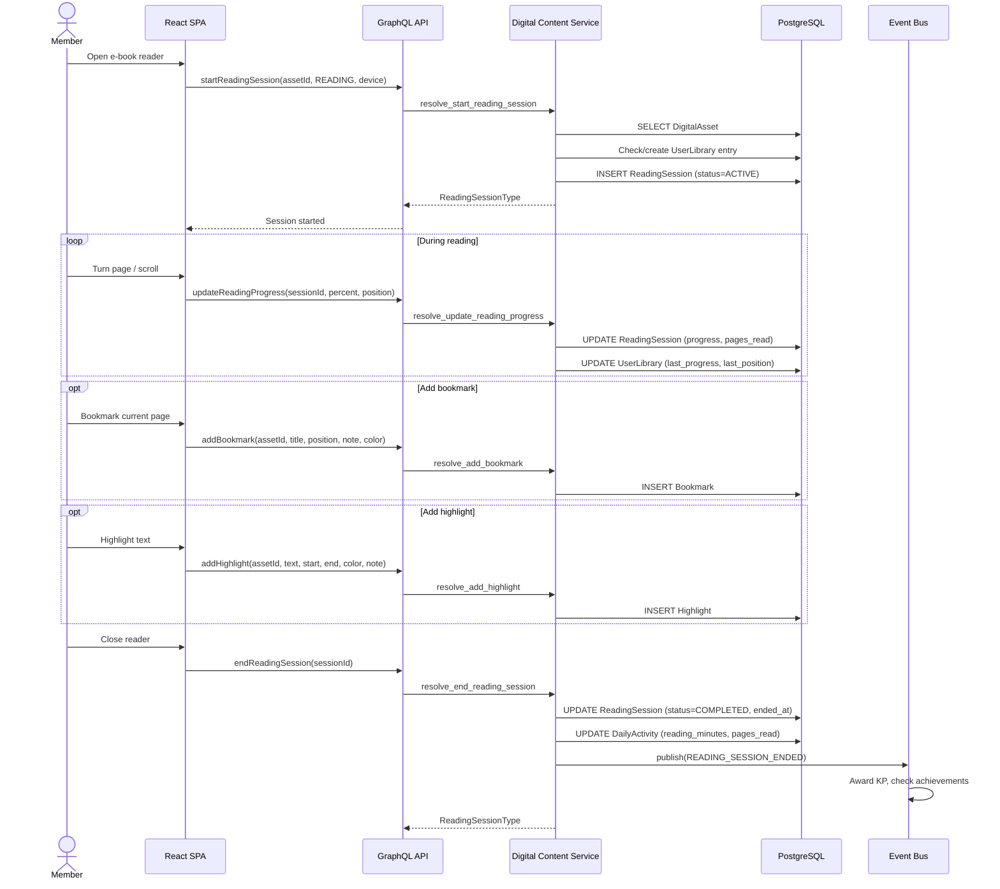
```mermaid
sequenceDiagram
    actor Member
    participant SPA as React SPA
    participant GQL as GraphQL API
    participant Digital as Digital Content Service
    participant DB as PostgreSQL
    participant Events as Event Bus

    Member->>SPA: Open e-book reader
    SPA->>GQL: startReadingSession(assetId, READING, device)
    GQL->>Digital: resolve_start_reading_session
    Digital->>DB: SELECT DigitalAsset
    Digital->>DB: Check/create UserLibrary entry
    Digital->>DB: INSERT ReadingSession (status=ACTIVE)
    Digital-->>GQL: ReadingSessionType
    GQL-->>SPA: Session started

    loop During reading
        Member->>SPA: Turn page / scroll
        SPA->>GQL: updateReadingProgress(sessionId, percent, position)
        GQL->>Digital: resolve_update_reading_progress
        Digital->>DB: UPDATE ReadingSession (progress, pages_read)
        Digital->>DB: UPDATE UserLibrary (last_progress, last_position)
    end

    opt Add bookmark
        Member->>SPA: Bookmark current page
        SPA->>GQL: addBookmark(assetId, title, position, note, color)
        GQL->>Digital: resolve_add_bookmark
        Digital->>DB: INSERT Bookmark
    end

    opt Add highlight
        Member->>SPA: Highlight text
        SPA->>GQL: addHighlight(assetId, text, start, end, color, note)
        GQL->>Digital: resolve_add_highlight
        Digital->>DB: INSERT Highlight
    end

    Member->>SPA: Close reader
    SPA->>GQL: endReadingSession(sessionId)
    GQL->>Digital: resolve_end_reading_session
    Digital->>DB: UPDATE ReadingSession (status=COMPLETED, ended_at)
    Digital->>DB: UPDATE DailyActivity (reading_minutes, pages_read)
    Digital->>Events: publish(READING_SESSION_ENDED)
    Events->>Events: Award KP, check achievements
    Digital-->>GQL: ReadingSessionType
```

---

## 13. GraphQL Request Lifecycle

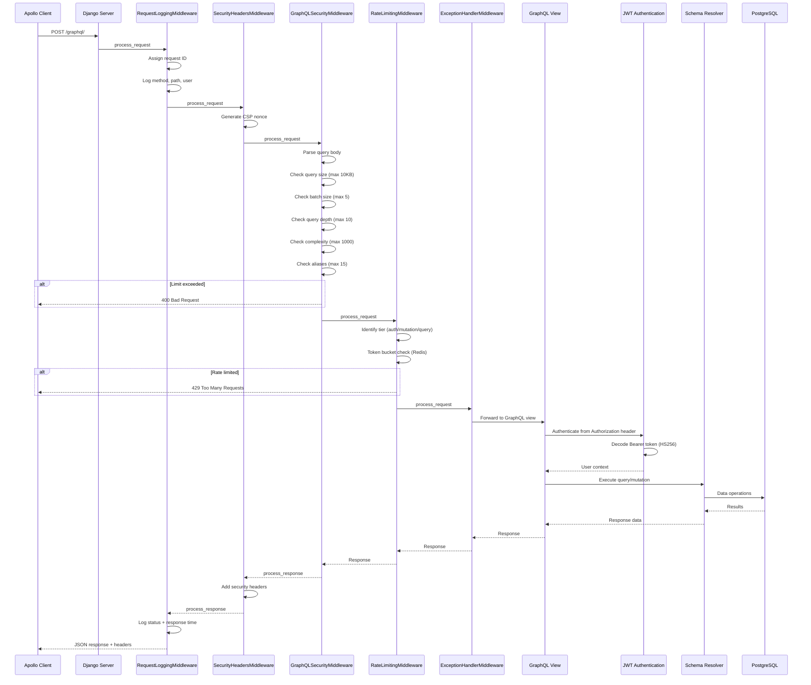
```mermaid
sequenceDiagram
    participant Client as Apollo Client
    participant Django as Django Server
    participant ReqLog as RequestLoggingMiddleware
    participant SecHead as SecurityHeadersMiddleware
    participant GQLSec as GraphQLSecurityMiddleware
    participant RateLimit as RateLimitingMiddleware
    participant ExcHandler as ExceptionHandlerMiddleware
    participant GraphQL as GraphQL View
    participant JWT as JWT Authentication
    participant Resolver as Schema Resolver
    participant DB as PostgreSQL

    Client->>Django: POST /graphql/
    Django->>ReqLog: process_request
    ReqLog->>ReqLog: Assign request ID
    ReqLog->>ReqLog: Log method, path, user

    ReqLog->>SecHead: process_request
    SecHead->>SecHead: Generate CSP nonce

    SecHead->>GQLSec: process_request
    GQLSec->>GQLSec: Parse query body
    GQLSec->>GQLSec: Check query size (max 10KB)
    GQLSec->>GQLSec: Check batch size (max 5)
    GQLSec->>GQLSec: Check query depth (max 10)
    GQLSec->>GQLSec: Check complexity (max 1000)
    GQLSec->>GQLSec: Check aliases (max 15)
    alt Limit exceeded
        GQLSec-->>Client: 400 Bad Request
    end

    GQLSec->>RateLimit: process_request
    RateLimit->>RateLimit: Identify tier (auth/mutation/query)
    RateLimit->>RateLimit: Token bucket check (Redis)
    alt Rate limited
        RateLimit-->>Client: 429 Too Many Requests
    end

    RateLimit->>ExcHandler: process_request
    ExcHandler->>GraphQL: Forward to GraphQL view

    GraphQL->>JWT: Authenticate from Authorization header
    JWT->>JWT: Decode Bearer token (HS256)
    JWT-->>GraphQL: User context

    GraphQL->>Resolver: Execute query/mutation
    Resolver->>DB: Data operations
    DB-->>Resolver: Results
    Resolver-->>GraphQL: Response data

    GraphQL-->>ExcHandler: Response
    ExcHandler-->>RateLimit: Response
    RateLimit-->>GQLSec: Response
    GQLSec-->>SecHead: process_response
    SecHead->>SecHead: Add security headers
    SecHead-->>ReqLog: process_response
    ReqLog->>ReqLog: Log status + response time
    ReqLog-->>Client: JSON response + headers
```

---

## 14. Knowledge Points Award Flow

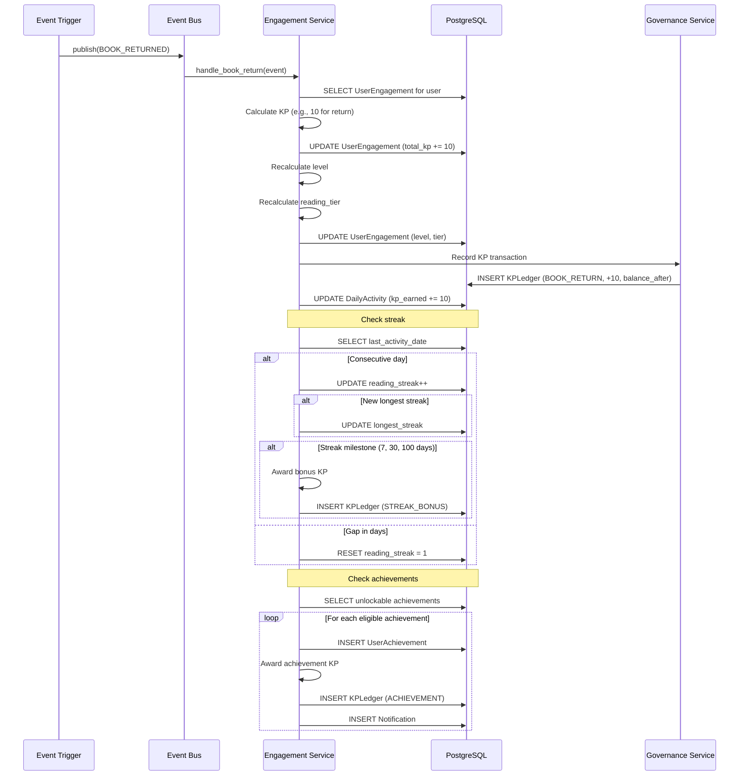
```mermaid
sequenceDiagram
    participant Trigger as Event Trigger
    participant Events as Event Bus
    participant Eng as Engagement Service
    participant DB as PostgreSQL
    participant Gov as Governance Service

    Trigger->>Events: publish(BOOK_RETURNED)
    Events->>Eng: handle_book_return(event)

    Eng->>DB: SELECT UserEngagement for user
    Eng->>Eng: Calculate KP (e.g., 10 for return)
    Eng->>DB: UPDATE UserEngagement (total_kp += 10)
    Eng->>Eng: Recalculate level
    Eng->>Eng: Recalculate reading_tier
    Eng->>DB: UPDATE UserEngagement (level, tier)

    Eng->>Gov: Record KP transaction
    Gov->>DB: INSERT KPLedger (BOOK_RETURN, +10, balance_after)

    Eng->>DB: UPDATE DailyActivity (kp_earned += 10)

    Note over Eng,DB: Check streak
    Eng->>DB: SELECT last_activity_date
    alt Consecutive day
        Eng->>DB: UPDATE reading_streak++
        alt New longest streak
            Eng->>DB: UPDATE longest_streak
        end
        alt Streak milestone (7, 30, 100 days)
            Eng->>Eng: Award bonus KP
            Eng->>DB: INSERT KPLedger (STREAK_BONUS)
        end
    else Gap in days
        Eng->>DB: RESET reading_streak = 1
    end

    Note over Eng,DB: Check achievements
    Eng->>DB: SELECT unlockable achievements
    loop For each eligible achievement
        Eng->>DB: INSERT UserAchievement
        Eng->>Eng: Award achievement KP
        Eng->>DB: INSERT KPLedger (ACHIEVEMENT)
        Eng->>DB: INSERT Notification
    end
```
