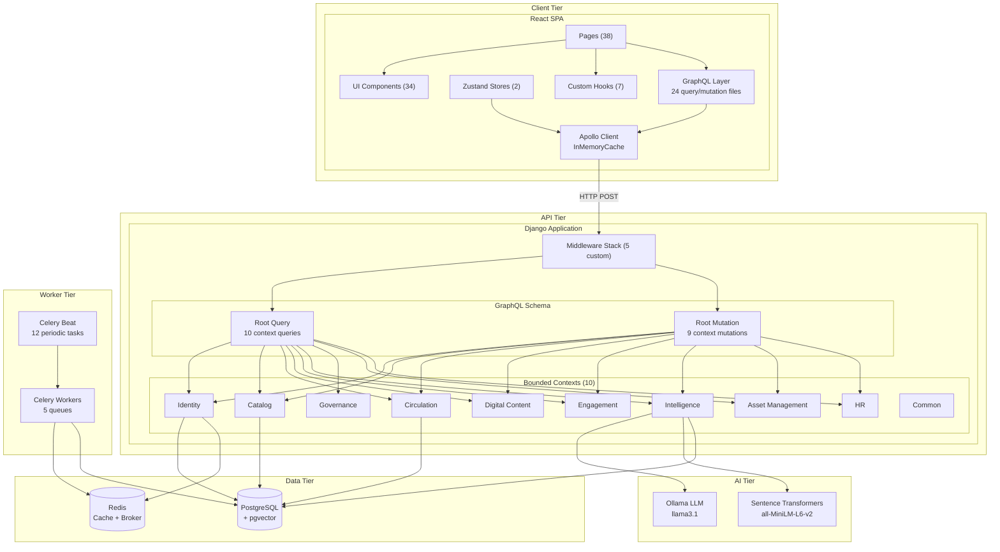
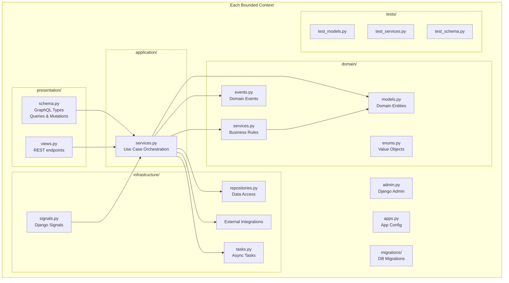
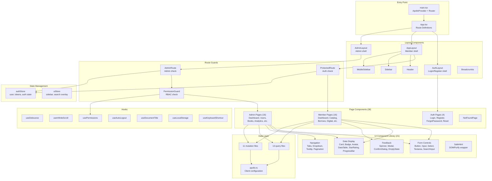
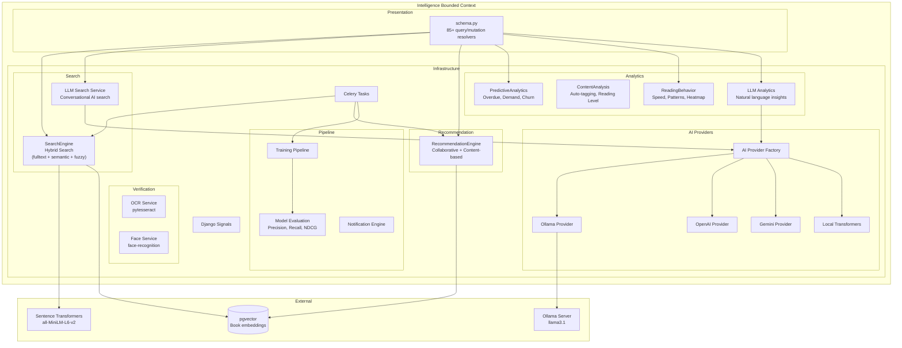
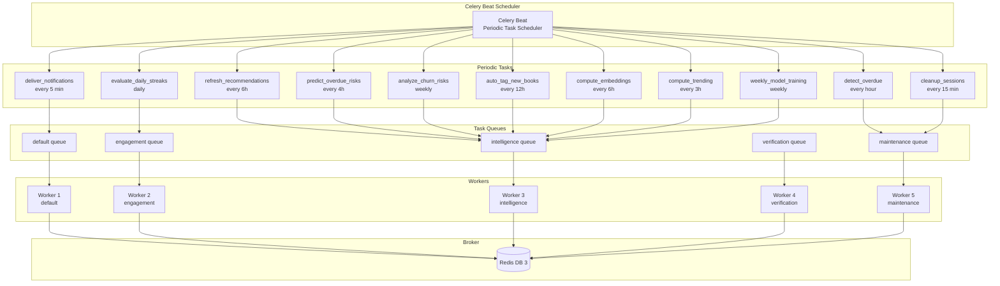
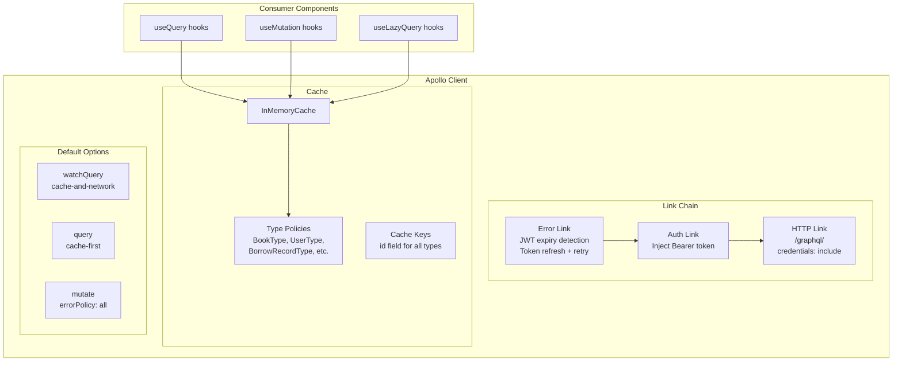
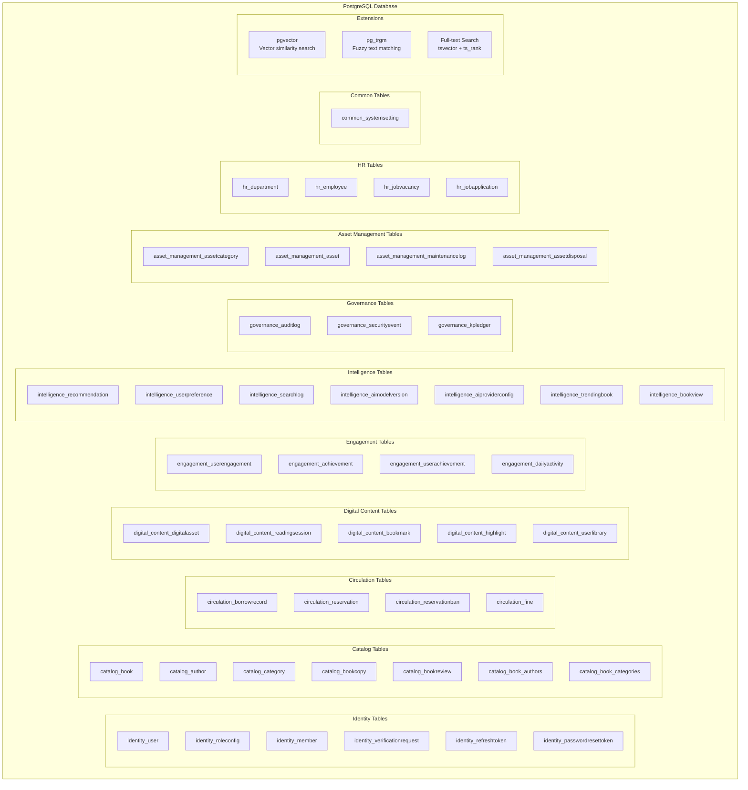

# 06 — Component Diagrams

> Backend and frontend component architecture diagrams showing module boundaries, dependencies, and communication patterns

---

## 1. Full System Component Overview

---

## 2. Backend — Bounded Context Internal Structure

---

## 3. Frontend — Component Architecture

---

## 4. Middleware Pipeline Component

```mermaid
graph LR
    Request["HTTP Request"] --> MW1

    subgraph "Django Middleware Stack"
        MW1["SecurityMiddleware<br/>(Django built-in)"]
        MW2["CorsMiddleware<br/>(django-cors-headers)"]
        MW3["SessionMiddleware"]
        MW4["CommonMiddleware"]
        MW5["CsrfViewMiddleware"]
        MW6["AuthenticationMiddleware"]
        MW7["MessageMiddleware"]
        MW8["XFrameOptionsMiddleware"]
        MW9["RequestLoggingMiddleware<br/>(custom)"]
        MW10["SecurityHeadersMiddleware<br/>(custom)"]
        MW11["GraphQLSecurityMiddleware<br/>(custom)"]
        MW12["RateLimitingMiddleware<br/>(custom)"]
        MW13["ExceptionHandlerMiddleware<br/>(custom)"]
    end

    MW1 --> MW2 --> MW3 --> MW4 --> MW5 --> MW6 --> MW7 --> MW8 --> MW9 --> MW10 --> MW11 --> MW12 --> MW13

    MW13 --> View["GraphQL View<br/>/ REST View"]
    View --> Response["HTTP Response"]
```

---

## 5. Intelligence Module — AI/ML Components

---

## 6. Celery Task Queue Components

---

## 7. Apollo Client Component Architecture

---

## 8. Database Component Layout

