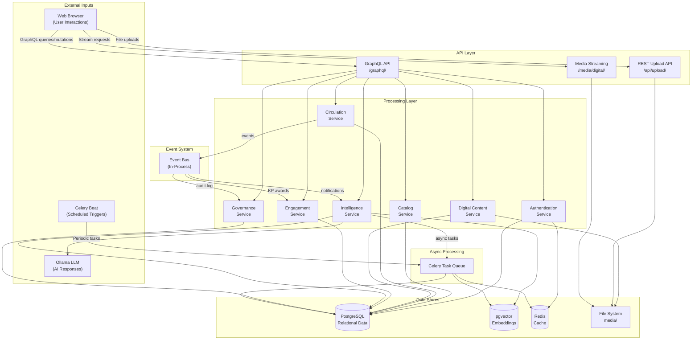
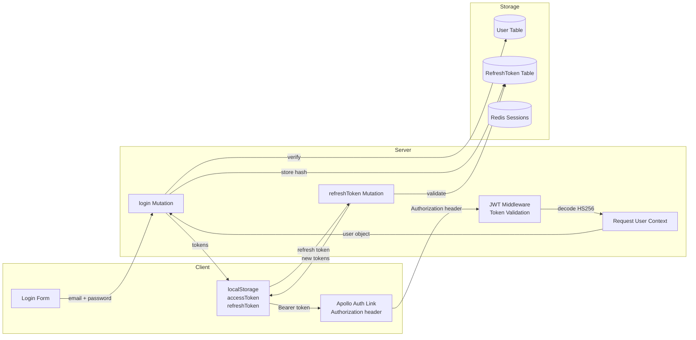
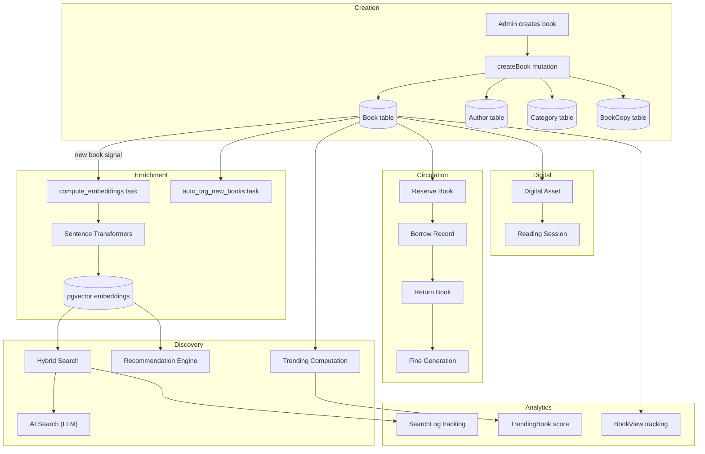
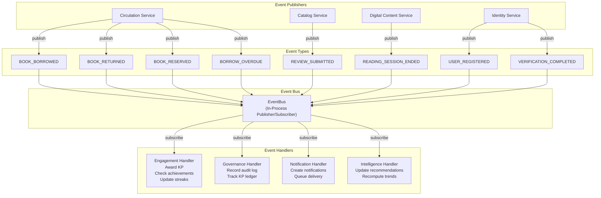
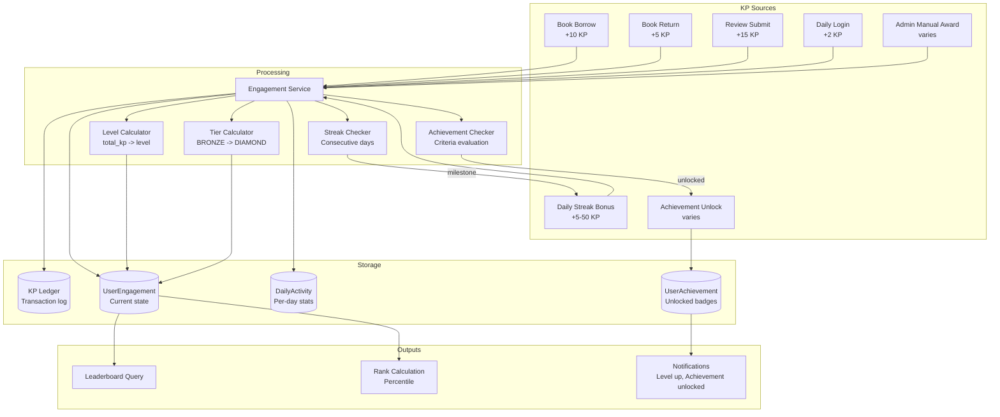
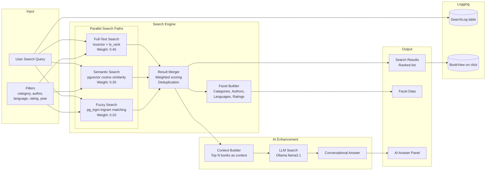
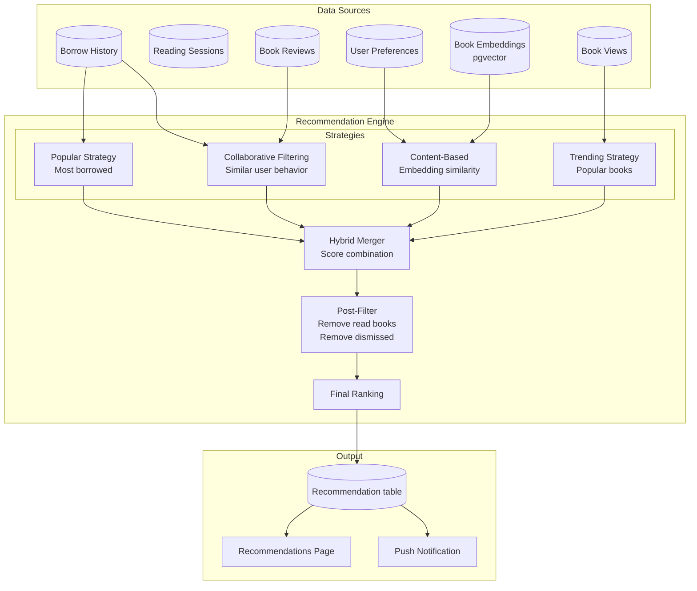
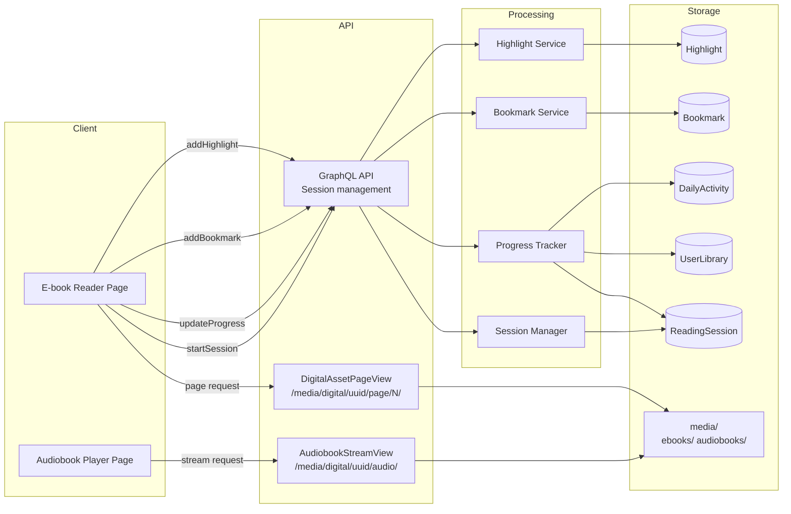
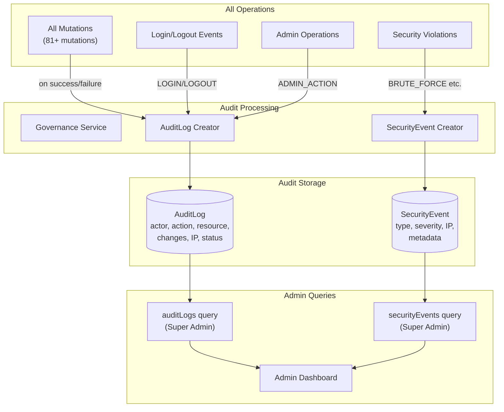

# 07 — Data Flow Diagrams

> System-wide data flow patterns, event bus communication, and integration points

---

## 1. High-Level System Data Flow

---

## 2. Authentication Data Flow

---

## 3. Book Lifecycle Data Flow

---

## 4. Event Bus Communication Flow

---

## 5. Knowledge Points (KP) Data Flow

---

## 6. Search Data Flow

---

## 7. Recommendation Data Flow

---

## 8. Digital Content Streaming Data Flow

---

## 9. Audit Trail Data Flow

