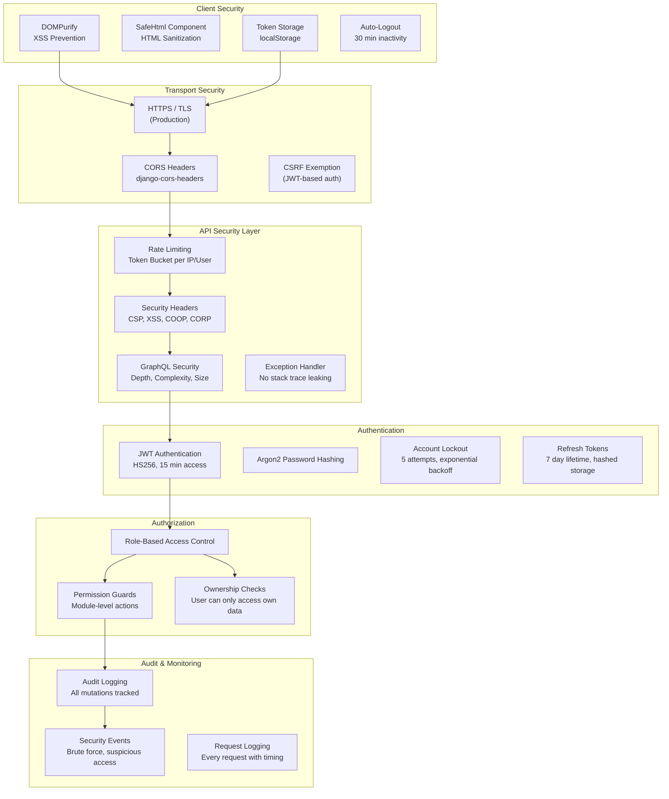
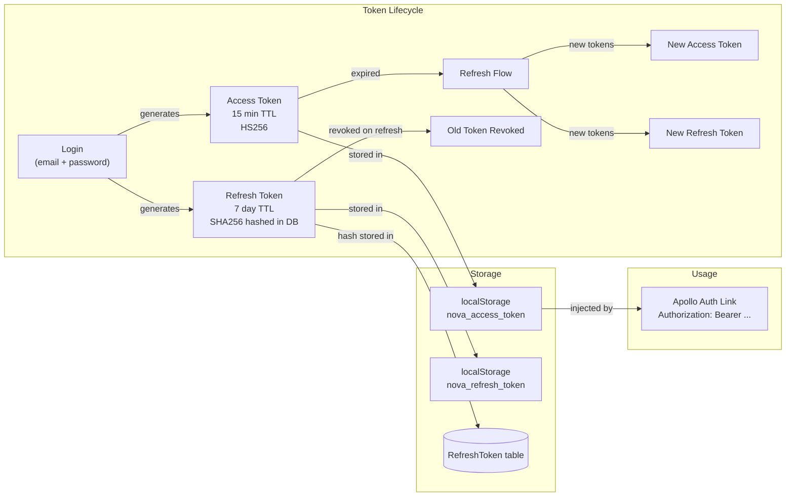
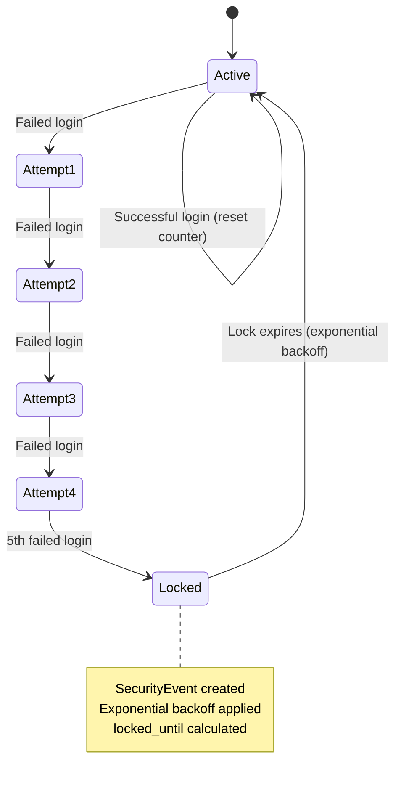
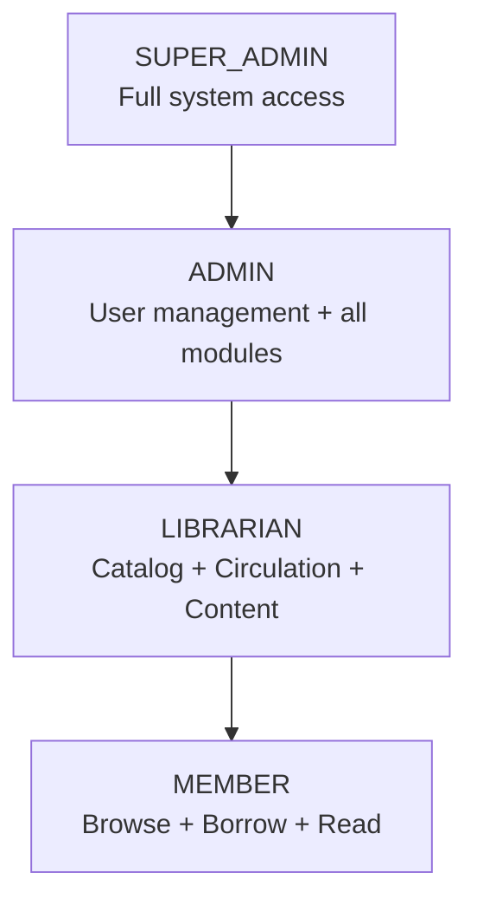
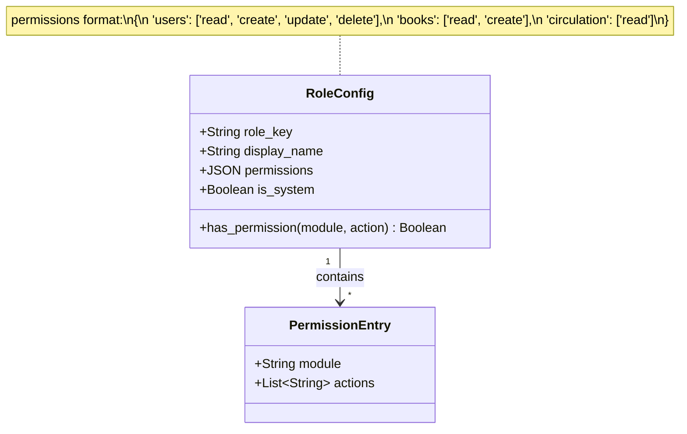
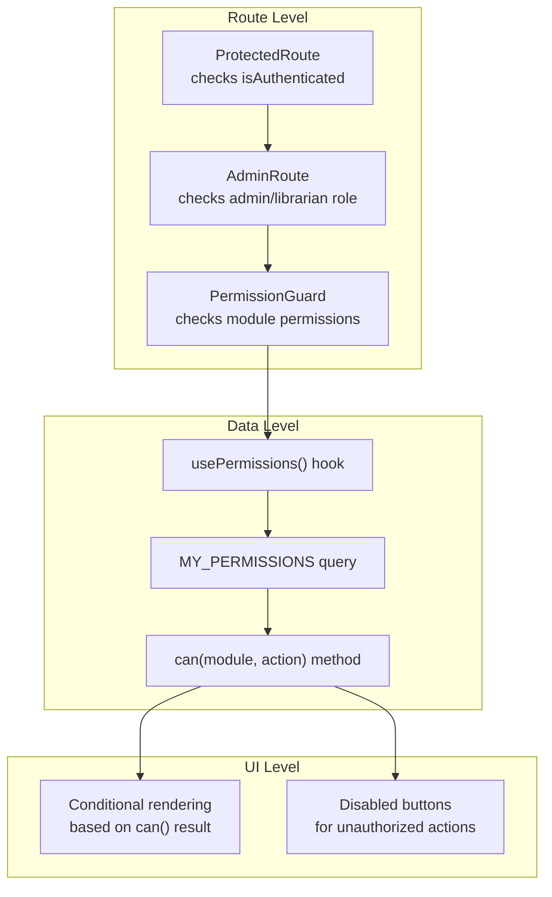
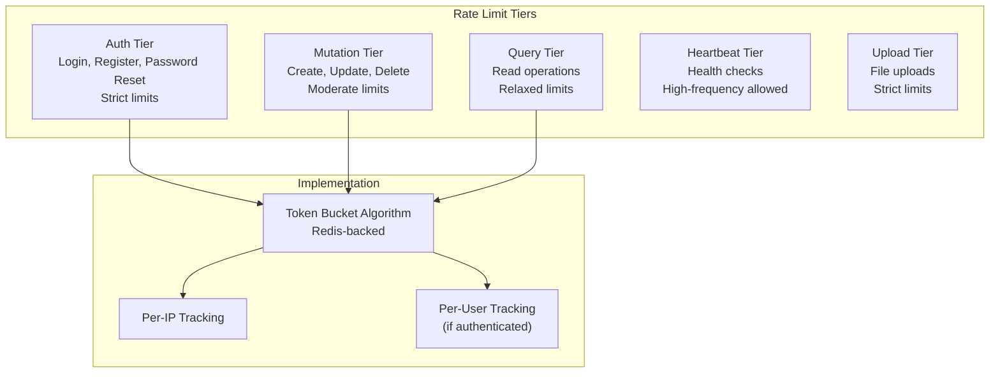
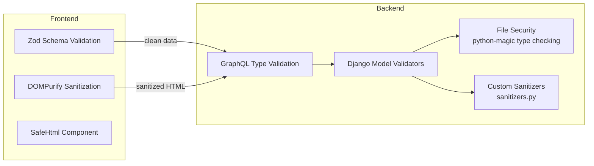
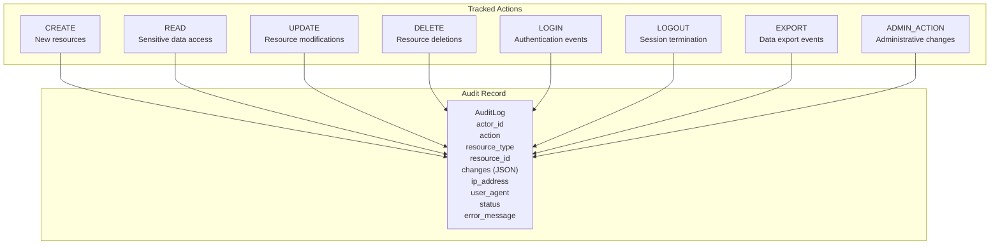
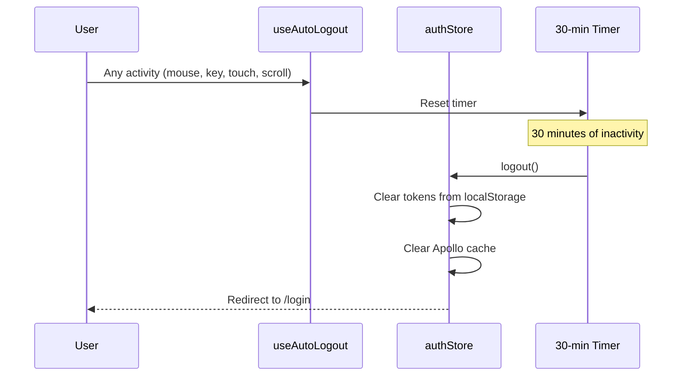

# 09 — Security Architecture

> Authentication, authorization, RBAC, middleware pipeline, security headers, rate limiting, and threat mitigation

---

## 1. Security Architecture Overview



---

## 2. Authentication Flow

### 2.1 JWT Token Architecture



### 2.2 Password Security

| Feature | Implementation |
|---------|---------------|
| **Hashing Algorithm** | Argon2 (primary), PBKDF2 (fallback) |
| **Minimum Length** | 10 characters |
| **Django Validators** | `UserAttributeSimilarityValidator`, `MinimumLengthValidator`, `CommonPasswordValidator`, `NumericPasswordValidator` |
| **Failed Login Tracking** | `failed_login_attempts` counter on User model |
| **Account Lockout** | After 5 failures, exponential backoff (`locked_until`) |
| **Password Reset** | 3-step OTP flow (request → verify → confirm) |
| **OTP Security** | SHA256 hashed, 5 attempt limit, time-limited expiry |

### 2.3 Account Lockout Mechanism



---

## 3. Authorization — RBAC System

### 3.1 Role Hierarchy



### 3.2 Permission Model



### 3.3 Permission Modules

| Module | Actions | Description |
|--------|---------|-------------|
| `users` | read, create, update, delete | User management |
| `books` | read, create, update, delete | Book catalog |
| `authors` | read, create, update, delete | Author management |
| `circulation` | read, create, update, delete | Borrow/return/fines |
| `digital_content` | read, create, update, delete | E-books/audiobooks |
| `analytics` | read | Analytics dashboards |
| `ai` | read, create, update, delete | AI configuration |
| `audit` | read | Audit log access |
| `assets` | read, create, update, delete | Physical assets |
| `employees` | read, create, update, delete | HR management |
| `roles` | read, create, update, delete | RBAC configuration |
| `members` | read, create, update, delete | Library members |
| `settings` | read, update | System settings |

### 3.4 Frontend Permission Enforcement



---

## 4. Middleware Security Pipeline

### 4.1 GraphQL Security Middleware

| Check | Limit | Purpose |
|-------|-------|---------|
| **Query Size** | 10,240 bytes | Prevent resource exhaustion |
| **Batch Size** | 5 operations | Prevent batch attacks |
| **Query Depth** | 10 levels | Prevent deep nesting attacks |
| **Query Complexity** | 1,000 points | Prevent expensive queries |
| **Aliases** | 15 max | Prevent alias-based amplification |
| **Introspection** | Disabled in production | Hide schema from attackers |

**Field Cost Configuration:**
| Field | Cost |
|-------|------|
| Default field | 1 |
| `searchBooks` | 10 |
| `semanticSearch` | 15 |
| `books` (paginated) | 5 |
| `users` (paginated) | 5 |
| `allBorrows` (paginated) | 5 |

### 4.2 Rate Limiting



### 4.3 Security Headers

| Header | Value | Purpose |
|--------|-------|---------|
| `X-Content-Type-Options` | `nosniff` | Prevent MIME type sniffing |
| `X-XSS-Protection` | `1; mode=block` | XSS filter |
| `Referrer-Policy` | `strict-origin-when-cross-origin` | Limit referrer information |
| `Permissions-Policy` | `camera=(), microphone=(), geolocation=()` | Restrict browser APIs |
| `Content-Security-Policy` | `default-src 'self'; script-src 'self' 'nonce-{random}'` | Prevent code injection |
| `Cross-Origin-Opener-Policy` | `same-origin` | Isolate browsing context |
| `Cross-Origin-Resource-Policy` | `same-origin` | Restrict resource sharing |

---

## 5. Data Security

### 5.1 Input Validation & Sanitization



### 5.2 File Upload Security

| Check | Implementation |
|-------|---------------|
| **File Type Validation** | `python-magic` MIME type detection |
| **File Size Limits** | Configurable per upload type |
| **Path Traversal Prevention** | Django's `FileSystemStorage` |
| **Virus Scanning** | File security module (`file_security.py`) |
| **Storage Isolation** | Separate directories per type (covers, ebooks, verifications) |

### 5.3 Sensitive Data Protection

| Data | Protection |
|------|-----------|
| Passwords | Argon2 hashing (never stored in plaintext) |
| Refresh tokens | SHA256 hashed before DB storage |
| OTP codes | SHA256 hashed |
| API keys (AI providers) | Stored encrypted in `AIProviderConfig` |
| System settings | `is_secret` flag hides values in API |
| Face encodings | Stored as numeric arrays, not images |
| NIC data | JSON with parsed OCR data |

---

## 6. Security Event Tracking

### 6.1 Event Types

| Event Type | Severity | Trigger |
|-----------|----------|---------|
| `BRUTE_FORCE` | HIGH | 5+ failed login attempts |
| `SUSPICIOUS_ACCESS` | MEDIUM | Unusual access patterns |
| `RATE_LIMIT_EXCEEDED` | LOW | Rate limit hit |
| `INVALID_TOKEN` | MEDIUM | Tampered/expired JWT |
| `DATA_BREACH_ATTEMPT` | CRITICAL | Unauthorized data access attempt |

### 6.2 Audit Log Coverage



---

## 7. Exception Handling Security

The `ExceptionHandlerMiddleware` prevents information leakage:

| Exception Type | HTTP Status | Exposed to Client |
|---------------|-------------|-------------------|
| `AuthenticationError` | 401 | Generic auth error message |
| `AuthorizationError` | 403 | "Permission denied" |
| `NotFoundError` | 404 | "Resource not found" |
| `ValidationError` | 400 | Validation details |
| `RateLimitExceeded` | 429 | "Rate limit exceeded" + retry time |
| **Unknown Exception** | 500 | "Internal server error" (NO stack trace) |

---

## 8. Client-Side Security

### 8.1 Auto-Logout



### 8.2 XSS Prevention

| Layer | Tool | Purpose |
|-------|------|---------|
| HTML rendering | `DOMPurify` via `SafeHtml` component | Sanitize all user-generated HTML |
| API responses | GraphQL type system | Prevent injection via typed responses |
| Form inputs | Zod validation + react-hook-form | Validate and sanitize inputs |
| Content Security Policy | CSP header with nonce | Prevent inline script injection |

---

## 9. Security Configuration Summary

```yaml
# JWT
JWT_ACCESS_TOKEN_EXPIRY: 15 minutes
JWT_REFRESH_TOKEN_EXPIRY: 7 days
JWT_ALGORITHM: HS256
JWT_HEADER_PREFIX: Bearer

# Account Security
FAILED_LOGIN_MAX_ATTEMPTS: 5
ACCOUNT_LOCKOUT: Exponential backoff
MIN_PASSWORD_LENGTH: 10

# Rate Limiting
RATE_LIMIT_ENABLED: true (disabled in dev)
RATE_LIMIT_BACKEND: Redis

# GraphQL Security
MAX_QUERY_DEPTH: 10
MAX_QUERY_COMPLEXITY: 1000
MAX_ALIASES: 15
MAX_QUERY_SIZE: 10240 bytes
MAX_BATCH_SIZE: 5

# CORS
CORS_ALLOWED_ORIGINS: [configured per environment]
CORS_ALLOW_CREDENTIALS: true

# Cookies (Production)
SESSION_COOKIE_SECURE: true
CSRF_COOKIE_SECURE: true
SESSION_COOKIE_HTTPONLY: true
```
