# 10 — AI/ML Architecture

> AI/ML pipeline, hybrid search engine, recommendation engine, predictive analytics, LLM integration, and model management

---

## 1. AI/ML System Overview

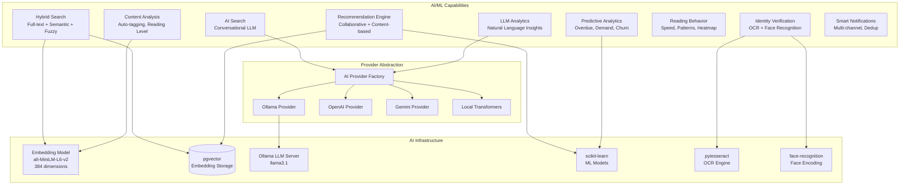

---

## 2. Hybrid Search Engine

### 2.1 Architecture

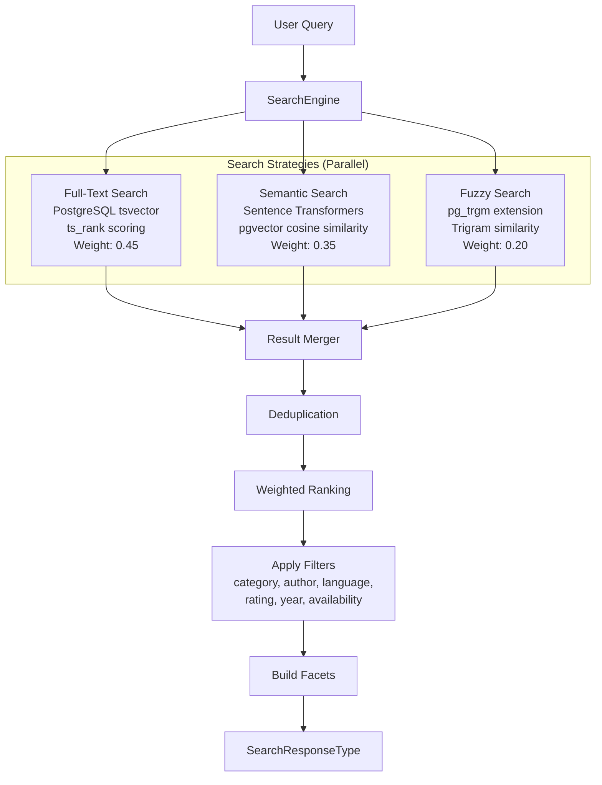

### 2.2 Search Weights Configuration

| Strategy | Weight | Best For |
|----------|--------|----------|
| **Full-text** | 0.45 | Exact keyword matches, title searches |
| **Semantic** | 0.35 | Conceptual similarity, natural language queries |
| **Fuzzy** | 0.20 | Typo tolerance, partial matches |

### 2.3 Embedding Pipeline

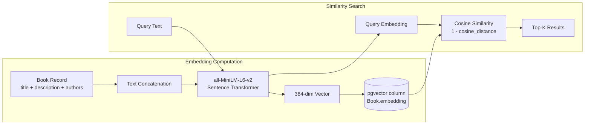

### 2.4 Auto-Suggest

| Feature | Implementation |
|---------|---------------|
| **Prefix matching** | PostgreSQL `LIKE` with index |
| **Popular searches** | SearchLog aggregation |
| **Debouncing** | 300ms client-side debounce |

---

## 3. Recommendation Engine

### 3.1 Strategy Architecture

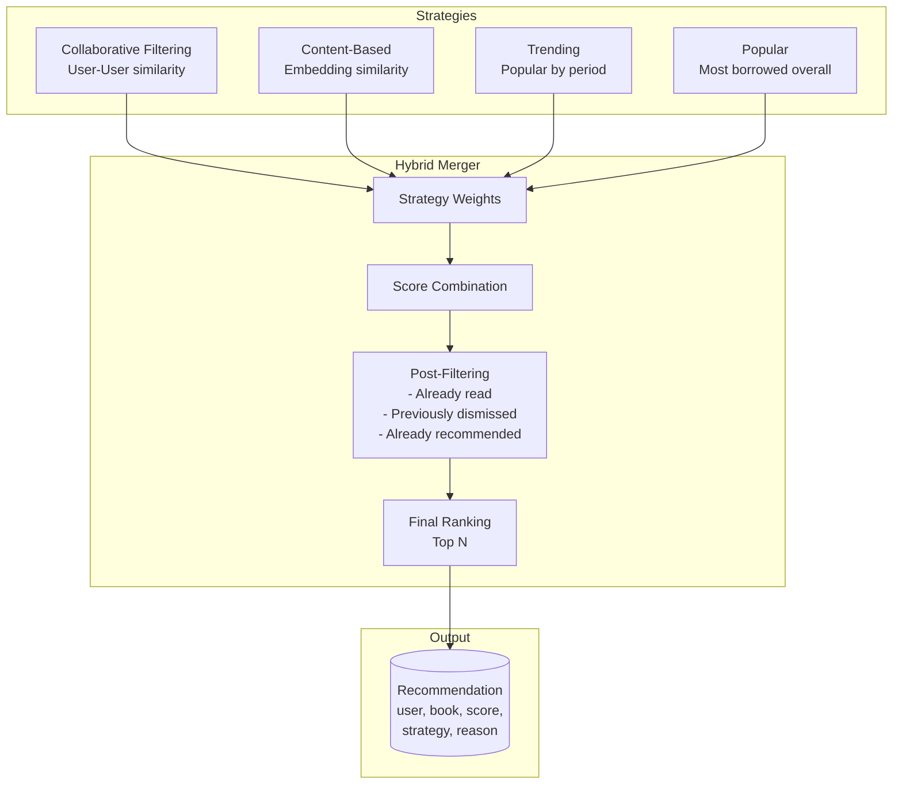

### 3.2 Collaborative Filtering

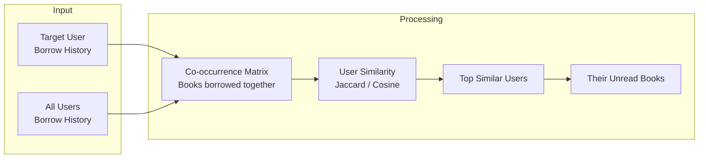

### 3.3 Content-Based Filtering

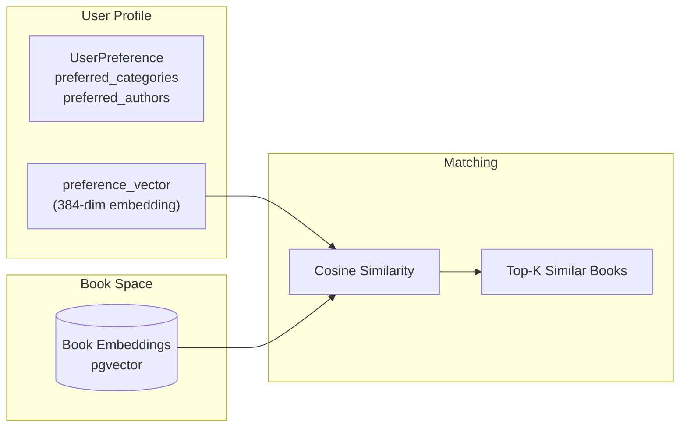

### 3.4 Periodic Refresh Schedule

| Task | Schedule | Description |
|------|----------|-------------|
| `refresh_stale_recommendations` | Every 6 hours | Regenerate recommendations for users with stale data |
| `compute_book_embeddings` | Every 6 hours | Compute embeddings for new/updated books |
| `compute_trending_books` | Every 3 hours | Recompute trending scores |
| `weekly_model_training` | Weekly | Retrain recommendation models |

---

## 4. Predictive Analytics

### 4.1 Overdue Prediction

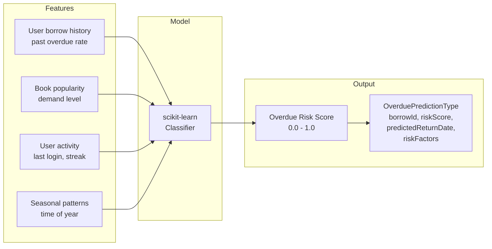

### 4.2 Demand Forecasting

| Feature | Description |
|---------|-------------|
| **Input** | Historical borrow counts, trends, seasonal patterns |
| **Model** | Time series analysis with scikit-learn |
| **Output** | `DemandForecastType` — book, predicted demand, confidence, period |
| **Schedule** | Every 4 hours via Celery |

### 4.3 Churn Prediction

| Feature | Description |
|---------|-------------|
| **Input** | Last activity date, borrow frequency, reading time, engagement |
| **Model** | Classification model (logistic regression / random forest) |
| **Output** | `ChurnPredictionType` — user, churn probability, risk factors, last activity |
| **Schedule** | Weekly via Celery |

### 4.4 Collection Gap Analysis

| Feature | Description |
|---------|-------------|
| **Input** | Search queries with zero results, reservation queues, popular categories |
| **Analysis** | Identifies categories/topics with high demand but low supply |
| **Output** | `CollectionGapType` — category, severity, recommendation |
| **Schedule** | Part of weekly analysis |

---

## 5. LLM Integration

### 5.1 AI Provider Architecture

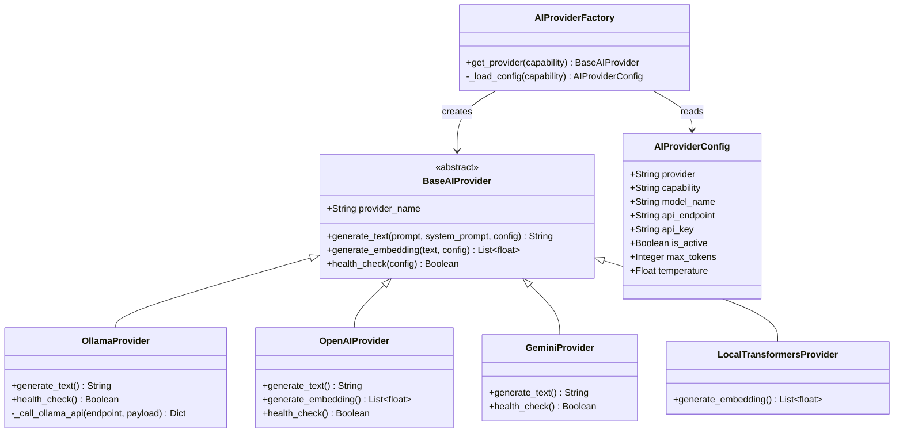

### 5.2 LLM-Powered Search

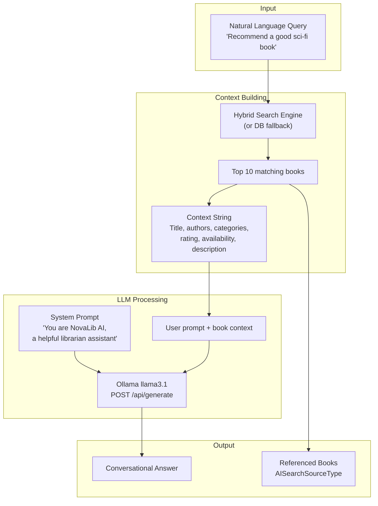

### 5.3 LLM Analytics

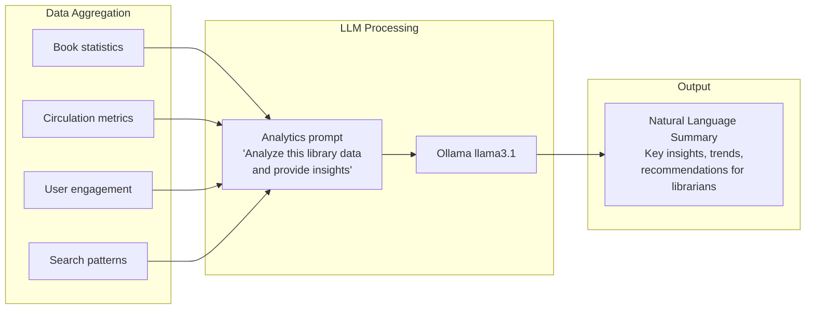

---

## 6. Identity Verification Pipeline

### 6.1 OCR + Face Recognition

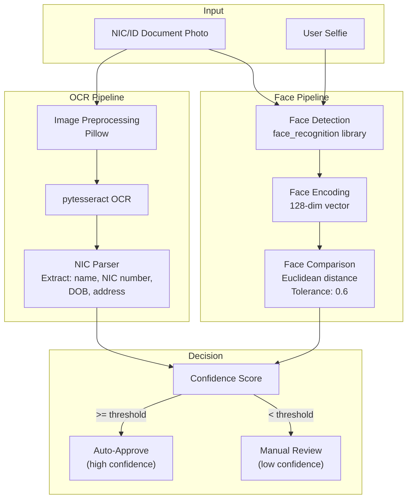

---

## 7. Content Analysis

### 7.1 Auto-Tagging Pipeline

| Step | Description |
|------|-------------|
| 1. Text extraction | Combine title + description + author names |
| 2. NLP processing | NLTK tokenization, stemming, stop-word removal |
| 3. Topic modeling | TF-IDF feature extraction |
| 4. Category suggestion | Match against existing category embeddings |
| 5. Tag assignment | Auto-assign top matching categories |

### 7.2 Reading Level Assessment

| Level | Criteria |
|-------|---------|
| **Beginner** | Short sentences, simple vocabulary, < 200 pages |
| **Intermediate** | Moderate complexity, 200-400 pages |
| **Advanced** | Complex vocabulary, technical content, > 400 pages |

---

## 8. Reading Behavior Analytics

### 8.1 Components

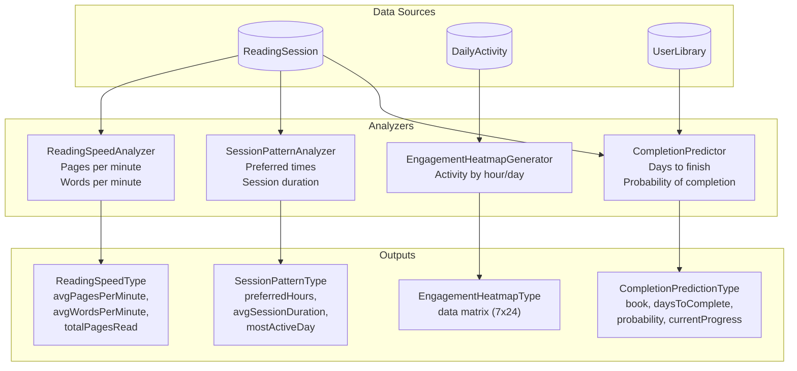

---

## 9. Model Training Pipeline

### 9.1 Training Workflow

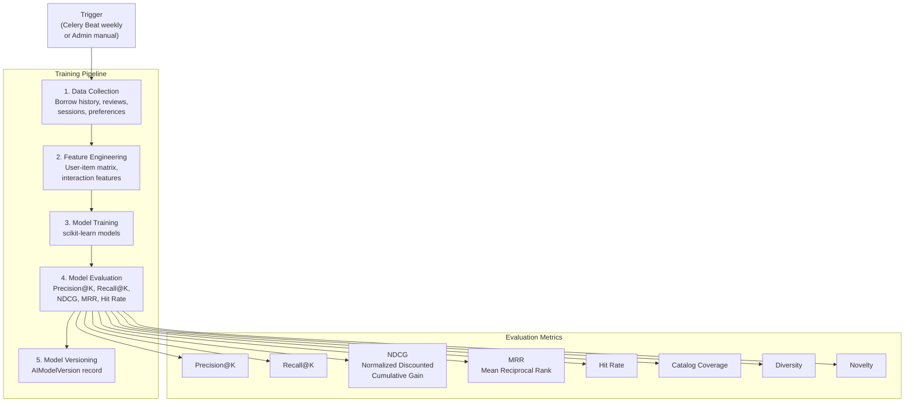

### 9.2 Model Version Management

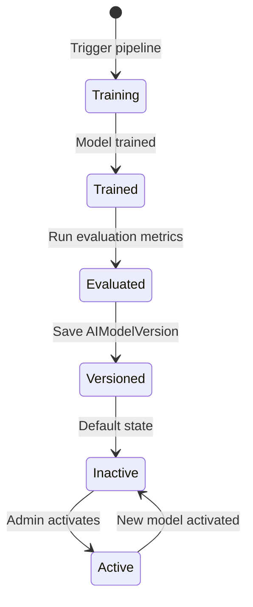

---

## 10. AI Configuration

### 10.1 AIProviderConfig Settings

| Field | Description |
|-------|-------------|
| `provider` | OLLAMA, OPENAI, GEMINI, LOCAL_TRANSFORMERS |
| `capability` | TEXT_GENERATION, EMBEDDING, CLASSIFICATION |
| `model_name` | e.g., "llama3.1", "gpt-4", "gemini-pro" |
| `api_endpoint` | e.g., "http://localhost:11434" |
| `api_key` | Encrypted API key (nullable for local) |
| `is_active` | Only one active per capability |
| `priority` | Selection priority when multiple available |
| `max_tokens` | Max response tokens (default 2048) |
| `temperature` | Creativity parameter (default 0.7) |

### 10.2 Embedding Configuration

```yaml
EMBEDDING_MODEL: "all-MiniLM-L6-v2"
EMBEDDING_DIMENSIONS: 384
EMBEDDING_BATCH_SIZE: 100
EMBEDDING_SCHEDULE: "Every 6 hours"
BOOK_TEXT_FORMAT: "{title} {description} by {authors}"
```

### 10.3 Search Configuration

```yaml
SEARCH_WEIGHTS:
  FULLTEXT: 0.45
  SEMANTIC: 0.35
  FUZZY: 0.20

SEARCH_FIELD_COSTS:
  searchBooks: 10
  semanticSearch: 15
  default: 1
```
