# 11 — Frontend Architecture

> React 18, Apollo Client, Zustand state management, Tailwind design system, and component library

---

## 1. Frontend Technology Stack

| Layer | Technology | Version |
|-------|-----------|---------|
| **UI Framework** | React | 18.3 |
| **Router** | React Router DOM | 6 |
| **API Client** | Apollo Client | 3.11 |
| **State Management** | Zustand | 5.0 |
| **Type System** | TypeScript | 5.7 |
| **Build Tool** | Vite | 6.0 |
| **Styling** | Tailwind CSS | 3.4 |
| **Component Library** | Headless UI + Heroicons | 2 |
| **Charting** | Chart.js + react-chartjs-2 | 4 |
| **Animation** | Framer Motion | 11 |
| **Forms** | React Hook Form + Zod | 7 + 3 |
| **Sanitization** | DOMPurify | 3 |
| **Testing** | Vitest + Testing Library | 2 + 16 |

---

## 2. Application Bootstrap

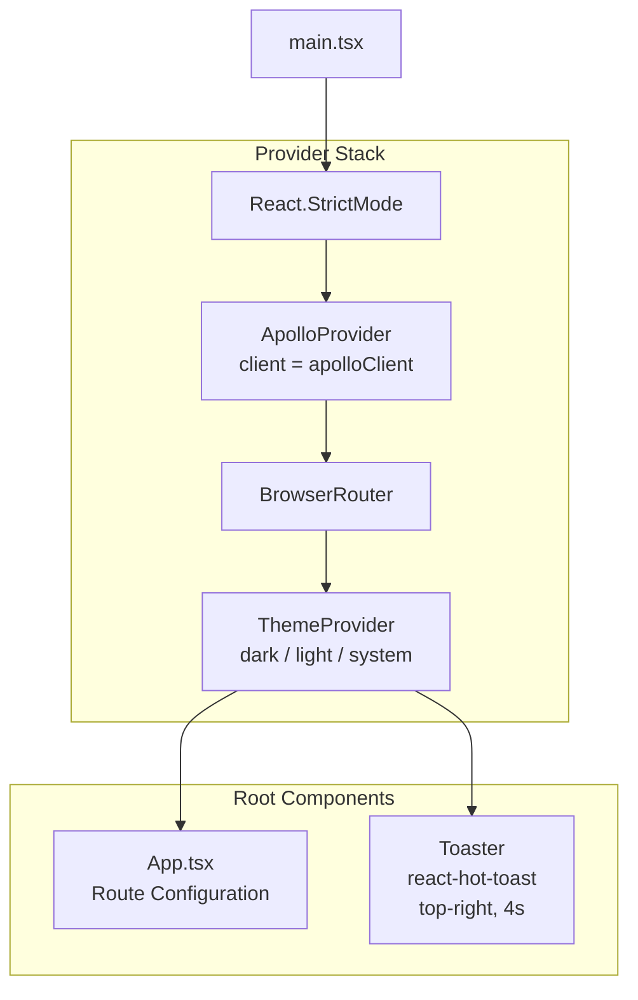

---

## 3. Routing Architecture

### 3.1 Route Tree

```mermaid
graph TB
    Root["BrowserRouter"]
    
    subgraph "Auth Routes (AuthLayout)"
        Login["/login<br/>LoginPage"]
        Register["/register<br/>RegisterPage"]
        Forgot["/forgot-password<br/>ForgotPasswordPage"]
        Reset["/reset-password<br/>ForgotPasswordPage"]
    end

    subgraph "Member Routes (ProtectedRoute → AppLayout)"
        Dashboard["/dashboard<br/>DashboardPage"]
        Catalog["/catalog<br/>CatalogPage"]
        BookDetail["/catalog/:bookId<br/>BookDetailPage"]
        Search["/search<br/>SearchPage"]
        Borrows["/borrows<br/>MyBorrowsPage"]
        Reservations["/reservations<br/>MyReservationsPage"]
        Fines["/fines<br/>MyFinesPage"]
        Library["/library<br/>DigitalLibraryPage"]
        Reader["/reader/:assetId<br/>ReaderPage"]
        Audio["/listen/:assetId<br/>AudiobookPlayerPage"]
        Profile["/profile<br/>ProfilePage"]
        Achievements["/achievements<br/>AchievementsPage"]
        Leaderboard["/leaderboard<br/>LeaderboardPage"]
        KP["/kp-center<br/>KnowledgePointsPage"]
        Recs["/recommendations<br/>RecommendationsPage"]
        Notifications["/notifications<br/>NotificationsPage"]
        Insights["/insights<br/>ReadingInsightsPage"]
    end

    subgraph "Admin Routes (AdminRoute → AdminLayout)"
        ADash["/admin/dashboard<br/>AdminDashboardPage"]
        AUsers["/admin/users<br/>AdminUsersPage"]
        ABooks["/admin/books<br/>AdminBooksPage"]
        AAuthors["/admin/authors<br/>AdminAuthorsPage"]
        ADigital["/admin/digital<br/>AdminDigitalPage"]
        ACirc["/admin/circulation<br/>AdminCirculationPage"]
        AAnalytics["/admin/analytics<br/>AdminAnalyticsPage"]
        AAI["/admin/ai-config<br/>AdminAIConfigPage"]
        AAudit["/admin/audit<br/>AdminAuditPage"]
        AAssets["/admin/assets<br/>AdminAssetsPage"]
        AEmps["/admin/employees<br/>AdminEmployeesPage"]
        AJobs["/admin/jobs<br/>AdminEmployeesPage"]
        ARoles["/admin/roles<br/>AdminRolesPage"]
        AMembers["/admin/members<br/>AdminMembersPage"]
        ASettings["/admin/settings<br/>AdminSettingsPage"]
        ASMTP["/admin/smtp<br/>AdminSmtpPage"]
    end

    NotFound["* → NotFoundPage"]

    Root --> Login
    Root --> Register
    Root --> Forgot
    Root --> Reset
    Root --> Dashboard
    Root --> Catalog
    Root --> BookDetail
    Root --> Search
    Root --> Borrows
    Root --> Reservations
    Root --> Fines
    Root --> Library
    Root --> Reader
    Root --> Audio
    Root --> Profile
    Root --> Achievements
    Root --> Leaderboard
    Root --> KP
    Root --> Recs
    Root --> Notifications
    Root --> Insights
    Root --> ADash
    Root --> AUsers
    Root --> ABooks
    Root --> AAuthors
    Root --> ADigital
    Root --> ACirc
    Root --> AAnalytics
    Root --> AAI
    Root --> AAudit
    Root --> AAssets
    Root --> AEmps
    Root --> AJobs
    Root --> ARoles
    Root --> AMembers
    Root --> ASettings
    Root --> ASMTP
    Root --> NotFound
```

**All pages are lazy-loaded** via `React.lazy()` with `<Suspense fallback={<LoadingScreen />}>`.

### 3.2 Route Guards

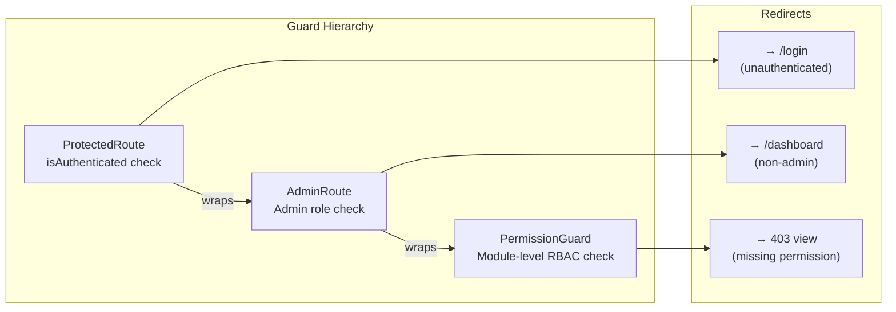

### 3.3 Complete Route Table

#### Auth Routes (Public)

| Path | Component | Layout |
|------|-----------|--------|
| `/login` | `LoginPage` | `AuthLayout` |
| `/register` | `RegisterPage` | `AuthLayout` |
| `/forgot-password` | `ForgotPasswordPage` | `AuthLayout` |
| `/reset-password` | `ForgotPasswordPage` | `AuthLayout` |

#### Member Routes (Protected)

| Path | Component | Category |
|------|-----------|----------|
| `/` | Redirect → `/dashboard` | — |
| `/dashboard` | `DashboardPage` | Dashboard |
| `/catalog` | `CatalogPage` | Catalog |
| `/catalog/:bookId` | `BookDetailPage` | Catalog |
| `/search` | `SearchPage` | Search |
| `/borrows` | `MyBorrowsPage` | Circulation |
| `/reservations` | `MyReservationsPage` | Circulation |
| `/fines` | `MyFinesPage` | Circulation |
| `/library` | `DigitalLibraryPage` | Digital |
| `/reader/:assetId` | `ReaderPage` | Digital |
| `/listen/:assetId` | `AudiobookPlayerPage` | Digital |
| `/profile` | `ProfilePage` | Profile |
| `/achievements` | `AchievementsPage` | Engagement |
| `/leaderboard` | `LeaderboardPage` | Engagement |
| `/kp-center` | `KnowledgePointsPage` | Engagement |
| `/recommendations` | `RecommendationsPage` | Intelligence |
| `/notifications` | `NotificationsPage` | Intelligence |
| `/insights` | `ReadingInsightsPage` | Intelligence |

#### Admin Routes (Protected + RBAC)

| Path | Component | Permission Module |
|------|-----------|-------------------|
| `/admin` | Redirect → `/admin/dashboard` | — |
| `/admin/dashboard` | `AdminDashboardPage` | (none) |
| `/admin/users` | `AdminUsersPage` | `users` |
| `/admin/books` | `AdminBooksPage` | `books` |
| `/admin/authors` | `AdminAuthorsPage` | `authors` |
| `/admin/digital` | `AdminDigitalPage` | `digital_content` |
| `/admin/circulation` | `AdminCirculationPage` | `circulation` |
| `/admin/analytics` | `AdminAnalyticsPage` | `analytics` |
| `/admin/ai-config` | `AdminAIConfigPage` | `ai` |
| `/admin/audit` | `AdminAuditPage` | `audit` |
| `/admin/assets` | `AdminAssetsPage` | `assets` |
| `/admin/employees` | `AdminEmployeesPage` | `employees` |
| `/admin/jobs` | `AdminEmployeesPage` | `employees` |
| `/admin/roles` | `AdminRolesPage` | `roles` |
| `/admin/members` | `AdminMembersPage` | `members` |
| `/admin/settings` | `AdminSettingsPage` | `settings` |
| `/admin/smtp` | `AdminSmtpPage` | `settings` |

---

## 4. State Management

### 4.1 Store Architecture

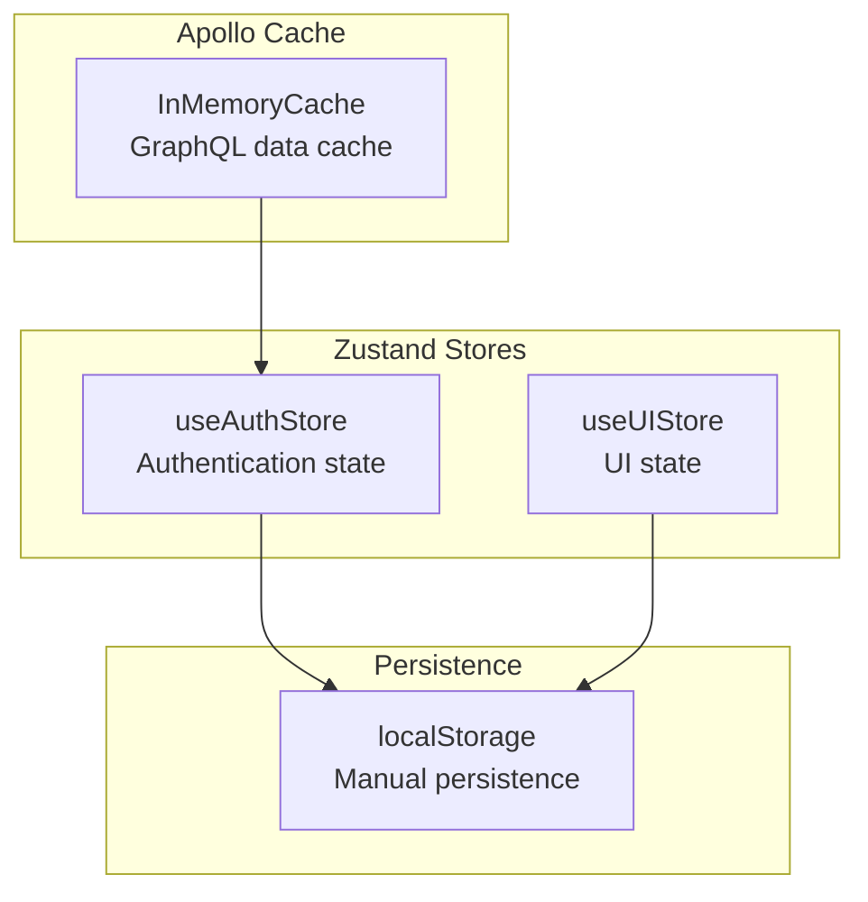

### 4.2 Auth Store

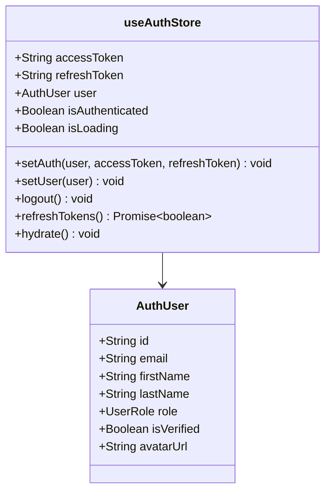

**Persistence keys:**
- `nova_access_token` — JWT access token
- `nova_refresh_token` — JWT refresh token
- `nova_user` — Serialized user object

**Auto-hydration:** `useAuthStore.getState().hydrate()` called on module load.

### 4.3 UI Store

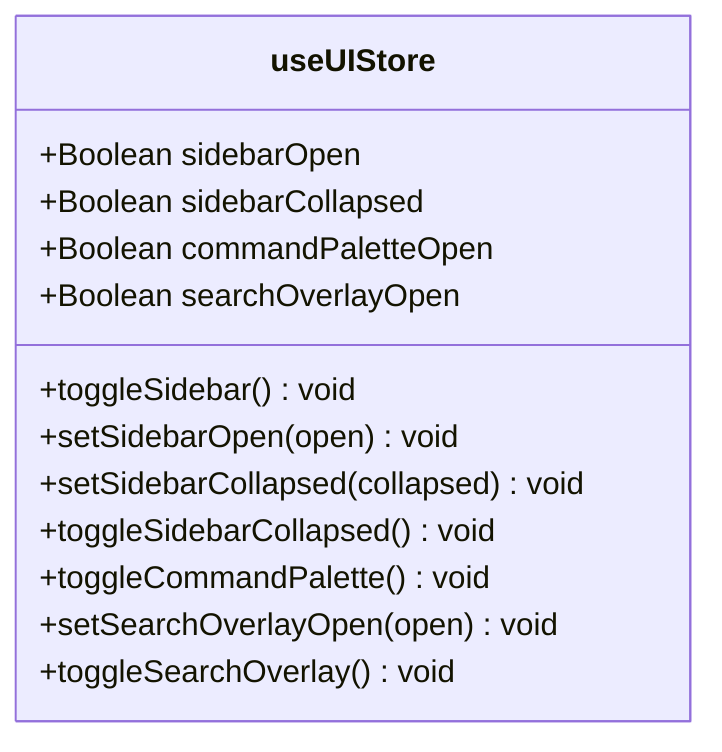

**Persistence:** Only `sidebarCollapsed` → `localStorage` key `nova-sidebar-collapsed`.

---

## 5. Apollo Client Architecture

### 5.1 Link Chain

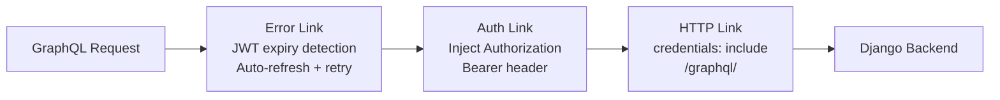

### 5.2 Token Refresh Flow

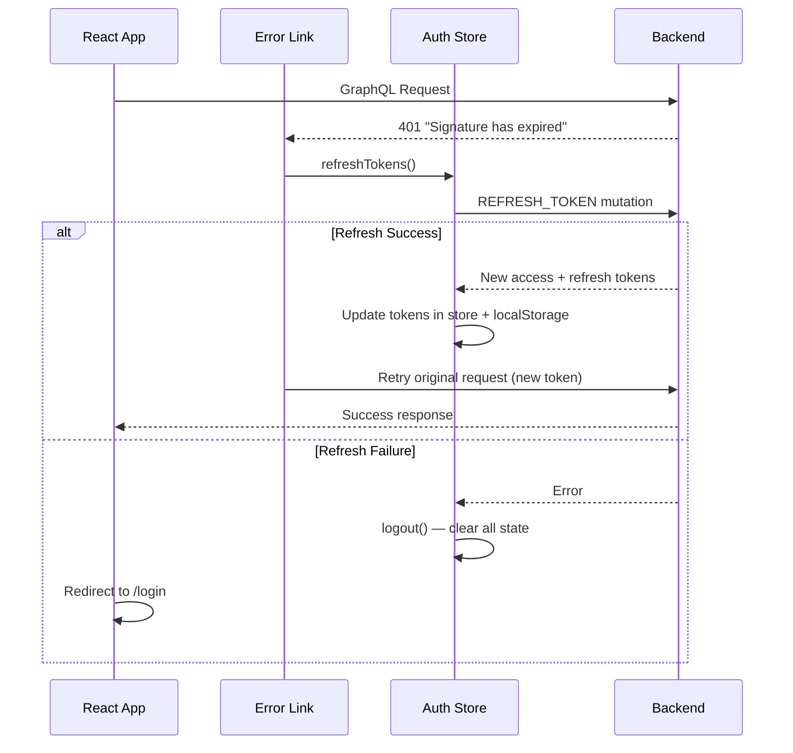

### 5.3 Cache Configuration

| Type | Key Field | Merge Strategy |
|------|-----------|----------------|
| `BookType` | `id` | Normalize by ID |
| `UserType` | `id` | Normalize by ID |
| `BorrowRecordType` | `id` | Normalize by ID |
| `RecommendationType` | `id` | Normalize by ID |
| `Query.books` | `[query, categoryId, authorId, language]` | Flat pagination |
| `Query.users` | `[role, isActive, search]` | Flat pagination |
| `Query.allBorrows` | `[status, userId]` | Flat pagination |
| `Query.auditLogs` | `[action, resourceType, actorId]` | Flat pagination |

**Default fetch policies:**
- `watchQuery`: `cache-and-network`
- `query`: `cache-first`
- `mutate`: errorPolicy `all`

---

## 6. Component Architecture

### 6.1 Component Tree

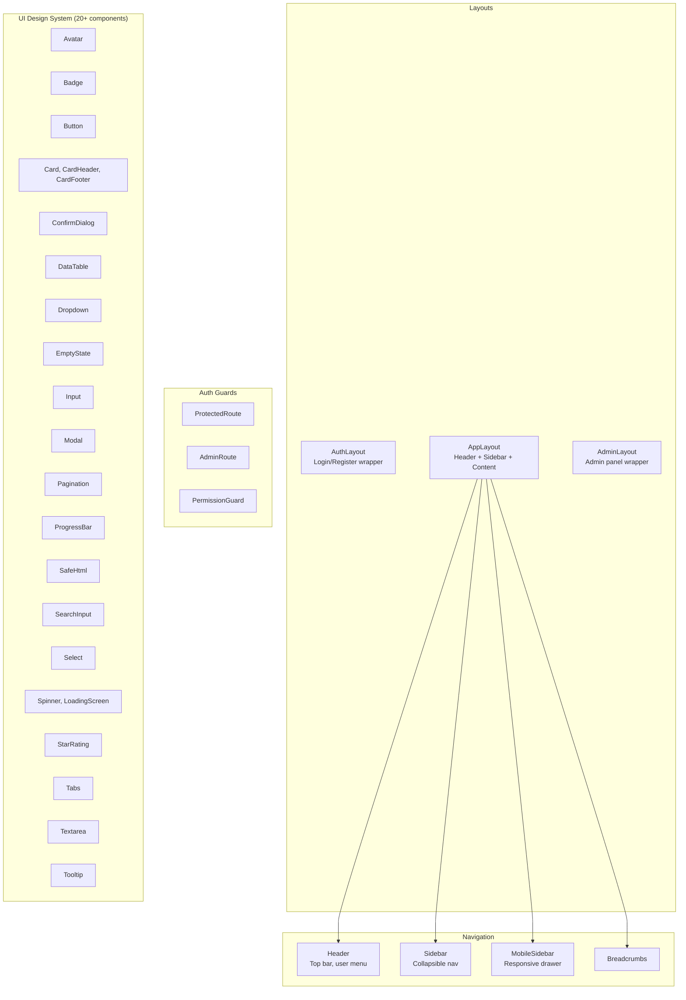

### 6.2 Design System Components

| Component | Props | Description |
|-----------|-------|-------------|
| `Avatar` | `src?, initials?, size` | User avatar with fallback initials |
| `Badge` | `variant, children` | Status/label badge |
| `Button` | `variant, size, loading, disabled` | Primary action button |
| `Card` | `children, className` | Content card container |
| `ConfirmDialog` | `open, title, message, onConfirm, onCancel` | Confirmation modal |
| `DataTable` | `columns, data, loading, onSort` | Sortable data table |
| `Dropdown` | `items, trigger` | Dropdown menu |
| `EmptyState` | `icon, title, description, action` | Empty content placeholder |
| `Input` | `label, error, type, ...inputProps` | Form text input |
| `Modal` | `open, onClose, title, size` | Dialog overlay |
| `Pagination` | `page, totalPages, onPageChange` | Page navigation |
| `ProgressBar` | `value, max, color` | Progress indicator |
| `SafeHtml` | `html` | DOMPurify-sanitized HTML renderer |
| `SearchInput` | `value, onChange, placeholder` | Search field with icon |
| `Select` | `options, value, onChange, label` | Dropdown select |
| `Spinner` | `size` | Loading spinner |
| `StarRating` | `rating, onChange?, readonly?` | Star rating display/input |
| `Tabs` | `tabs, activeTab, onChange` | Tab navigation |
| `Textarea` | `label, error, ...props` | Multi-line text input |
| `Tooltip` | `content, children` | Hover tooltip |

---

## 7. GraphQL Operations

### 7.1 Query Files

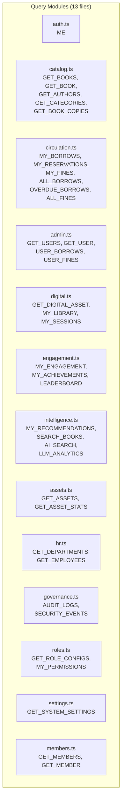

### 7.2 Mutation Files

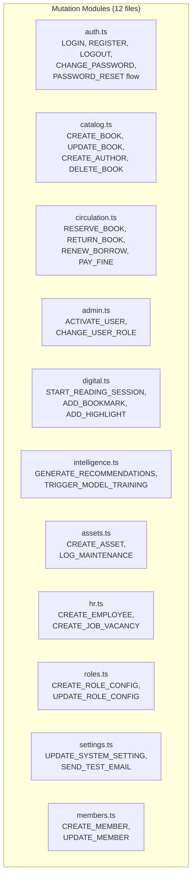

### 7.3 Operation Count by Module

| Module | Queries | Mutations |
|--------|---------|-----------|
| Auth | 1 | 11 |
| Catalog | 8 | 9 |
| Circulation | 8 | 8 |
| Admin | 7 | 6 |
| Digital | 8 | 9 |
| Engagement | 6 | 0 |
| Intelligence | 22 | 17 |
| Assets | 5 | 6 |
| HR | 6 | 7 |
| Governance | 4 | 0 |
| Roles | 4 | 3 |
| Settings | 1 | 3 |
| Members | 3 | 3 |
| **Total** | **83** | **82** |

---

## 8. Custom Hooks

### 8.1 Hook Inventory

```mermaid
classDiagram
    class useDebounce~T~ {
        +T value
        +number delay = 300
        returns T debouncedValue
    }

    class useDocumentTitle {
        +String title
        sets document.title
        restores on unmount
    }

    class useInfiniteScroll {
        +Boolean hasMore
        +Boolean loading
        +Function onLoadMore
        +number threshold = 100
        returns RefObject sentinelRef
    }

    class useKeyboardShortcut {
        +String key
        +Object modifiers
        +Function handler
        +Boolean enabled
        registers global listener
    }

    class useLocalStorage~T~ {
        +String key
        +T initialValue
        returns T value
        returns Function setter
    }

    class useAutoLogout {
        +number timeoutMs = 1800000
        monitors mousemove keydown touch scroll
        calls logout after 30min
    }

    class usePermissions {
        returns Object permissions
        returns Function can
        returns Function canRead
        returns Function canCreate
        returns Function canUpdate
        returns Function canDelete
    }
```

### 8.2 Permission System

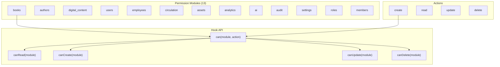

---

## 9. Theme System

### 9.1 Theme Architecture

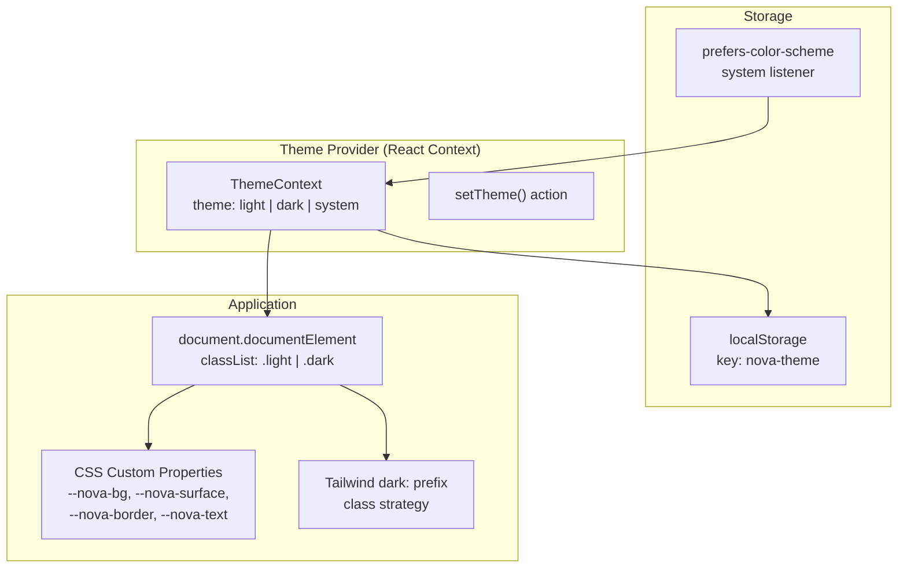

### 9.2 Design Tokens

| Token | Light | Dark | Usage |
|-------|-------|------|-------|
| `--nova-bg` | `#f8fafc` | `#0f172a` | Page background |
| `--nova-surface` | `#ffffff` | `#1e293b` | Card/panel background |
| `--nova-surface-hover` | `#f1f5f9` | `#334155` | Hover states |
| `--nova-border` | `#e2e8f0` | `#334155` | Borders |
| `--nova-text` | `#0f172a` | `#f1f5f9` | Primary text |
| `--nova-text-secondary` | `#475569` | `#94a3b8` | Secondary text |
| `--nova-text-muted` | `#94a3b8` | `#64748b` | Muted text |

### 9.3 Custom Color Scales

| Scale | Purpose | Range |
|-------|---------|-------|
| `primary` | Blue brand color | 50–950 |
| `accent` | Purple accent color | 50–950 |
| `nova` | Semantic CSS variable tokens | bg, surface, border, text |
| `kp` | Knowledge Points badges | bronze, silver, gold, platinum, diamond |

---

## 10. Build Configuration

### 10.1 Vite Configuration

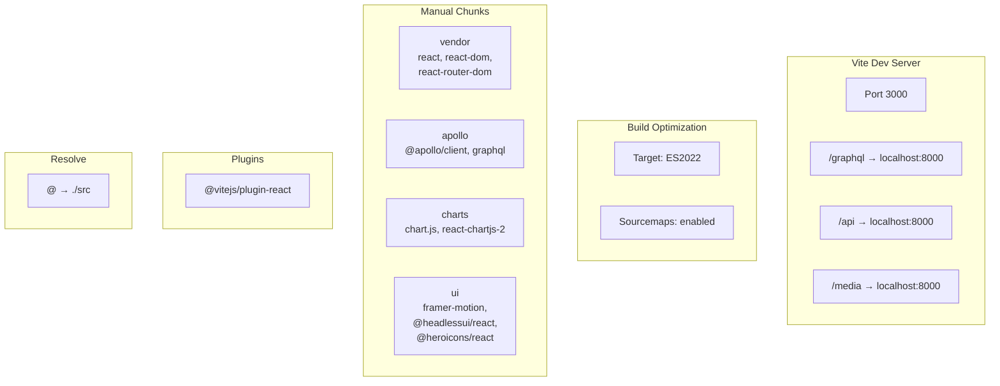

### 10.2 TypeScript Configuration

| Setting | Value |
|---------|-------|
| `target` | ES2022 |
| `module` | ESNext |
| `jsx` | react-jsx |
| `strict` | true |
| `paths.@/*` | `./src/*` |

---

## 11. Page Architecture

### 11.1 Page Categories

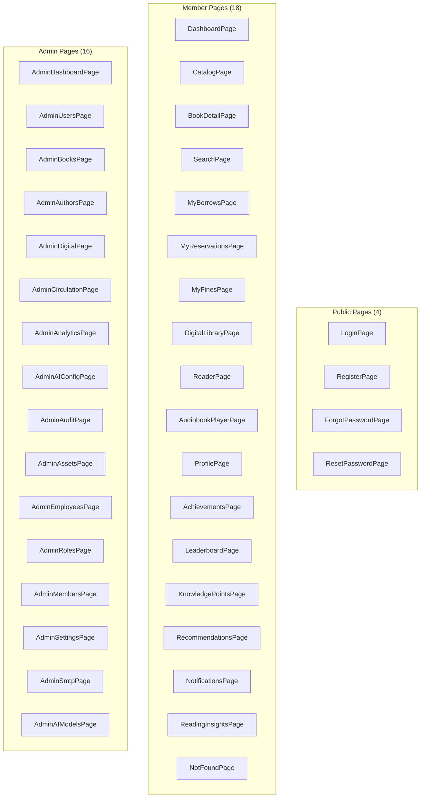

### 11.2 Total: 38 Pages

| Category | Count |
|----------|-------|
| Auth (public) | 4 |
| Member (protected) | 18 |
| Admin (RBAC) | 16 |
| **Total** | **38** |

---

## 12. Security (Client-Side)

### 12.1 XSS Prevention

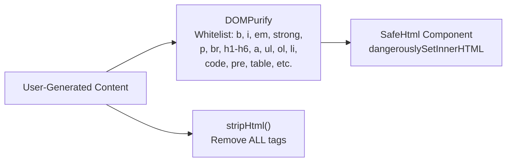

### 12.2 Auto-Logout

| Setting | Value |
|---------|-------|
| Timeout | 30 minutes (1,800,000 ms) |
| Monitored events | `mousemove`, `keydown`, `touchstart`, `scroll` |
| Action | Clear tokens + redirect to `/login` |

### 12.3 Token Security

| Measure | Implementation |
|---------|---------------|
| Storage | `localStorage` (manual management) |
| Header injection | Apollo `authLink` — `Authorization: Bearer <token>` |
| Auto-refresh | `errorLink` detects expired token → `refreshTokens()` |
| Credential passing | `credentials: 'include'` on HTTP link |

---

## 13. Utility Library

### 13.1 Core Utilities (`lib/utils.ts`)

| Function | Description |
|----------|-------------|
| `cn(...inputs)` | Tailwind class merging (clsx + tailwind-merge) |
| `formatDate(date)` | Format to "MMM d, yyyy" |
| `timeAgo(date)` | Relative time (e.g., "2 hours ago") |
| `formatDateTime(date)` | Format to "MMM d, yyyy HH:mm" |
| `truncate(text, max)` | Truncate with ellipsis |
| `capitalize(str)` | First letter uppercase |
| `formatNumber(n)` | Number with comma separators |
| `formatCurrency(amount, currency?)` | Currency formatting |
| `debounce(fn, ms)` | Debounce function wrapper |
| `getInitials(first?, last?)` | Name initials extraction |
| `kpLevelName(level)` | Level → Bronze/Silver/Gold/Platinum/Diamond |
| `kpLevelClass(level)` | Level → CSS class mapping |
| `riskColor(risk)` | Risk level → Tailwind text color |
| `sleep(ms)` | Async sleep utility |
| `extractGqlError(error)` | Extract readable GraphQL error message |

### 13.2 Constants (`lib/constants.ts`)

| Constant | Value |
|----------|-------|
| `APP_NAME` | `VITE_APP_NAME` or `'Nova Library'` |
| `ROLES` | 6 roles: SUPER_ADMIN, LIBRARIAN, LIBRARY_ASSISTANT, MEMBER, STUDENT, GUEST |
| `ADMIN_ROLES` | SUPER_ADMIN, LIBRARIAN, LIBRARY_ASSISTANT |
| `STAFF_ROLES` | SUPER_ADMIN, LIBRARIAN |
| `BORROW_STATUS` | ACTIVE, RETURNED, OVERDUE, LOST |
| `RESERVATION_STATUS` | PENDING, READY, FULFILLED, CANCELLED, EXPIRED |
| `FINE_STATUS` | PENDING, PAID, WAIVED, OVERDUE |
| `NOTIFICATION_TYPES` | 9 types |
| `TRENDING_PERIODS` | DAILY, WEEKLY, MONTHLY, ALL_TIME |
| `BOOK_LANGUAGES` | 10 languages |
| `ITEMS_PER_PAGE` | 20 |
| `MAX_SEARCH_SUGGESTIONS` | 8 |

---

## 14. Dependencies

### Runtime Dependencies

| Package | Version | Purpose |
|---------|---------|---------|
| `react` | 18.3 | UI framework |
| `react-dom` | 18.3 | DOM rendering |
| `react-router-dom` | 6 | Client-side routing |
| `@apollo/client` | 3.11 | GraphQL client |
| `graphql` | — | GraphQL language support |
| `zustand` | 5.0 | State management |
| `chart.js` | 4 | Charting library |
| `react-chartjs-2` | — | React Chart.js wrapper |
| `framer-motion` | 11 | Animations |
| `@headlessui/react` | 2 | Accessible UI primitives |
| `@heroicons/react` | 2 | Icon library |
| `react-hook-form` | 7 | Form management |
| `zod` | 3 | Schema validation |
| `dompurify` | 3 | HTML sanitization |
| `date-fns` | 4 | Date utilities |
| `react-hot-toast` | 2 | Toast notifications |
| `clsx` | — | Class name utility |
| `tailwind-merge` | — | Tailwind class merge |

### Dev Dependencies

| Package | Version | Purpose |
|---------|---------|---------|
| `typescript` | 5.7 | Type system |
| `vite` | 6 | Build tool |
| `vitest` | 2 | Test runner |
| `@testing-library/react` | 16 | Component testing |
| `@testing-library/jest-dom` | 6 | DOM assertions |
| `eslint` | 9 | Linting |
| `prettier` | 3 | Code formatting |
| `tailwindcss` | 3.4 | Utility CSS |
| `postcss` | — | CSS processing |
| `@graphql-codegen` | 5 | GraphQL type generation |
