# 12 — Deployment & Configuration

> Django settings, database, Redis, Celery, middleware, security configuration, and environment variables

---

## 1. Settings Architecture

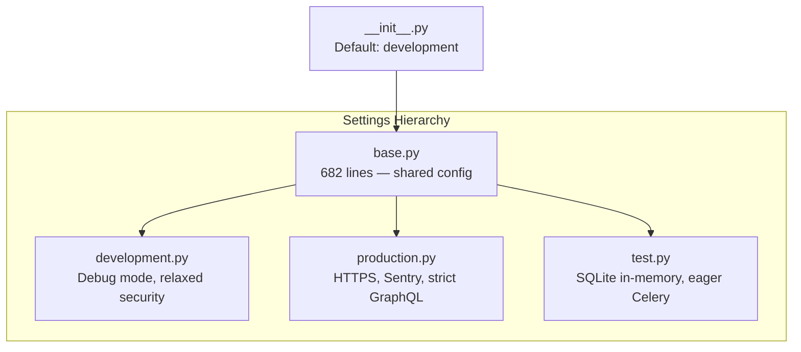

**Active settings** controlled by: `DJANGO_SETTINGS_MODULE` (default: `nova.settings.development`)

---

## 2. Django Core Settings

| Setting | Value |
|---------|-------|
| `SECRET_KEY` | `env('DJANGO_SECRET_KEY')` — required in production (min 50 chars) |
| `DEBUG` | `env('DJANGO_DEBUG', default=True)` |
| `ALLOWED_HOSTS` | `env.list('DJANGO_ALLOWED_HOSTS', default=['localhost', '127.0.0.1'])` |
| `ROOT_URLCONF` | `nova.urls` |
| `WSGI_APPLICATION` | `nova.wsgi.application` |
| `ASGI_APPLICATION` | `nova.asgi.application` |
| `AUTH_USER_MODEL` | `identity.User` |
| `DEFAULT_AUTO_FIELD` | `django.db.models.BigAutoField` |
| `LANGUAGE_CODE` | `en-us` |
| `TIME_ZONE` | `UTC` |
| `USE_TZ` | `True` |

---

## 3. Installed Apps

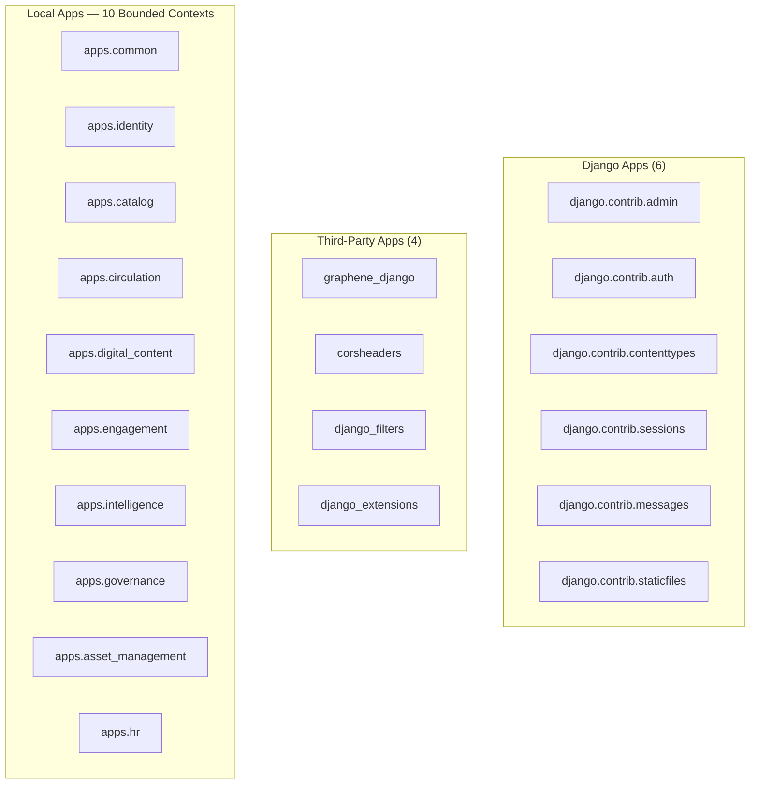

Dev adds: `debug_toolbar`

---

## 4. Middleware Stack

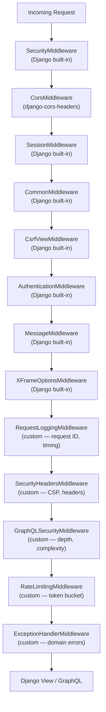

Dev prepends: `DebugToolbarMiddleware`

---

## 5. Database Configuration

### 5.1 Development

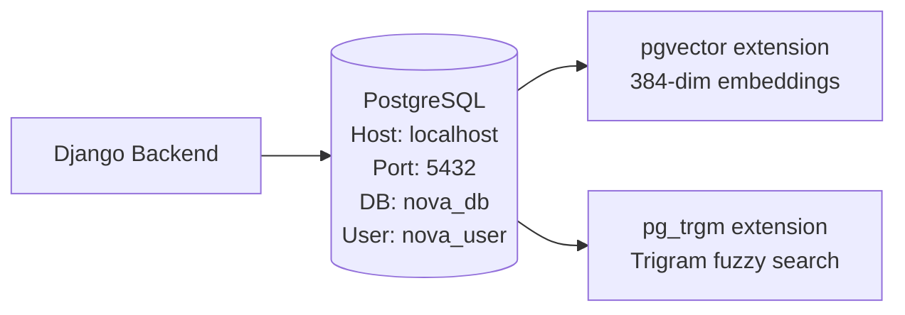

| Setting | Value |
|---------|-------|
| `ENGINE` | `django.db.backends.postgresql` |
| `NAME` | `env('DATABASE_NAME', default='nova_db')` |
| `USER` | `env('DATABASE_USER', default='nova_user')` |
| `PASSWORD` | `env('DATABASE_PASSWORD', default='nova_password')` |
| `HOST` | `env('DATABASE_HOST', default='localhost')` |
| `PORT` | `env('DATABASE_PORT', default='5432')` |
| `ATOMIC_REQUESTS` | `True` |
| `CONN_MAX_AGE` | 0 (dev) / 600 (prod) |

### 5.2 Production Additions

| Setting | Value |
|---------|-------|
| `sslmode` | `env('DATABASE_SSL_MODE', default='require')` |
| `default_transaction_isolation` | `read committed` |
| `MAX_CONNECTIONS` | 100 |

### 5.3 Test

| Setting | Value |
|---------|-------|
| `ENGINE` | `django.db.backends.sqlite3` |
| `NAME` | `:memory:` |

---

## 6. Redis Architecture

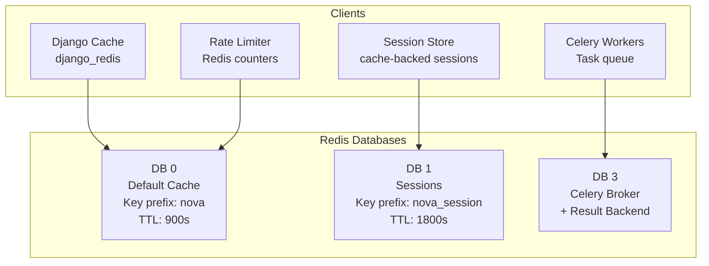

### 6.1 Cache Configuration

| Setting | Value |
|---------|-------|
| `BACKEND` | `django_redis.cache.RedisCache` |
| `LOCATION` | `env('REDIS_CACHE_URL', default='redis://localhost:6379/0')` |
| `KEY_PREFIX` | `nova` |
| `TIMEOUT` | 900s (15 min) |
| `SOCKET_CONNECT_TIMEOUT` | 5s |
| `SOCKET_TIMEOUT` | 5s |
| `RETRY_ON_TIMEOUT` | `True` |
| `MAX_CONNECTIONS` | 50 (base) / 100 (prod) |

### 6.2 Session Configuration

| Setting | Value |
|---------|-------|
| `SESSION_ENGINE` | `django.contrib.sessions.backends.cache` |
| `SESSION_CACHE_ALIAS` | `sessions` |
| `SESSION_COOKIE_NAME` | `__nova_sid` |
| `SESSION_COOKIE_HTTPONLY` | `True` |
| `SESSION_COOKIE_SAMESITE` | `Lax` |
| `SESSION_COOKIE_AGE` | 1800 (30 min) |
| `SESSION_EXPIRE_AT_BROWSER_CLOSE` | `True` |
| `SESSION_SAVE_EVERY_REQUEST` | `True` (rolling expiry) |

---

## 7. Celery Task Queue

### 7.1 Configuration

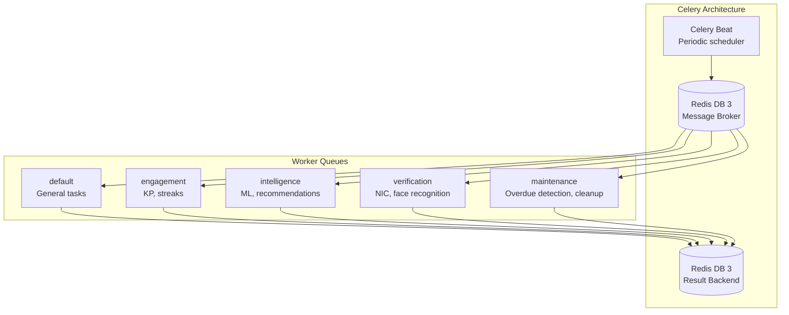

| Setting | Value |
|---------|-------|
| `CELERY_BROKER_URL` | `env('CELERY_BROKER_URL', default='redis://localhost:6379/3')` |
| `CELERY_RESULT_BACKEND` | `env('CELERY_RESULT_BACKEND', default='redis://localhost:6379/3')` |
| `CELERY_ACCEPT_CONTENT` | `['json']` |
| `CELERY_TASK_SERIALIZER` | `json` |
| `CELERY_TIMEZONE` | `UTC` |
| `CELERY_TASK_TRACK_STARTED` | `True` |
| `CELERY_TASK_TIME_LIMIT` | 300s (5 min hard) |
| `CELERY_TASK_SOFT_TIME_LIMIT` | 240s (4 min soft) |
| `CELERY_WORKER_PREFETCH_MULTIPLIER` | 1 |
| `CELERY_TASK_ACKS_LATE` | `True` |

### 7.2 Periodic Tasks (Beat Schedule)

| Task | Schedule | Queue |
|------|----------|-------|
| Detect overdue transactions | Every 1 hour | `maintenance` |
| Cleanup expired sessions | Every 15 min | `maintenance` |
| Evaluate daily streaks | Every 1 day | `engagement` |
| Refresh stale recommendations | Every 6 hours | `intelligence` |
| Predict overdue risks | Every 4 hours | `intelligence` |
| Analyze churn risks | Every 7 days | `intelligence` |
| Auto-tag new books | Every 12 hours | `intelligence` |
| Deliver notifications | Every 5 min | `default` |
| Compute book embeddings | Every 6 hours | `intelligence` |
| Compute trending books | Every 3 hours | `intelligence` |
| Run model training | Every 7 days | `intelligence` |

---

## 8. GraphQL Configuration

### 8.1 Graphene Settings

```python
GRAPHENE = {
    'SCHEMA': 'nova.schema.schema',
    'MIDDLEWARE': ['graphql_jwt.middleware.JSONWebTokenMiddleware'],
}
```

### 8.2 JWT Configuration

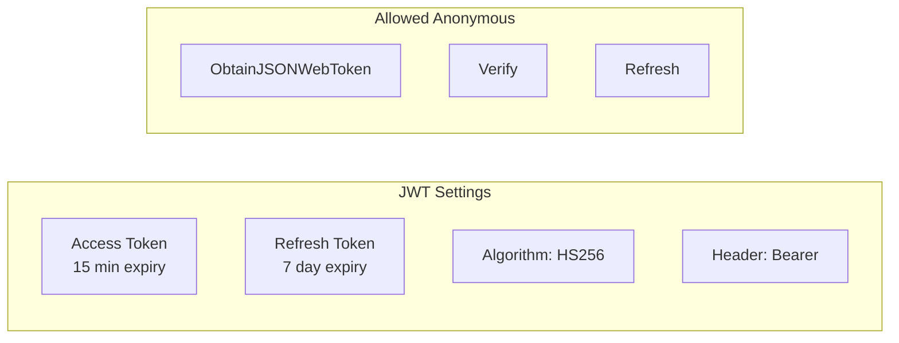

| Setting | Value |
|---------|-------|
| `JWT_VERIFY_EXPIRATION` | `True` |
| `JWT_EXPIRATION_DELTA` | `timedelta(minutes=15)` |
| `JWT_REFRESH_EXPIRATION_DELTA` | `timedelta(days=7)` |
| `JWT_SECRET_KEY` | `env('JWT_SIGNING_KEY', default=SECRET_KEY)` |
| `JWT_ALGORITHM` | `HS256` |
| `JWT_AUTH_HEADER_PREFIX` | `Bearer` |

### 8.3 GraphQL Security Limits

| Setting | Dev | Prod |
|---------|-----|------|
| `MAX_DEPTH` | 10 | 8 |
| `MAX_COMPLEXITY` | 1000 | 800 |
| `MAX_ALIASES` | 15 | 15 |
| `MAX_QUERY_SIZE_BYTES` | 10,000 | 10,000 |
| `MAX_BATCH_SIZE` | 5 | 3 |
| `INTROSPECTION_ENABLED` | Follows DEBUG | `False` |

### 8.4 Schema Composition

```mermaid
graph TB
    RootSchema["nova.schema.schema"]

    subgraph "Query Mixins"
        IQ["IdentityQuery"]
        CQ["CatalogQuery"]
        CircQ["CirculationQuery"]
        DQ["DigitalContentQuery"]
        EQ["EngagementQuery"]
        IntQ["IntelligenceQuery"]
        GQ["GovernanceQuery"]
        AQ["AssetManagementQuery"]
        HQ["HRQuery"]
        SQ["SettingsQuery"]
    end

    subgraph "Mutation Mixins"
        IM["IdentityMutation"]
        CM["CatalogMutation"]
        CircM["CirculationMutation"]
        DM["DigitalContentMutation"]
        EM["EngagementMutation"]
        IntM["IntelligenceMutation"]
        AM["AssetManagementMutation"]
        HM["HRMutation"]
        SM["SettingsMutation"]
    end

    Health["health: String → 'ok'"]

    RootSchema --> IQ & CQ & CircQ & DQ & EQ & IntQ & GQ & AQ & HQ & SQ & Health
    RootSchema --> IM & CM & CircM & DM & EM & IntM & AM & HM & SM
```

---

## 9. CORS Configuration

| Setting | Dev | Prod |
|---------|-----|------|
| `CORS_ALLOW_ALL_ORIGINS` | `True` | `False` |
| `CORS_ALLOWED_ORIGINS` | — | From `env.list()` |
| `CORS_ALLOW_CREDENTIALS` | `True` | `True` |
| `CORS_ALLOW_METHODS` | `GET, OPTIONS, POST` | `GET, OPTIONS, POST` |
| `CORS_EXPOSE_HEADERS` | `X-Request-ID, X-RateLimit-Remaining, Retry-After` | Same |

---

## 10. Authentication & Security

### 10.1 Password Security

| Setting | Value |
|---------|-------|
| Primary hasher | `Argon2PasswordHasher` |
| Minimum length | 10 characters |
| Validators | Similarity, MinLength, Common, Numeric |
| Auth backends | `JSONWebTokenBackend`, `ModelBackend` |

### 10.2 Account Lockout

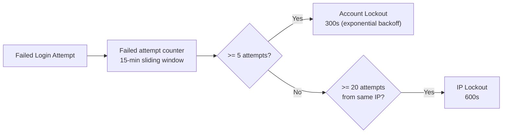

| Setting | Value |
|---------|-------|
| `MAX_FAILED_ATTEMPTS` | 5 |
| `LOCKOUT_BASE_SECONDS` | 300 (5 min) |
| `LOCKOUT_MAX_SECONDS` | 3600 (1 hour) |
| `LOCKOUT_MULTIPLIER` | 2 (exponential) |
| `FAILED_ATTEMPT_WINDOW_SECONDS` | 900 (15 min) |
| `IP_MAX_FAILED_ATTEMPTS` | 20 |
| `IP_LOCKOUT_SECONDS` | 600 (10 min) |

---

## 11. Rate Limiting

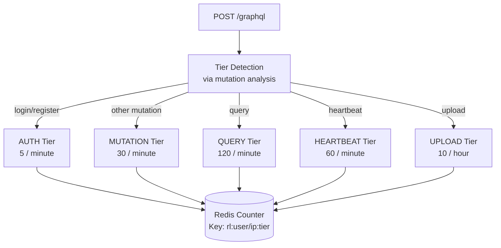

- **Fail-open:** If Redis is unreachable, requests pass through
- Response headers: `X-RateLimit-Remaining`
- 429 responses include `Retry-After` header
- Disabled in development and test environments

---

## 12. URL Configuration

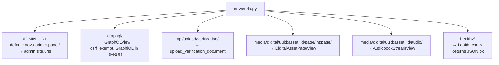

DEBUG mode adds: static files, media files, debug toolbar URLs.

---

## 13. File Upload & Storage

### 13.1 Upload Limits

| Content Type | Allowed Extensions | Max Size |
|--------------|-------------------|----------|
| E-book | `.pdf`, `.epub` | 100 MB |
| Audiobook | `.mp3`, `.m4a`, `.ogg`, `.wav` | 500 MB |
| Image | `.jpg`, `.jpeg`, `.png`, `.webp` | 5 MB |
| ID Document | `.jpg`, `.jpeg`, `.png`, `.pdf` | 10 MB |

### 13.2 Storage Backend

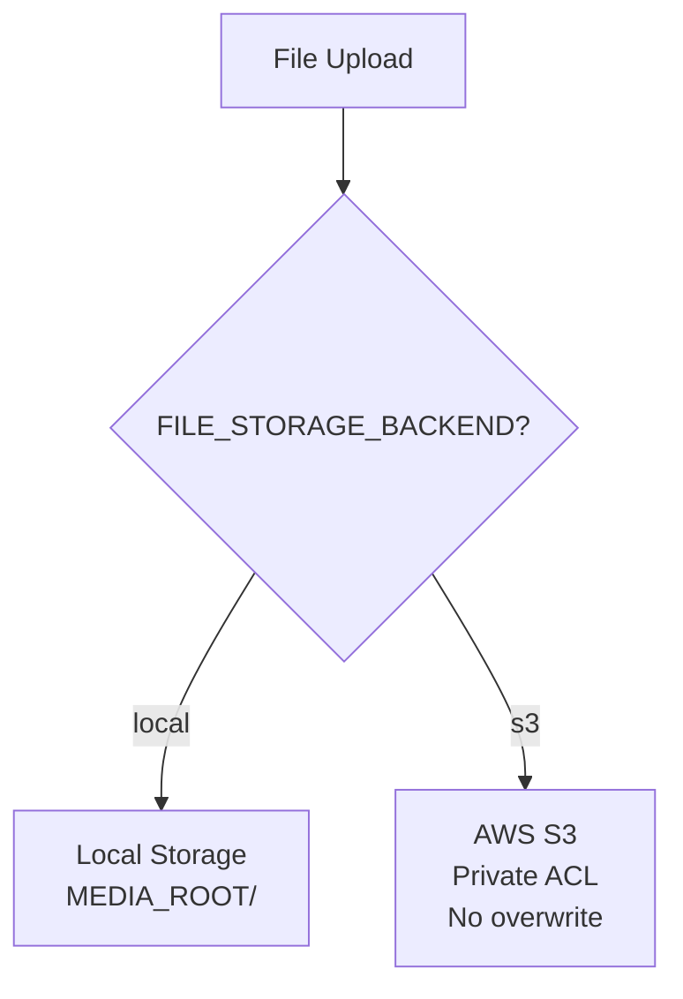

S3 settings: `AWS_ACCESS_KEY_ID`, `AWS_SECRET_ACCESS_KEY`, `AWS_STORAGE_BUCKET_NAME`, `AWS_S3_REGION_NAME`

---

## 14. Logging Architecture

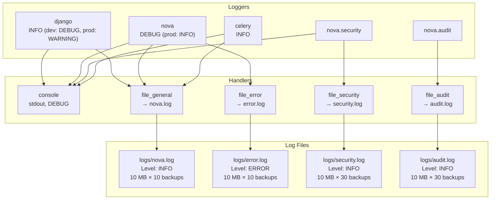

**Formatter:** `apps.common.logging_formatters.JSONFormatter` (structured JSON logging)

---

## 15. Production Hardening

### 15.1 SSL & HSTS

| Setting | Value |
|---------|-------|
| `SECURE_SSL_REDIRECT` | `True` |
| `SECURE_HSTS_SECONDS` | 63,072,000 (2 years) |
| `SECURE_HSTS_INCLUDE_SUBDOMAINS` | `True` |
| `SECURE_HSTS_PRELOAD` | `True` |
| `SECURE_PROXY_SSL_HEADER` | `('HTTP_X_FORWARDED_PROTO', 'https')` |
| `SESSION_COOKIE_SECURE` | `True` |
| `CSRF_COOKIE_SECURE` | `True` |

### 15.2 Sentry Integration

| Setting | Value |
|---------|-------|
| `SENTRY_DSN` | `env('SENTRY_DSN')` |
| Integrations | DjangoIntegration, CeleryIntegration, RedisIntegration |
| `traces_sample_rate` | `env('SENTRY_TRACES_SAMPLE_RATE', default=0.1)` |
| `send_default_pii` | `False` |
| `release` | `env('APP_VERSION', default='unknown')` |

### 15.3 Email (Production)

| Setting | Value |
|---------|-------|
| Backend | `django.core.mail.backends.smtp.EmailBackend` |
| Host | `env('EMAIL_HOST', default='smtp.gmail.com')` |
| Port | `env.int('EMAIL_PORT', default=587)` |
| TLS | `True` |

Dev: `console.EmailBackend` | Test: `locmem.EmailBackend`

---

## 16. Domain Configuration

### 16.1 Engagement Configuration

| Setting | Value |
|---------|-------|
| `DAILY_KP_CAP` | 200 |
| `MIN_SESSION_DURATION_SECONDS` | 120 |
| `IDLE_THRESHOLD_SECONDS` | 60 |
| `SESSION_TIMEOUT_SECONDS` | 5400 |
| `HEARTBEAT_INTERVAL_SECONDS` | 30 |
| `MAX_HEARTBEAT_GAP_SECONDS` | 90 |
| `STREAK_MIN_ACTIVE_MINUTES` | 15 |

**KP Weights:**

| Category | Weight |
|----------|--------|
| Reading Time | 0.30 |
| Completion | 0.25 |
| Content Creation | 0.20 |
| Consistency | 0.15 |
| Diversity | 0.10 |

**Streak Multipliers:** 3d → 1.1x, 7d → 1.2x, 14d → 1.3x, 30d → 1.5x

**KP Levels:**

| Level | Min KP | Title |
|-------|--------|-------|
| 1 | 0 | Curious Reader |
| 2 | 100 | Active Learner |
| 3 | 500 | Knowledge Seeker |
| 4 | 1500 | Scholar |
| 5 | 5000 | Thought Leader |

### 16.2 Circulation Configuration

| Setting | Value |
|---------|-------|
| `DEFAULT_BORROW_DAYS` | 14 |
| `MAX_EXTENSIONS` | 2 |
| `MAX_CONCURRENT_BORROWS` | 2 |
| `MAX_CONCURRENT_RESERVATIONS` | 2 |
| `RESERVATION_PICKUP_HOURS` | 12 |
| `FINE_BASE_RATE_PER_DAY` | $0.50 |
| `MAX_UNPAID_FINE_THRESHOLD` | $25.00 |

**Fine Escalation Tiers:**

| Days Overdue | Rate per Day |
|-------------|--------------|
| 1–7 | $1.00 |
| 8–30 | $1.50 |
| 31+ | $2.00 |

**Abuse Prevention:**

| Setting | Value |
|---------|-------|
| Lookback period | 30 days |
| Max no-shows | 3 |
| Ban duration | 7 days |

### 16.3 AI Configuration

| Setting | Value |
|---------|-------|
| Embedding model | `all-MiniLM-L6-v2` |
| Embedding dimensions | 384 |
| Face recognition tolerance | 0.6 |
| OCR language | `eng` |
| Recommendation cache TTL | 86400s (24h) |
| Search fulltext weight | 0.45 |
| Search semantic weight | 0.35 |
| Search fuzzy weight | 0.20 |
| Auto-tag top N | 5 |
| Overdue risk threshold | 0.6 |
| Churn risk threshold | 0.6 |
| Notification daily cap | 8 |
| Notification dedup hours | 2 |
| Model artifact directory | `data/models` |

---

## 17. Requirements Summary

### 17.1 Base Dependencies (28 packages)

| Category | Packages |
|----------|----------|
| **Django Core** | Django >=4.2, django-environ, django-filter, django-extensions |
| **GraphQL** | graphene-django >=3.1.5, django-graphql-jwt >=0.4.0, graphene >=3.3 |
| **Database** | psycopg2-binary >=2.9.9, pgvector >=0.2.4 |
| **Auth** | PyJWT >=2.8.0, argon2-cffi >=23.1.0 |
| **CORS** | django-cors-headers >=4.3.1 |
| **Cache** | django-redis >=5.4.0, redis >=5.0.1 |
| **Task Queue** | celery[redis] >=5.3.6 |
| **AI/ML** | sentence-transformers >=2.2.2, scikit-learn >=1.3.2, numpy, pandas, nltk >=3.8.1 |
| **Vision** | pytesseract >=0.3.10, face-recognition >=1.3.0, opencv-python-headless >=4.8.1, Pillow >=10.1.0 |
| **Utilities** | python-magic, requests, uvicorn >=0.25.0, uuid |

### 17.2 Production Additions

| Package | Purpose |
|---------|---------|
| gunicorn >=21.2.0 | WSGI server |
| gevent >=23.9.1 | Async worker class |
| sentry-sdk[django] >=1.39.1 | Error tracking |
| prometheus-client >=0.19.0 | Metrics export |
| django-csp >=3.7 | Content Security Policy |
| django-permissions-policy >=4.18.0 | Permissions headers |
| boto3 >=1.34.0 | AWS S3 SDK |
| django-storages >=1.14.2 | S3 file storage |

### 17.3 Test Additions

| Package | Purpose |
|---------|---------|
| pytest >=7.4.3 | Test runner |
| pytest-django | Django integration |
| pytest-cov | Coverage reporting |
| pytest-asyncio | Async test support |
| pytest-mock | Mock utilities |
| pytest-xdist | Parallel test execution |
| factory-boy | Test factories |
| faker | Fake data generation |
| freezegun | Time mocking |
| responses | HTTP mock |

---

## 18. Environment Variables Reference

### 18.1 Core

| Variable | Default | Required in Prod |
|----------|---------|:---:|
| `DJANGO_SETTINGS_MODULE` | `nova.settings.development` | No |
| `DJANGO_SECRET_KEY` | `insecure-dev-key...` | **Yes** |
| `DJANGO_DEBUG` | `True` | No (forced `False`) |
| `DJANGO_ALLOWED_HOSTS` | `localhost,127.0.0.1` | **Yes** |
| `DJANGO_ADMIN_URL` | `nova-admin-panel/` | No |

### 18.2 Database

| Variable | Default | Required in Prod |
|----------|---------|:---:|
| `DATABASE_NAME` | `nova_db` | **Yes** |
| `DATABASE_USER` | `nova_user` | **Yes** |
| `DATABASE_PASSWORD` | `nova_password` | **Yes** |
| `DATABASE_HOST` | `localhost` | **Yes** |
| `DATABASE_PORT` | `5432` | No |
| `DATABASE_SSL_MODE` | `require` | No |

### 18.3 Redis

| Variable | Default |
|----------|---------|
| `REDIS_CACHE_URL` | `redis://localhost:6379/0` |
| `REDIS_SESSION_URL` | `redis://localhost:6379/1` |
| `CELERY_BROKER_URL` | `redis://localhost:6379/3` |
| `CELERY_RESULT_BACKEND` | `redis://localhost:6379/3` |

### 18.4 JWT

| Variable | Default |
|----------|---------|
| `JWT_ACCESS_TOKEN_LIFETIME_MINUTES` | `15` |
| `JWT_REFRESH_TOKEN_LIFETIME_DAYS` | `7` |
| `JWT_SIGNING_KEY` | `SECRET_KEY` |

### 18.5 CORS

| Variable | Default |
|----------|---------|
| `CORS_ALLOWED_ORIGINS` | `http://localhost:3000,http://127.0.0.1:3000` |

### 18.6 Storage

| Variable | Default |
|----------|---------|
| `MEDIA_ROOT` | `<BASE_DIR>/media` |
| `FILE_STORAGE_BACKEND` | `local` |
| `AWS_ACCESS_KEY_ID` | `''` |
| `AWS_SECRET_ACCESS_KEY` | `''` |
| `AWS_STORAGE_BUCKET_NAME` | `''` |
| `AWS_S3_REGION_NAME` | `us-east-1` |

### 18.7 AI/ML

| Variable | Default |
|----------|---------|
| `EMBEDDING_MODEL_NAME` | `all-MiniLM-L6-v2` |
| `FACE_RECOGNITION_TOLERANCE` | `0.6` |
| `OCR_LANGUAGE` | `eng` |
| `RECOMMENDATION_CACHE_TTL` | `86400` |

### 18.8 Rate Limiting

| Variable | Default |
|----------|---------|
| `RATE_LIMIT_DEFAULT` | `100/hour` |
| `RATE_LIMIT_AUTH` | `5/minute` |
| `RATE_LIMIT_UPLOAD` | `10/hour` |

### 18.9 Email (Production)

| Variable | Default |
|----------|---------|
| `EMAIL_HOST` | `smtp.gmail.com` |
| `EMAIL_PORT` | `587` |
| `EMAIL_HOST_USER` | `''` |
| `EMAIL_HOST_PASSWORD` | `''` |

### 18.10 Monitoring (Production)

| Variable | Default |
|----------|---------|
| `SENTRY_DSN` | `''` |
| `SENTRY_TRACES_SAMPLE_RATE` | `0.1` |
| `APP_VERSION` | `unknown` |

---

## 19. Test Configuration

### Pytest Settings

```ini
[pytest]
DJANGO_SETTINGS_MODULE = nova.settings.test
python_files = tests.py test_*.py *_tests.py
python_classes = Test*
python_functions = test_*
addopts = --verbose --tb=short --strict-markers --no-header -ra
markers = slow, integration, unit, ai
```

### Test Performance Optimizations

| Setting | Value |
|---------|-------|
| Database | SQLite `:memory:` |
| Password hasher | `MD5PasswordHasher` (fast) |
| Celery mode | `TASK_ALWAYS_EAGER` |
| Email backend | `locmem` |
| Cache backend | `LocMemCache` |
| Rate limiting | Disabled |
